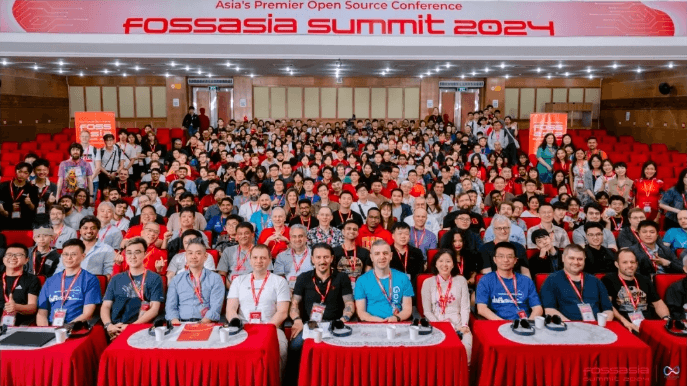
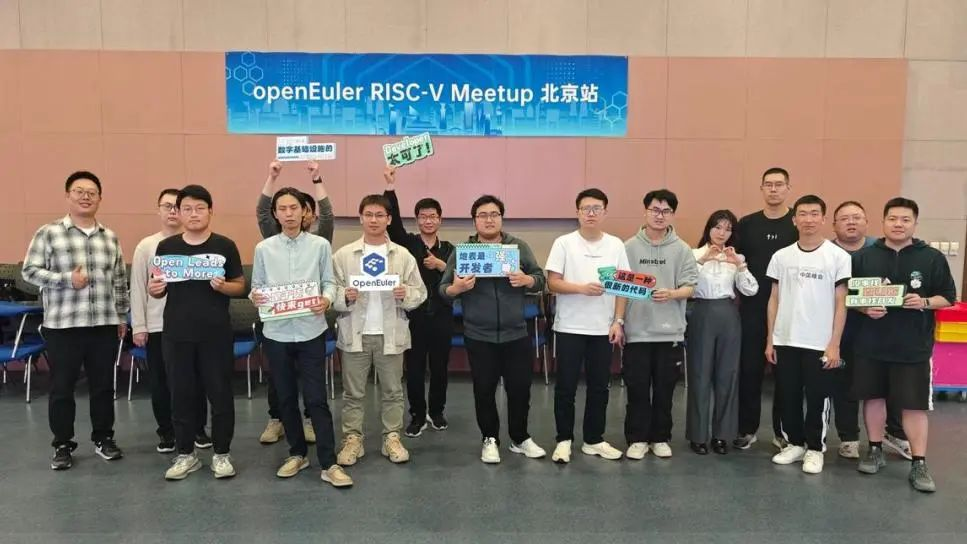
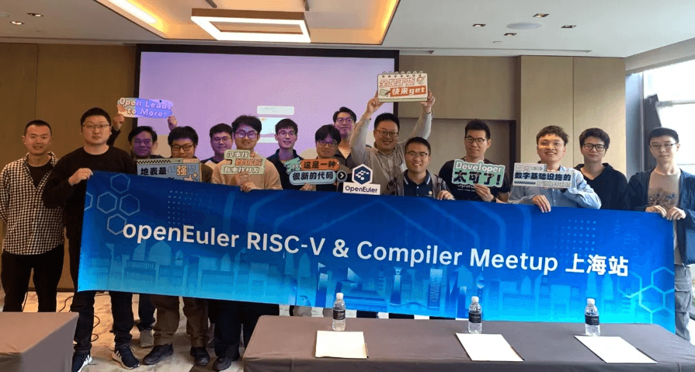
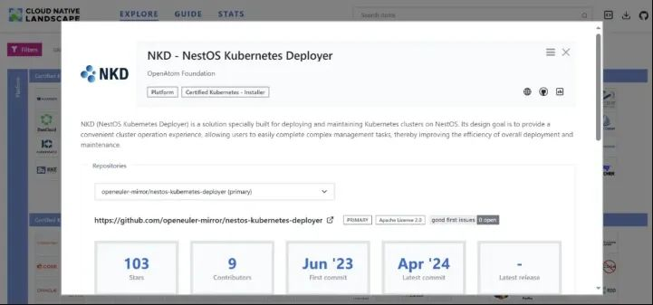
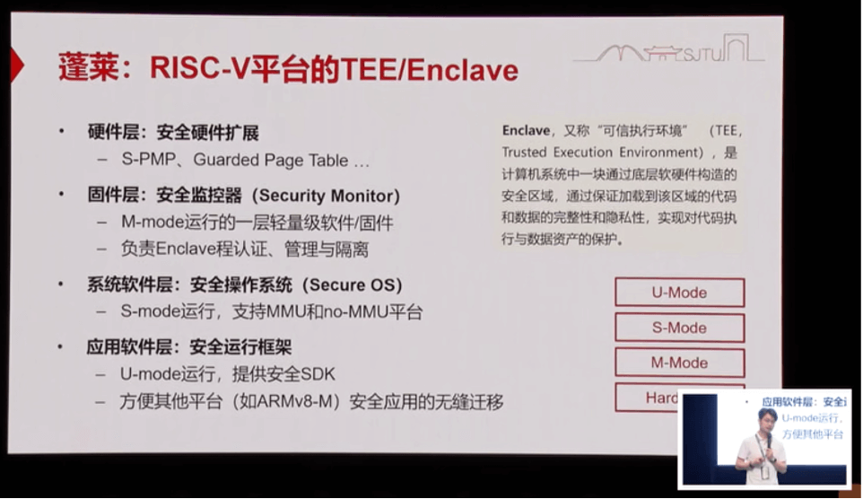
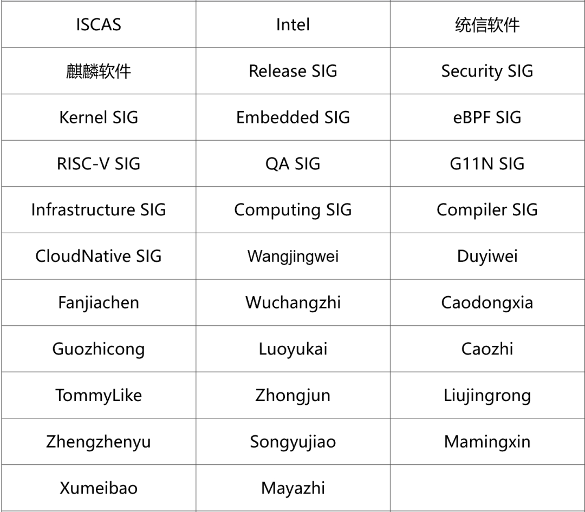

**概述**
-----

2024年4月19日，2023-2024年 OpenAtom openEuler （简称：openEuler )
技术委员会线下会议在南京召开，本次会议由江苏润和软件股份有限公司承办，感谢润和软件对社区的支持。

本次会上，经全体技术委员会委员讨论决议，同意 OceanBase
技术团队在社区创建 OceanBase
SIG，共同推动双方的技术合作，促进生态发展；同意后续规划成立 SBOM SIG
帮助 openEuler 社区及 OSV 进一步完善 SBOM
的能力，保障供应链安全。同时，全体委员对 openEuler 24.03
LTS版本发布计划、openEuler
基础设施2024年度规划等多项社区工作规划进行了审视并提出完善建议。

 在技术发展方面，社区原创项目 NestOS Kubernetes Deployer (简称：NKD)
通过 CNCF K8s 一致性认证，成功加入CNCF
Landscape。基于eBPF实现的高性能网络QoS管理程序
bwm、Linux系统安全检查工具 secureguardian、ssh快速连接工具 ssh-utils
等项目已在社区建仓并运作。此外，Intel Arch SIG 正积极推进 openEuler 对
Intel 下一代 Xeon 平台两个系列产品的支持。Release、RISC-V、Embedded 等
SIG 组正加速向 24.03 LTS 冲刺。openEuler RISC-V 引入蓬莱 TEE
，预计作为一个安全特性随 openEuler RISC-V 24.03 LTS 发布。

本月初，openEuler
社区携手中科院软件所、华为、麒麟软件、Linaro、润和软件、统信软件、EasyStack、湖南大学等成员单位共同参加国际开源盛会
FOSSASIA Summit 2024，给来自东南亚的金融、互联网等行业用户展现 openEuler
在多样性算力支持的优势，吸引了众多开源爱好者与行业专家的关注。

此外，Kubernetes Community Days Shanghai
2024、第二届eBPF开发者大会、OpenInfra
基金会线上PTG会议等大会相继举办，openEuler 社区各 SIG
组积极参加，在云原生、eBPF、OpenStack等领域贡献 openEuler
的技术，进一步服务开发者。

本月，社区持续在各个城市活跃。RISC-V、 Compiler 等 SIG
组开发者相继在北京、上海举办Meetup活动。在高校人才培养方面，开放原子开源大赛
openEuler AI 应用挑战赛正式结赛。开源之夏 2024
学生报名通道已开启，openEuler 社区项目累计上线 95
个项目任务，同学们可以在开源之夏官网（https://summer-ospp.ac.cn/）浏览社区的项目信息，主动联系感兴趣的项目导师，深入了解项目内容。

随着开发者对社区的进一步互动需求的增加，openEuler 于 Discord
平台开设了专属频道（https://discord.gg/qjNYqbV2），诚挚邀请广大开发者加入该频道，与全球开发者一起探讨最新的技术趋势，共同推动开源生态的发展。

本月报阅读时长预计20分钟。

**社区规模**
------

截至2024年4月30日，openEuler
社区用户累计超过238万。超过1.8万名开发者在社区持续贡献。社区累计产生
166.5K个PRs、92.8K条Issues。目前，加入openEuler
社区的单位成员1534家，本月新增27家。

社区贡献看板（截至2024/04/30）

**社区事件**
-----

**openEuler携手成员单位亮相 FOSSASIA Summit 2024**

4月8日，国际开源盛会 FOSSASIA Summit 2024 在越南河内举行。openEuler
社区携手中科院软件所、华为、麒麟软件、Linaro、润和软件、统信软件、EasyStack、湖南大学等成员单位共同参展，吸引众多开源爱好者和专业人士，给来自东南亚的金融、互联网等行业用户带来openEuler在多样性算力支持方面的优势，并与世界各地前来参展和观展的IT、软件企业、OS提供商和服务提供商进行了深度交流。

原文阅读

**openEuler 参加 Kubernetes Community Days**

4月20日，Kubernetes Community Day（简称：KCD）在上海召开，openEuler
作为钻石级别参与本次大会。openEuler 社区 Maintainer 郑振宇、openEuler
社区技术专家、麒麟软件高级工程师 王悦良，openEuler
社区技术专家、华为高级软件工程师
姜鹏飞参加了本次活动，向现场开发者们分享了 openEuler
在云原生领域的创新实践和经验。

**openEuler RISC-V Meetup 在北京举办**

4月27日，openEuler RISC-V Meetup 在北京举办。此次活动由社区 RISC-V SIG
与开源软件供应链点亮计划-开源之夏联合发起。活动围绕 openEuler 在 RISC-V
架构的生态建设、版本计划等最新进展以及开源之夏活动中的 RISC-V
相关议题展开讨论，吸引了30余位开源技术专家及爱好者的参加。

**openEuler RISC-V & Compiler SIG Meetup在上海举办**

4月21日，由 openEuler RISC-V SIG、Compiler SIG 以及苦芽科技联合的 Meetup
活动在上海举办。来自华为毕昇团队、中科院软件所、苦芽科技、上海交通大学等单位的30余位专家与爱好者列席，就
openEuler 的新技术特性、RISC-V
架构版本近况及编译器、虚拟机等领域最新进展进行分享与交流，并重点讨论了「LLVM平行宇宙计划」的路线图实施情况。

**openEuler 参加第二届 eBPF 开发者大会**

4月13日，第二届 eBPF 开发者大会在西安邮电大学举办。openEuler 社区
oEVP（openEuler Valuable Professional）任玉鑫，openEuler eBPF SIG
Maintainer 吴长治、陈臻在会上分享了 openEuler 在 eBPF
领域的相关应用与实践，并与现场开发者进行了友好交流。

**openEuler 参加 OpenInfra 基金会线上PTG会议**

4月8日，由OpenInfra基金会发起的PTG会议在线上召开。openEuler
相关领域的技术专家与开发者们参加了本次会议，围绕 openEuler 与 OpenStack
的融合话题，与全球开源开发者进行深入交流，推动 openEuler OpenStack
在技术创新与发展。

**开源之夏 2024 正式启动学生报名**

本月底，开源之夏 2024 学生报名通道正式开启。openEuler 社区项目累计上线
95
个项目任务，涵盖RISC-V、Embedded、Compiler等多个技术领域。同学们可以在开源之夏官网浏览社区的项目信息，主动联系感兴趣的项目导师，深入了解项目内容。

开源之夏官网：https://summer-ospp.ac.cn/

**开放原子"校源行" 暨校源行一周年活动在西安举办**

4月29-30日，开放原子"校源行"（西安站）暨校源行一周年活动在西北工业大学举行。openEuler
社区 Maintainer 郑振宇出席该活动，并为现场开发者与学生介绍
openEuler社区的发展以及社区对开源人才培养的重视，分享openEuler
携手开源之夏的四年发展成果。

**开放原子开源大赛**

**openEuler AI 应用挑战赛正式结赛**

4月17日，开放原子开源大赛 openEuler AI
应用挑战赛决赛路演在江苏南通举办。在现场，进入决赛的6支队伍分别对各自作品进行阐述。最终，队伍"白菜狗说得对"的作品《在openEuler
22.03 LTS-SP2 上，成功适配并构建了PyTorch 2.0.1》摘得桂冠。

作品链接：

https://github.com/xiaodouzi666/openEuler-

**openEuler 社区技术直播开放预约中，欢迎报名**

openEuler
社区B站技术直播开放预约中，如果您想分享您的技术实践、项目成果、开源经验等，与开发者们线上近距离交流。往期回放可在
openEuler B 站上观看。

感兴趣的朋友可联系社区小助手（微信号：openeuler123）预约直播内容。

本月，社区进行了4场技术直播：

**openEuler RISC-V 系列第一期开播**

-   4月29日，RISC-V SIG Committer 罗君分享了"在QEMU-RISC-V 拉取UniProton
并开发自己的RISC-V异常解析器"，开启了openEuler RISC-V
系列直播的第一期。该系列将分为四期，为社区开发者详细解析 RISC-V
的技术特点、优势及应用。欢迎感兴趣的朋友关注。

**openEuler 软件供应链安全SBOM介绍**

-   4月25日，SBOM 工具链 Maintainer 刘政均带来了 openEuler 软件供应链安全
SBOM 的介绍，详细分享了 openEuler 基于 SBOM
实现版本开源软件、License、漏洞的全景可视，看护软件供应链安全合规。

**openEuler 软件包引入&版本发布安全介绍**

-   4月18日，Compiler SIG Maintainer 李彦成带来了openEuler
软件包引入&版本发布安全的分享，详细介绍了社区版本发布网络安全质量要求，以及社区如何对发布件的安全与合规进行验收，让开发者更好的了解社区软件包引入与版本发布的流程与质量要求。

**openEuler 基础设施环境安全介绍**

-   4月10日，openEuler QA与CICD SIG Maintainer 、Release SIG Committer
范佳臣带来了 openEuler 基础设施环境安全的介绍，分享 openEuler
基础设施如何为社区提供安全的净室构建环境，确保每个包的构建安全、可信，以及openEuler基础设施为保证净室构建确立的一套配合包依赖的网络环境设置。
  

**社区治理**
-----

**2023-2024年 openEuler 技术委员会线下会议在南京召开**

4月19日，2023-2024年 openEuler
技术委员会线下会议在南京召开。会上，经全体技术委员会委员讨论决议，同意
OceanBase 技术团队在社区创建 OceanBase
SIG，共同推动双方的技术合作，促进生态发展；同意后续规划成立 SBOM SIG
帮助 openEuler 社区及 OSV 进一步完善 SBOM 的能力，保障供应链安全。

同时全体委员对 openEuler 24.03 LTS 版本发布计划、openEuler
基础设施2024年度规划、openEuler Developer Day
2024等多项社区工作规划进行了审视并提出完善建议。

**技术进展**
-----

**openEuler 孵化项目 NKD 加入 CNCF Landscape**

近日， openEuler 孵化项目 NestOS Kubernetes Deployer（简称：NKD）通过
CNCF K8s 一致性认证（Certified Kubernetes Conformance），成功加入CNCF
Landscape，从属于 Certified Kubernetes -- Installer 分类。

**Intel Arch SIG 正积极推进 openEuler 对 Intel 下一代 Xeon
平台两个系列产品的支持**

Intel Arch SIG 正在积极推进 openEuler 对 Intel 下一代 Xeon
平台两个系列产品的支持，包括注重能效的高密度高扩展的 Sierra Forest
以及注重性能的计算密集型的 Granite Rapids 平台的支持。

目前，Intel Arch SIG 已经在 openEuler
内核和虚拟化等方面完成了这两代平台主要的适配工作，并计划同时在openEuler
22.03 LTS SP4 和 openEuler 24.03 LTS
两个版本中都提供这两代平台的支持。这里主要的工作包括：

-   针对 Intel 新平台的 PMU 的增强；

-   IOMMU 的更新和增强；

-   DSA 2.0 和 DLB 2.0 特性的支持；

-   QAT 2.0 in-tree 驱动在openEuler 的集成和验证；

-   Intel 的统一电源管理框架TPMI的实现（其中包括TPMI driver framework，TPMI
RAPL driver，TPMI ISST driver，TPMI UFS driver等等）；

-   Intel RDT和RAS的增强；

-  intel\_idle driver的更新；

-  以及Intel LAM特性的支持等。

与此同时，Intel Arch SIG 为了能更好地支持不同客户对于 openEuler
不同发行版本的需求，也对 Sierra Forest 和 Granite Rapids
的支持提供了双内核的适配策略。其中这两代新平台的大部分特性会在 22.03 LTS
SP4 中提供 5.10内核的支持；并同时提供全特性版本的 6.6 内核对应的 24.03
LTS的支持。

此外，Intel Arch SIG 也在 openEuler 社区积极推进 Intel
平台上更丰富的测试和验证工作以及 Intel oneAPI 完整的软件栈在 openEuler
的进一步适配工作等。

**openEuler Embedded 正加速向 24.03 LTS 冲刺**

openEuler Embedded 正加速向 24.03 LTS 版本冲刺，本月完成的工作，包括：

-   全量软件包升级对齐到 24.03 LTS版本；

-  内核支持 6.6， 覆盖 x86-64，树莓派4B和qemu, 并支持 Preempt-RT
特性。openEuler Embedded 24.03-LTS 将同时支持5.10和6.6两个内核版本；

-   进一步完善嵌入式图性支持，目前已经已经可以支持基于 qtwebengine
的浏览器；

-   可以生成符合 docker 格式的嵌入式容器镜像，大小为9MB, 并可以在集成 iSulad
的 openEuler Embedded 容器OS中运行。

**openEuler RISC-V 引入蓬莱 TEE**

蓬莱由上海交通大学开发，是国内第一个支持 RISC-V 的开源 TEE
解决方案，预计作为一个安全特性随 openEuler RISC-V 24.03 LTS
一起发布。RISC-V SIG 会将蓬莱 TEE 打包成 sdk
的形式提供支持，让用户可以体验或者自己编写简单的 TEE
应用软件，同时可以基于 sdk 编译体验在 RISC-V 架构下 机密计算框架
secGear。

**高性能网络QoS管理程序 bwm 在社区开源，并在Volcano中集成部署**

bwm (Bandwidth Management) 是基于 eBPF
实现的高性能网络QoS管理程序，基于报文染色、EDT带宽调整等技术，保障云上不同类型应用混部下网络QoS不受损，在线业务带宽抢占时延\<100ms。该项目已在
openEuler 社区开源，并在华为云 volcano 中集成部署。

项目地址：

https://gitee.com/openeuler/oncn-bwm

**Linux 系统安全检查工具 secureguardian 项目在社区建仓**

secureguardian 是一款基于《openEuler 安全配置基线》开发的 Linux
系统安全检查工具，旨在帮助系统管理员评估和提高系统的安全性。该项目由麒麟软件发起、security-facility
SIG 维护管理，目前已在 openEuler 完成建仓工作。

secureguardian 的架构设计核心聚焦于实现对 Linux
系统配置进行系统性的安全性评估。它采纳了一种模块化的脚本策略来进行操作，这一策略极大地促进了高度的可定制性和扩展能力。

项目地址：

https://gitee.com/openeuler/secureguardian

openEuler 安全配置基线：

https://gitee.com/openeuler/security-committee/blob/master/secure-configuration-benchmark/release/openEuler安全配置基线.md

**ssh 快速连接工具 ssh-utils 项目在社区建仓**

由统信软件发起、memsafety SIG 维护管理的 ssh-utils 项目已在 openEuler
社区完成建仓工作。ssh-utils 是一款基于 Rust 语言实现的 ssh
快速连接工具，旨在为 openEuler
用户提供一个快速、简单且安全的远程连接解决方案。

传统的远程连接方式通常需要多个步骤，包括输入服务器地址、用户名、密码等，耗时长且容易出错。随着机器和用户的增多，每台机器和用户密码的不同，导致时间成本越来越高。ssh-utils
项目主要解决 openEuler 用户在使用 console
进行远程连接服务器时的繁琐步骤，提升整体工作效率：

简化操作流程：用户只需输入简单的命令即可快速连接到远程服务器。

增强用户体验：提供直观的命令行界面，使用户能够轻松选择和切换不同的服务器和用户。

提高工作效率：通过减少用户在远程连接过程中的操作步骤，大大缩短每次连接远程服务器的时间，提升用户工作效率。

ssh-utils
项目已完成技术架构方案设计，预计8月份将完成核心功能开发（包括命令行解析、服务器连接、服务器列表的展示和选择机制等），其1.0版本将随openEuler
23.09版本一同发布。

项目地址：

  

https://gitee.com/openeuler/ssh-utils

**软硬件兼容性认证**

2024年4月，兼容性方案 1605 个，北向 1056 个，南向 474 个，OS 141
个。4月新增 北向 35 个，南向 7 个，OS 5 个。

社区兼容性列表：

https://www.openeuler.org/zh/compatibility/

**安全公告**

2024年4月，社区共发布安全公告 168 个，修复漏洞 194 个（其中 Critical 7
个，High 43 个，其它 144 个）。

**重点漏洞提醒**

如下漏洞评估影响较大，请重点关注：

基于FreeRDP的3.5.1之前版本的客户端易受越界读取攻击（CVE-2024-32659）

CVSS评分为 9.8 分

公告链接：

https://www.openeuler.org/zh/security/cve/detail/?cveId=CVE-2024-32659&packageName=freerdp

影响范围：

openEuler-20.03-LTS-SP1

openEuler-20.03-LTS-SP4

openEuler-22.03-LTS

openEuler-22.03-LTS-SP1

openEuler-22.03-LTS-SP2

openEuler-22.03-LTS-SP3

基于FreeRDP的3.5.1之前版本的客户端易受越界读取攻击（CVE-2024-32658）

CVSS评分为9.8分

公告链接：

https://www.openeuler.org/zh/security/cve/detail/?cveId=CVE-2024-32658&packageName=freerdp

影响范围：

openEuler-20.03-LTS-SP1

openEuler-20.03-LTS-SP4

openEuler-22.03-LTS

openEuler-22.03-LTS-SP1

openEuler-22.03-LTS-SP2

openEuler-22.03-LTS-SP3

基于FreeRDP的3.5.0或2.11.6之前版本的客户端易受整数溢出和越界写入的攻击（CVE-2024-32039）

CVSS评分为9.8分

公告链接：

https://www.openeuler.org/zh/security/cve/detail/?cveId=CVE-2024-32039&packageName=freerdp

影响范围：

openEuler-20.03-LTS-SP1

openEuler-20.03-LTS-SP4

openEuler-22.03-LTS

openEuler-22.03-LTS-SP1

openEuler-22.03-LTS-SP2

openEuler-22.03-LTS-SP3

 

基于FreeRDP的3.5.0或2.11.6之前版本的客户端和服务器易受越界读取攻击（CVE-2024-32459）

CVSS评分为9.8分

公告链接：

https://www.openeuler.org/zh/security/cve/detail/?cveId=CVE-2024-32459&packageName=freerdp

影响范围：

openEuler-20.03-LTS-SP1

openEuler-20.03-LTS-SP4

openEuler-22.03-LTS

openEuler-22.03-LTS-SP1

openEuler-22.03-LTS-SP2

openEuler-22.03-LTS-SP3

 

基于FreeRDP的3.5.0或2.11.6之前版本的客户端易受越界读取攻击（CVE-2024-32041）

CVSS评分为9.8分

公告链接：

https://www.openeuler.org/zh/security/cve/detail/?cveId=CVE-2024-32041&packageName=freerdp

影响范围：

openEuler-20.03-LTS-SP1

openEuler-20.03-LTS-SP4

openEuler-22.03-LTS 

openEuler-22.03-LTS-SP1

openEuler-22.03-LTS-SP2

openEuler-22.03-LTS-SP3

 

基于FreeRDP的3.5.0或2.11.6之前版本的客户端易受越界读取攻击（CVE-2024-32458）

CVSS评分为9.8分

公告链接：

https://www.openeuler.org/zh/security/cve/detail/?cveId=CVE-2024-32458&packageName=freerdp

影响范围：

openEuler-20.03-LTS-SP1

openEuler-20.03-LTS-SP4

openEuler-22.03-LTS

openEuler-22.03-LTS-SP1

openEuler-22.03-LTS-SP2

openEuler-22.03-LTS-SP3

 

Artifex Ghostscript在9.53.0之前的版本中存在越界写入（CVE-2020-36773）

CVSS评分为9.8分

公告链接：

https://www.openeuler.org/zh/security/cve/detail/?cveId=CVE-2020-36773&packageName=ghostscript

影响范围：

openEuler-20.03-LTS-SP1

openEuler-20.03-LTS-SP4

**漏洞防护**

openEuler社区针对在维版本例行修复漏洞，发布安全补丁。建议用户关注openEuler官网安全公告，及时安装漏洞补丁进行防护。

openEuler 安全公告：

https://www.openeuler.org/zh/security/security-bulletins/

**感谢每一位朋友、开发者的支持**

因为大家的辛勤贡献，openEuler
的每一天都发生着好的事情。小编限于视野和能力，难免有所遗漏，在此表示歉意。同时，衷心感谢社区朋友、开发者们以及openEuler
SIG组成员的贡献：

\* 以上不分先后顺序

如果您希望在月报中增加您的工作内容，或对内容有任何改进建议，请联系wengqiaozhen@openeuler.sh。
