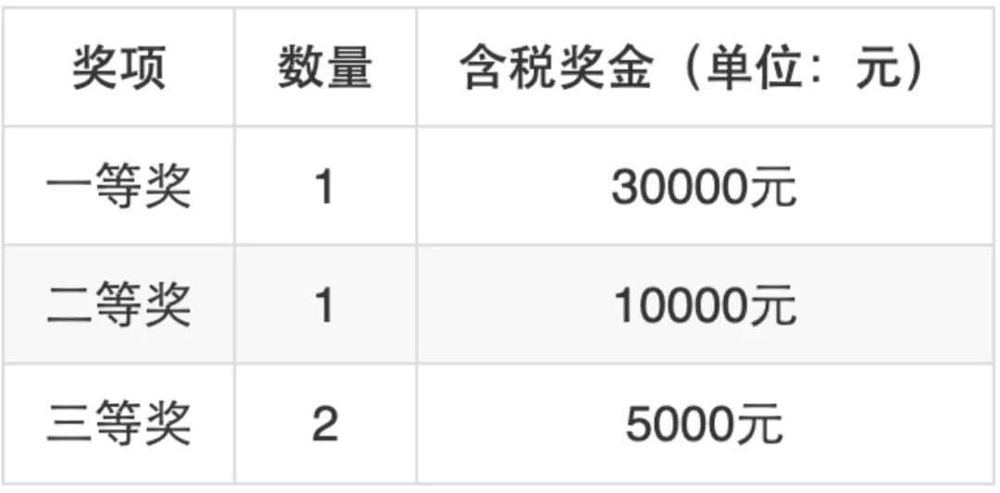

**赛事介绍**
-----

第七届CCF开源创新大赛由中国计算机学会（CCF）主办，长沙理工大学、CCF开源发展委员会联合承办。大赛面向国家"十四五"开源生态发展战略布局，聚焦"卡脖子"软件领域以及人工智能、大数据、芯片设计、物联网等前沿技术领域的开源软件，旨在为国内开源社区提供展示、交流、合作的平台，激发开源创新活力，培养开源实践人才，助力开源生态建设的高质量发展。

**openEuler赛题介绍**
-----

本届赛事中，openEuler在开源项目贡献赛道中共分为2个赛题，主要聚焦在openEuler操作系统的内存池管理与用户态线程设计与调度两个方向。

**赛题一：新型内存池管理策略**

赛题介绍：内存池管理是内存管理的重要部分，其决定了由哪个内存池来满足给定的内存分配请求。现有策略包括first
fit（第一个有足够空闲内存的内存池），size
segregated（每个内存池只服务指定大小的分配请求）等。前沿要求一直在探索新的管理策略，以优化内存管理的众多不同性能需求，比如最新论文提出一种新的策略，即一个内存池来满足生命周期相近的分配请求。本课题内容探索新的管理策略。

详见赛题项目issue：

https://gitlink.org.cn/ryuxin/new-memory

**赛题二：高效用户态线程设计与调度**

赛题介绍：用户态线程是实现parallel
loop和SIMD的一个典型途径，例如openmp，已成为系统的基础组件。他自动将数据分成多块，并分发给多个线程并行处理。但现有用户态线程系统由于负载均衡、调度分发等问题，不能高效地支持嵌套并行、应用混布等场景。该题目设计新的用户态线程架构和调度算法，并移植到更多场景应用。

详见赛题项目issue：

https://gitlink.org.cn/ryuxin/new-scheduler/tree/master

**赛程安排（拟定）**
-----

报名时间：2024年5月27日-2024年9月20日

初赛时间：2024年5月27日-2024年9月20日

初赛评审：2024年9月23日-2024年9月27日

决赛路演：2024年10月11日

决赛评审：2024年10月12日-2024年10月18日

颁奖典礼：2024年11月

**赛事激励**
-----

两道赛题奖金各5w，共计奖金10w。

奖项安排如下：

将为获奖队伍提供openEuler社区开源实习免测试资格。

openEuler社区开源实习（线上）信息官网页面：

https://www.openeuler.org/zh/internship/

3️获奖队伍将获得社区周边礼品。

**联系我们**
-----

感兴趣的同学可进微信交流群，赛事培训相关讯息将在群内通知，若二维码过期可添加openEuler小助手（openeuler123）

备注"第七届开源大赛"，进入群聊以便项目答疑或通知后续赛事信息。

**赛事详情&报名入口：**
-----

https://www.gitlink.org.cn/competitions/track1\_openEuler

大牛导师，万元奖金！盛夏来袭，待君夺冠！
