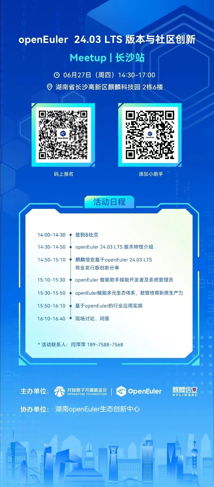

就在6月27日，OpenAtom
openEuler（简称\"openEuler\"）社区与麒麟信安将在长沙联合主办openEuler
24.03 LTS
版本与社区创新Meetup！向湖南区域的开发者和用户对最新发布的openEuler
24.03 LTS版本进行深入分享和解读，欢迎感兴趣的朋友来现场交流\~

**活动信息**

**主办单位**：openEuler 社区、麒麟信安

**协办单位**：湖南openEuler生态创新中心

**时间**：2024年6月27日 14:30-17:00

**地点**：湖南省长沙高新区麒麟科技园 2栋6楼

**活动议程**

