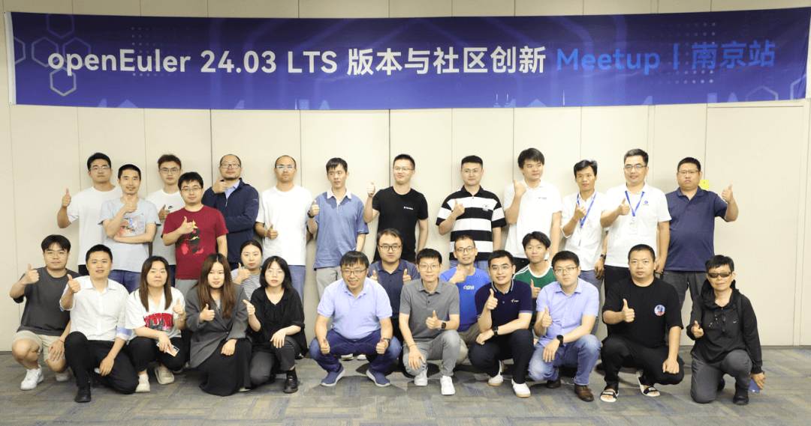
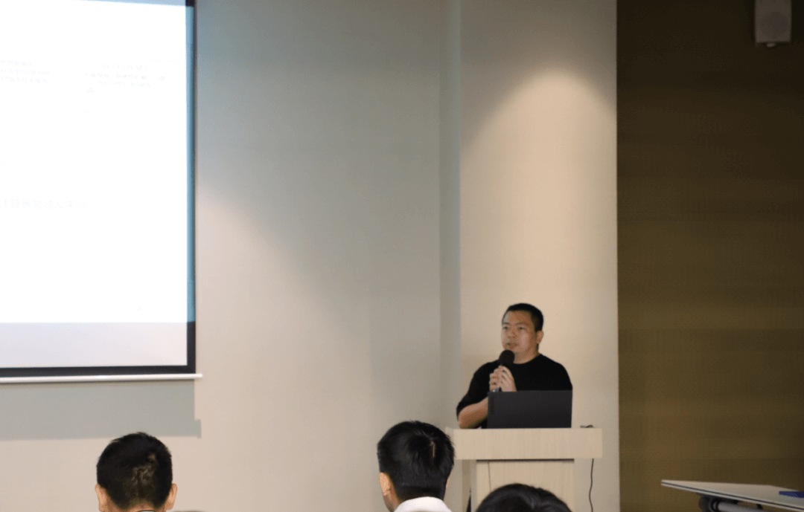
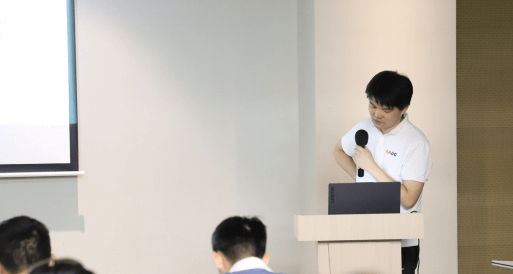
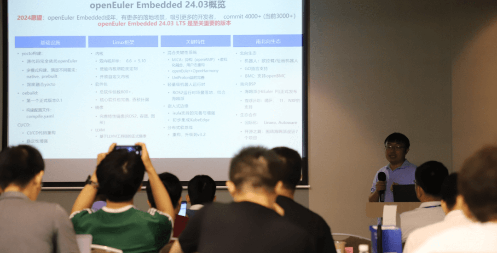
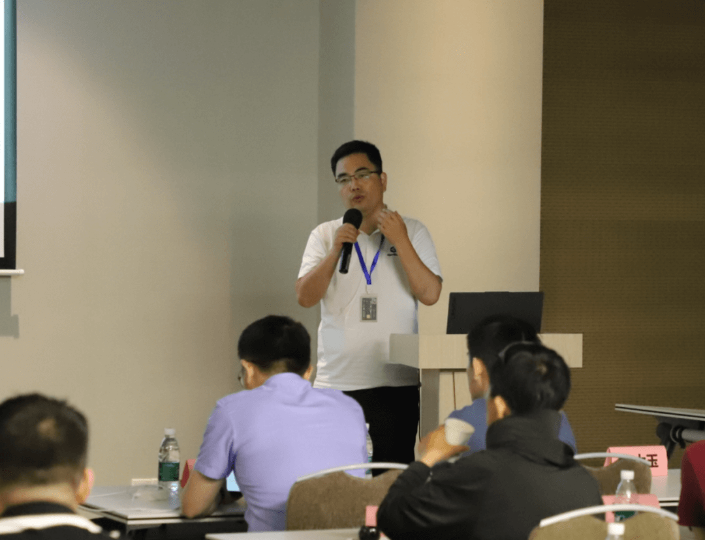
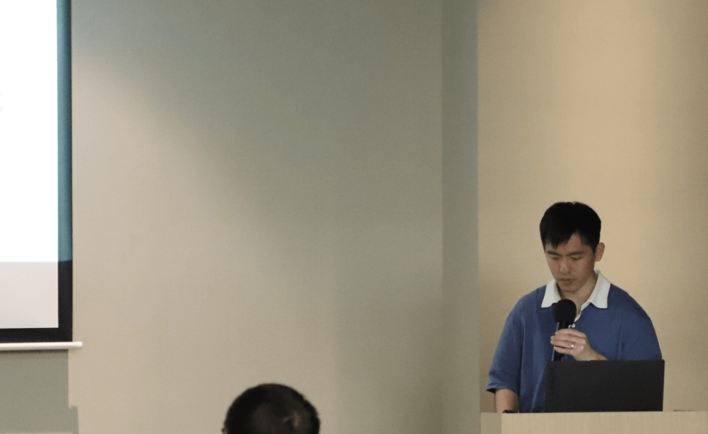
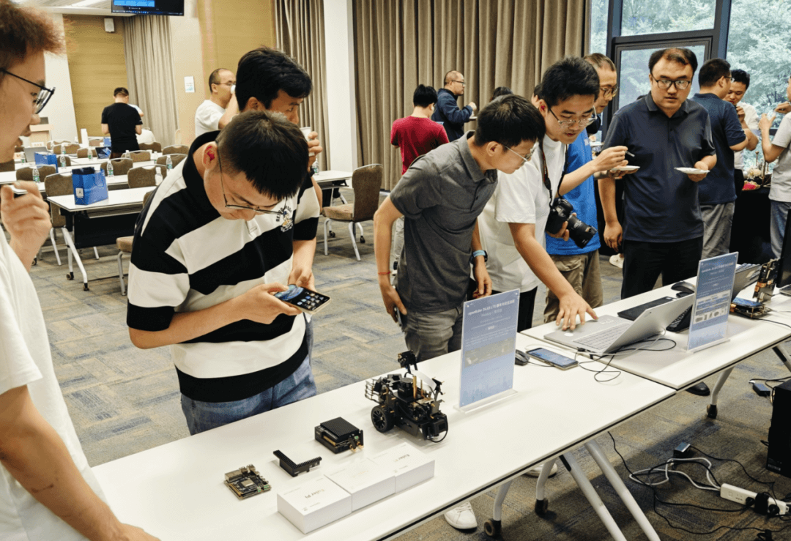

OpenAtom openEuler（简称\"openEuler\"） 24.03
LTS 版本于6月6日在北京发布后引起了广泛关注。为了进一步推广该版本特性和技术进展，**openEuler社区与江苏润和软件股份有限公司于6月21日在南京举办了一场围绕AI、嵌入式、分布式创新进展为主题的Meetup**，汇聚了来自全国各地近20家单位的 40 余名技术专家、开发者和用户参会交流。

**下面就让我们来回顾本次 Meetup 的内容**
------

openEuler 24.03 LTS
作为首个AI原生开源操作系统，对业界有关操作系统与AI技术融合的探索起到了积极示范效用。openEuler社区sig-Release-Management
Committer苏锦铃、sig-Intelligence Committer赵家麟分别讲解了 openEuler
24.03 LTS 版本特性与大模型自然语言交互平台。

openEuler是覆盖全场景的创新平台，在引领内核创新，夯实云化基座的基础上，打造全场景协同的面向数字基础设施的开源操作系统。openEuler
TC委员任慰、魏建刚分别介绍了openEuler社区在嵌入式、分布式领域的最新成果以及后续的发展计划。

根据IDC数据，2023年openEuler系在中国服务器操作系统市场份额达到36.8%。开源四年，openEuler实现了跨越式发展，成长为中国第一服务器操作系统，并在技术创新、生态发展、社区合作、商业落地上建立了完善的发展体系，形成了产业正循环。本次meetup邀请了恒生电子高性能实验室负责人缪栋屹向与会者介绍了openEuler在金融行业的实践成绩与经验。

        本次Meetup现场首次尝试设置了openEuler相关实物展示和互动环节，给与会者带来了近距离地感受openEuler魅力的全新体验。

        本次会议的压轴环节是有关openEuler社区技术创新的圆桌讨论。旨在让与会者围绕分享的主题展开深入、自由的交流，共同探索更多可能性。过程中，整个会场洋溢着热烈而积极的氛围，大家不仅分享了各自的经验和见解，还建立了深厚的友谊和联系。

