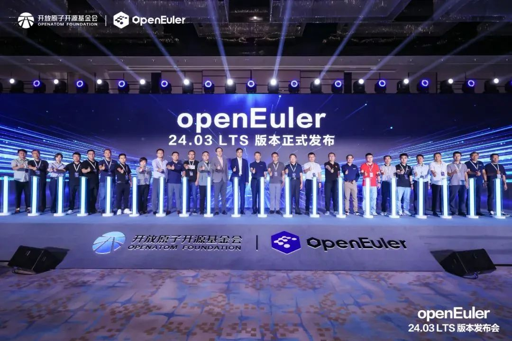
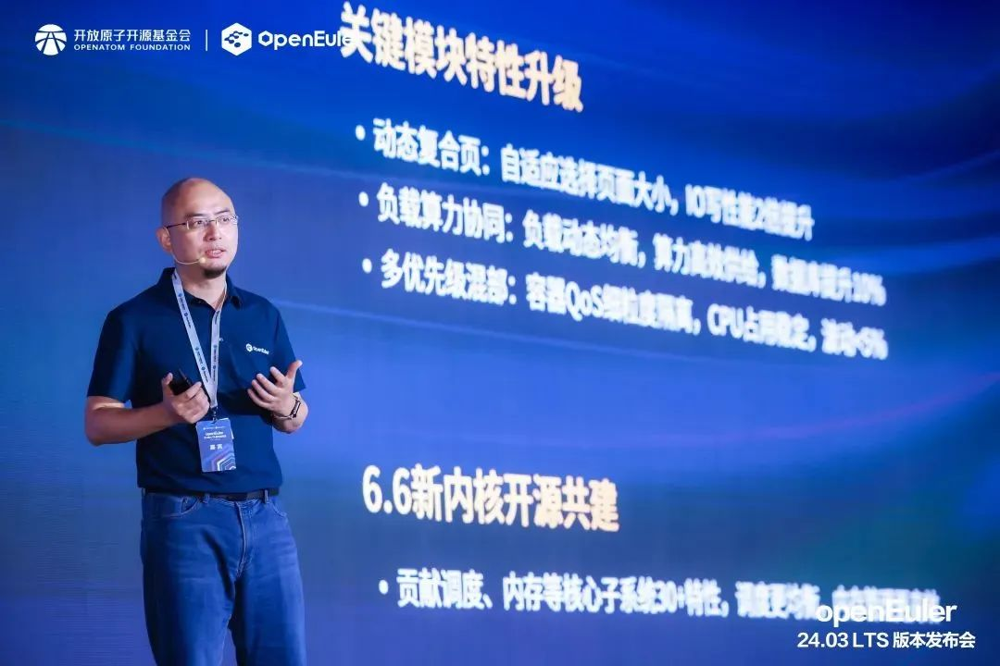
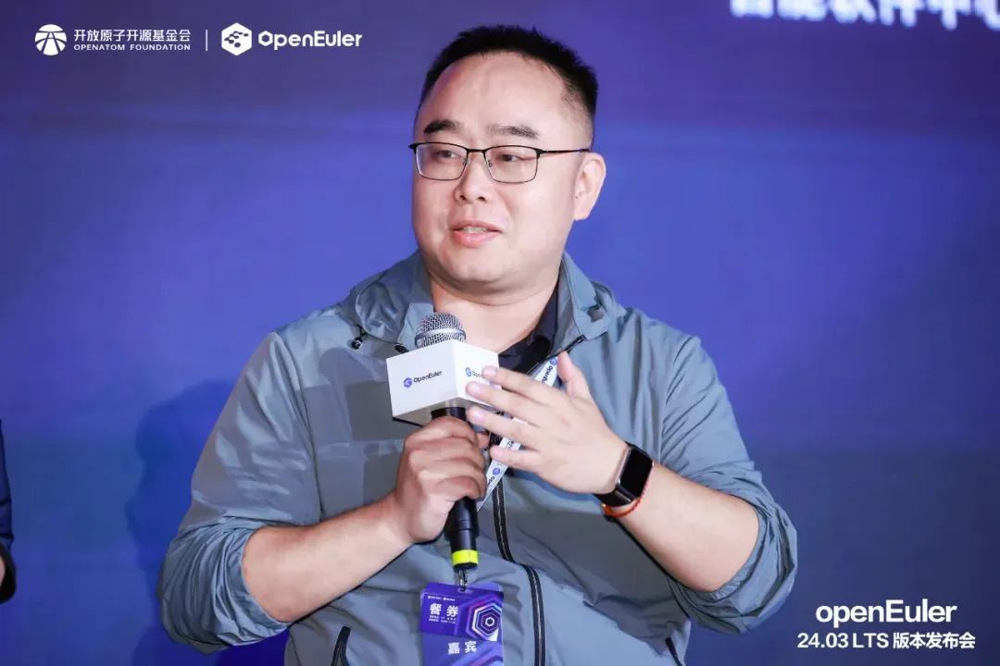

由openEuler社区主办的openEuler 24.03
LTS版本发布会（以下简称"发布会"）在北京成功举办。统信软件受邀出席本次发布会，与开放原子开源基金会及社区伙伴代表共同发布
openEuler 24.03
LTS，共探openEuler社区技术、生态、国际化发展，共建健康可持续发展的开源操作系统根社区。

**四大升级**

**AI原生开源操作系统正式发布**

智能时代，AI无处不在，以大模型为代表的人工智能技术是当前技术发展的重要方向。统信软件与openEuler积极拥抱智能时代，和AI深度结合，引领智能化创新，让操作系统使能AI更高效，AI使能操作系统更智能。

双方共建的openEuler 24.03
LTS版本在基础设施、Linux6.6内核、智能解决方案以及全场景体验四大方面实现了全面升级，为开发者和用户带来了高性能、高可靠、高灵活的开发体验。

目前，openEuler 24.03
LTS版本的ARM64、AMD64、RISC-V、LoongArch64四个架构镜像在社区官网、全球37个镜像点及主流云厂商分发渠道同步上线，**基于该版本技术路线的统信UOS服务器版V25（预览版）也将正式发布。**\

作为openEuler社区创始企业之一，统信软件持续投入社区各方面建设工作，并全程参与24.03
TS版本的技术选型、特性回合和问题修复，助力实现四大升级：

**在基础设施方面------**

首次发布openEuler软件中心，帮助用户快速掌握openEuler社区各领域丰富的软件生态；帮助开发者实时监控上游软件的更新情况，保持特性与上游实时一致。

**在内核方面------**

升级到Linux
6.6版本，CPU调度更均衡、内存管理更高效、虚拟机场景资源利用更灵活。同时，参与贡献动态复合页等关键能力，写性能得到两倍提升；

**在智能解决方案方面------**

通过大模型自然语言交互平台接入oeAware、A-ops、A-Tune实现智能调度、智能运维、智能调优。同时，openEuler更广泛地支持了南向硬件，并覆盖了主流的大模型、框架以及工具链，使能全栈AI，支持Faiss、DCN等推理和检索算法，兼容OpenViNO、Pytorch等主流AI框架，使能Numpy、ACL等基础算法库。

**在全场景体验方面------**

openEuler持续从服务器、云、边缘到嵌入式夯实全场景能力。在服务器场景中，sysSentry可以将已知的CPU故障100%检出使系统更可靠；在云场景中，内存潮汐调度实现容器速度提升80%。

**汇聚力量**

**共探openEuler繁荣之路**

openEuler社区自成立以来，一直致力于打造一个健康、可持续发展的操作系统根社区。会上，统信软件产研平台总经理助理崔湛作为重磅嘉宾，以"汇聚产业力量，共建操作系统根社区"为主题开展圆桌论坛。

**崔湛**表示，从openEuler 20.03 LTS到openEuler 24.03
LTS，每一次迭代都反映了社区对于技术创新的追求和对用户需求的响应。统信软件既为开源做贡献，又从开源中受益，是具备良性循环的双向奔赴。

他指出，在openEuler 24.03
LTS社区版本当中，统信软件基于二十年操作系统研发经验，带来了**DDE桌面、utsudo、utshell、migration-tools**等诸多自研特性。

统信软件主导完成OpenStack
Wallaby/Antelope两个版本的选型、开发、测试、文档编写等工作；

作为Desktop、KDE、Gnome等sig组软件包的主要维护者，完成24.03
LTS版本的软件包的选型、升级和维护工作；

参与完成Base-Service、Programming-Language、Networking、Compiler、Virt等多个sig组基础软件包的开发工作。

智启新程，奔赴山海。未来，统信软件与openEuler将持续携手全球伙伴、用户和开发者，将openEuler打造成国际化的开源协作平台，在中国汇聚全球开源力量，为世界开源贡献中国智慧。
