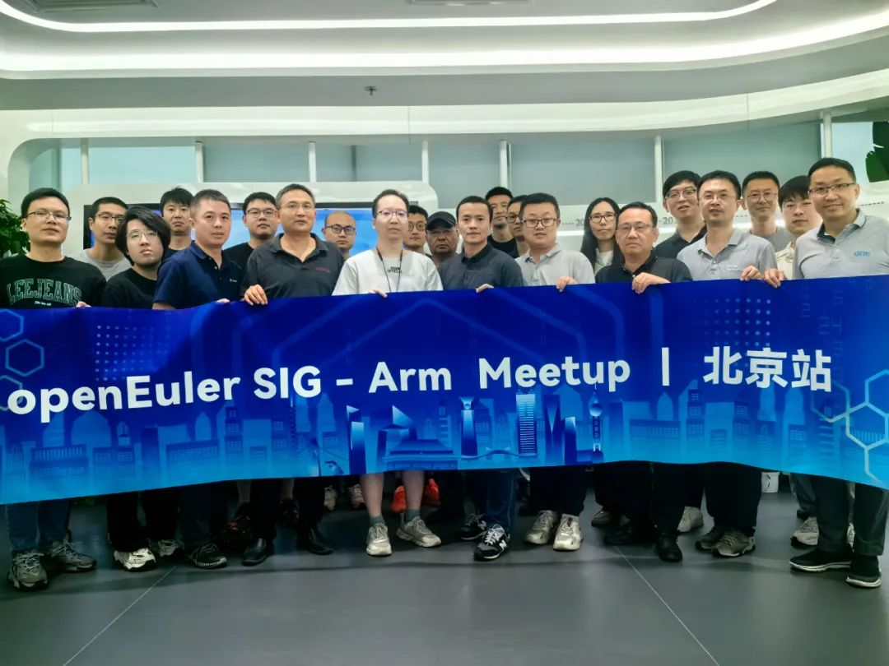
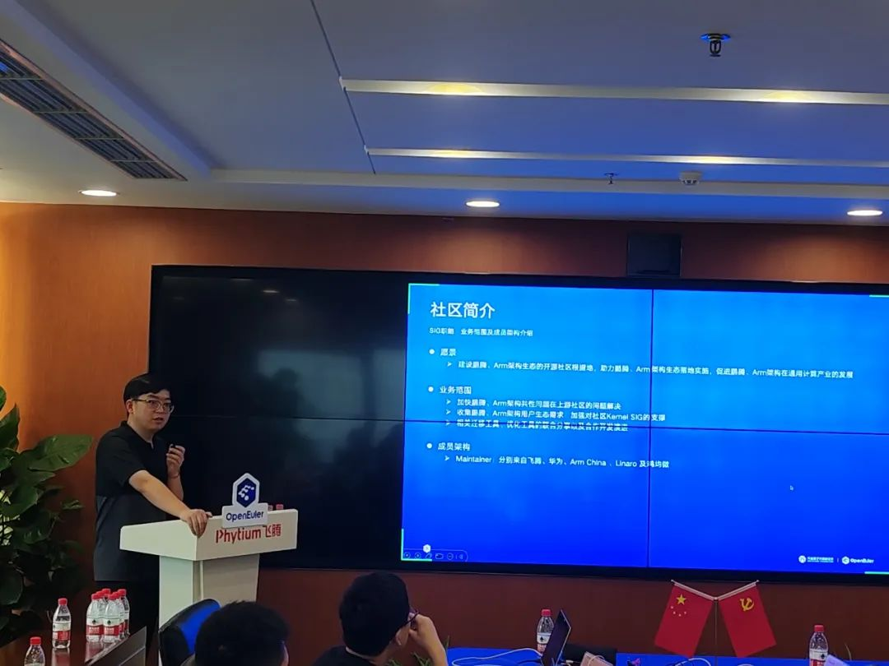
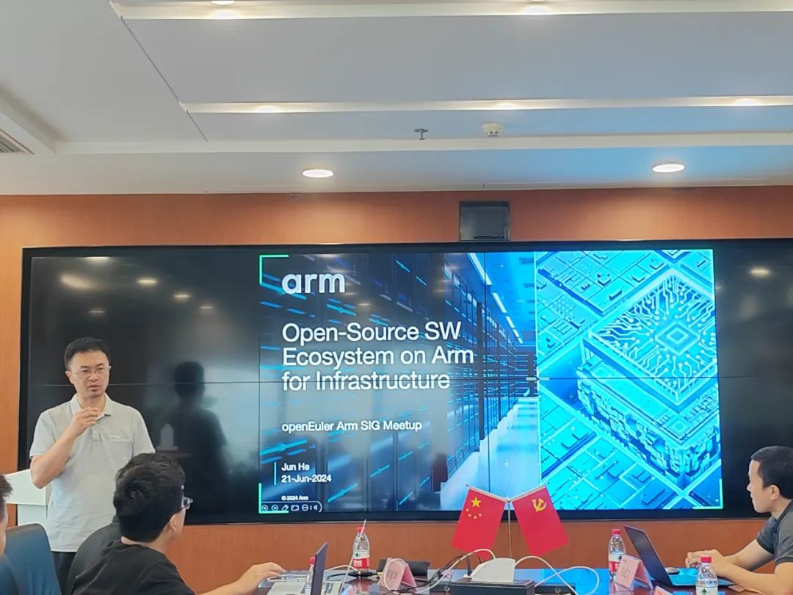
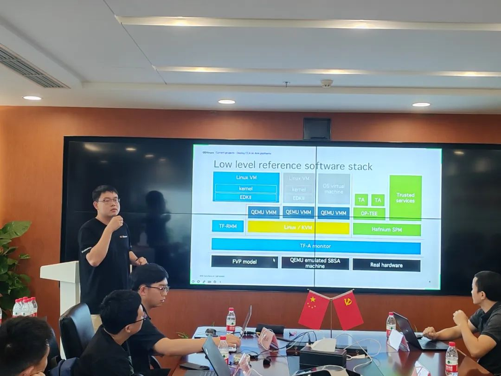
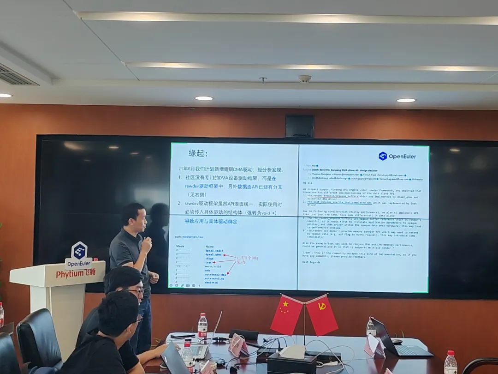
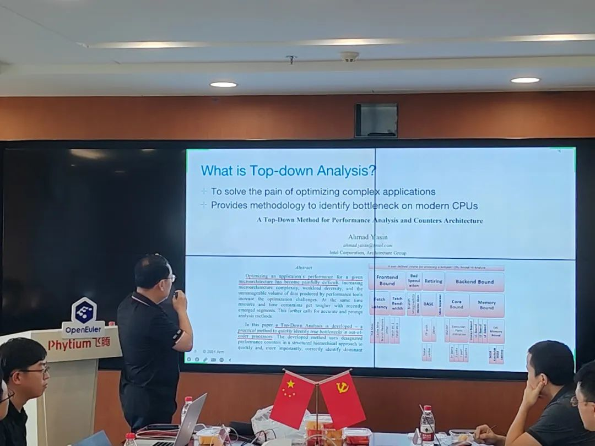
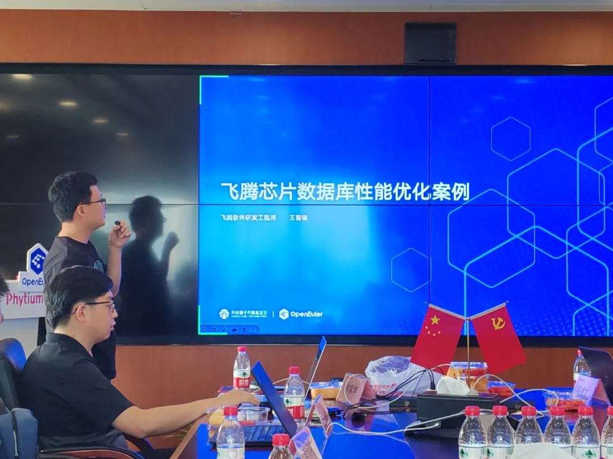
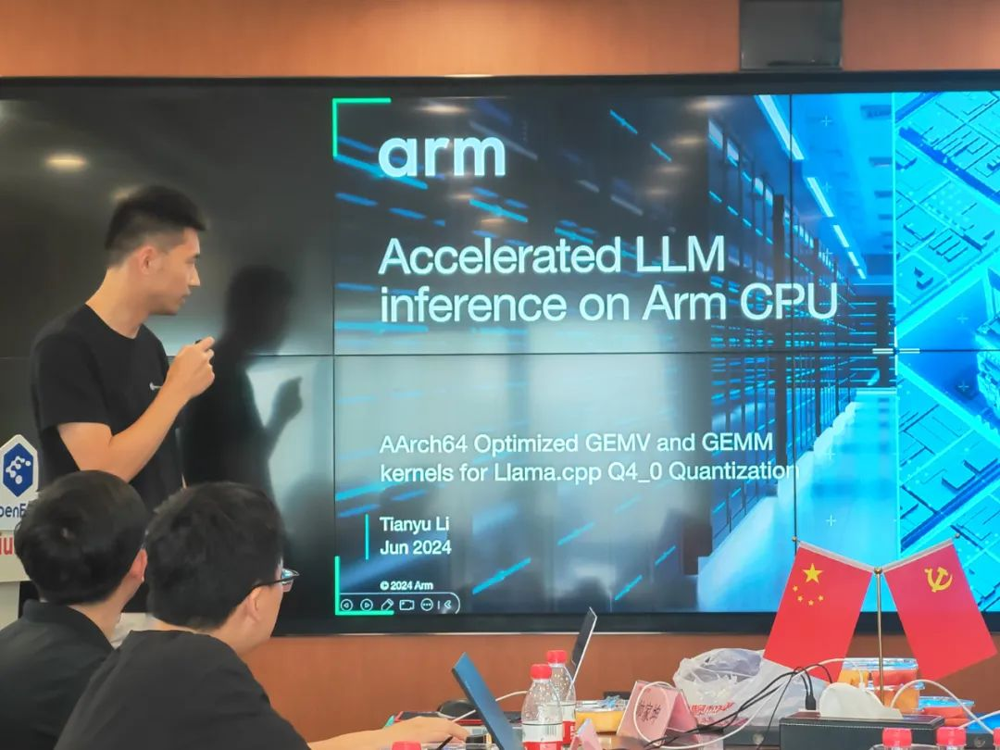

2024年6月21日， OpenAtom openEuler（简称\ openEuler\ ） Arm SIG
在北京举办了一场Meetup活动。此次 Meetup
汇聚了Arm软硬件生态的技术专家和行业先锋，交流内容集中在
Arm架构软件生态的最新进展。同时还展示了Arm架构在典型应用场景中的最佳实践，深入探讨在Arm服务器上的部署与优化技巧，以及未来的发展方向。

**下面就让我们来回顾本次 Meetup的精彩内容**

**（文末有彩蛋）**

**走进openEuler SIG -Arm：SIG工作进展汇报**

openEuler SIG - Arm Maintainer 帅家坤
为我们介绍了openEuler SIG - Arm
的组织架构，成员单位以及成立至今的工作进展。展示了SIG-Arm的发展时间线和重要时刻，以及SIG-Arm的业务范围。

**Arm开源软件生态概览**
---

近年来随着Arm架构在服务器领域的迅速发展和部署，其软件生态也得以蓬勃发展和壮大。从基本的操作系统、系统软件、运行时环境到各种应用框架和工作负载，Arm架构都得到了一流的支持，确保了良好的兼容性与高性能，使得用户能够无缝将应用程序部署在Arm服务器和设备上。充满活力的开源社区在推动Arm软件生态发展中发挥了关键作用。openEuler
SIG - Arm Maintainer，Arm主任软件工程师 贺军 介绍了
Arm在主要开源技术领域中的进展，包括操作系统、虚拟化技术、编程语言运行时等，并分享典型部署与应用场景中的支持情况。

**Arm机密计算框架(CCA)的最新开源进展**
---

作为Arm v9架构最重要的特性，Arm
机密计算架构一直引起业界的关注。伴随着RMM 1.1标准的发布，Arm
CCA的底层支持进入了快轨道，越来越多的参与者加入到Arm
CCA软件生态的建设中来。Linaro数据中心工作组Tech Lead，openEuler SIG -
Arm Maintainer 赵帅 重点介绍了Arm
CCA底层软件支持的进展，以及Linaro在Arm机密计算领域从事的主要工作和下阶段规划。

**DPDK中DMA框架设计、演进**
---

DMA设备驱动21年底合入DPDK21.11版本，正因为有了统一的API
，DMA成为近几年社区创新热点，包括vhost通过DMA加速拷贝、eventdev与dmadev结合（event－dma）；DPDK社区
Maintainer，华为软件工程师 冯成文 介绍了DMA驱动框架设计及对应演进。-

 

**Top-down性能分析与实践**
---

Top-down性能分析方法是一种层次化的性能分析技术，广泛应用于性能瓶颈定位和优化。它通过划分多个层级的性能指标来系统地分析和诊断程序的性能瓶颈。在Arm平台上，通过使用Arm的性能监控单元（PMU）和相关工具，如linux
perf，开发者可以收集和分析详细的Top-down性能数据，识别出性能瓶颈，并针对性地进行优化，从而提升系统的整体性能。Arm公司主任软件工程师
蔡亦波
介绍了在Arm平台上使用Top-down方法对实际工作负载进行分析和优化的工作，以及面临的挑战。

 

**飞腾服务器平台数据库性能优化案例分享**
---

数据库是企业业务的核心，是关键系统正常运行的必要基础组件。如何充分发挥硬件水平，并结合硬件的特性，确保数据库高效稳定运行，是目前软硬件厂商面临的巨大挑战。飞腾资深研发工程师
王智敏 介绍针对飞腾芯片平台下，优化和提升数据库性能的案例。

 

**Arm优化的矩阵乘法内核在llama.cpp中的应用**
---

Arm资深工程师 李天羽
基于llama.cpp推理框架的矩阵乘法内核优化和应用，分析优化的效果，探讨AI软件的趋势和挑战。

**彩蛋！！！**
---

本次 Meetup 的**分享材料**已上传至 openEuler
Gitee仓库。如果您需要本次活动的PDF，可前往
下方链接获取，期待您的下次参与！

链接：https://gitee.com/openeuler/presentations/tree/master/meetup/20240621-Arm%20Meetup

本次
Meetup 的**直播回放**已上传至 B站 openEuler
官方账号。如果您错过了本次线下活动，可前往 B
站关注查看，期待您的下次参与！

链接：https://space.bilibili.com/527064077/channel/collectiondetail?sid=3287907
