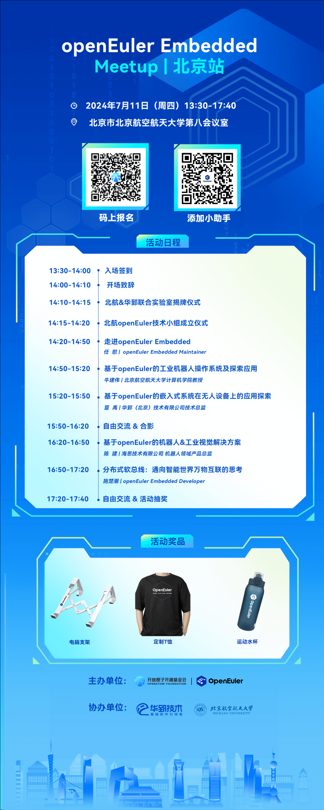

OpenAtom openEuler（简称\"openEuler\"）社区**将于 7月
11日在北京航空航天大学举办一场嵌入式交流的
Meetup**。本次交流活动将邀请多位业内专家，分享在嵌入式领域的实践经验。欢迎大家踊跃报名，
与现场嘉宾和贡献者分享交流嵌入式相关技术实践和畅想。

**活动信息**
----

**主办单位**

openEuler 社区

**协办单位**

华郅（北京）技术有限公司、北京航空航天大学

**时间**

2024年7月11日 13:30-17:40

**地点**

北京市北京航空航天大学第八会议室

**本次Meetup将围绕以下主题展开：**
----

1.嵌入式OS前沿技术分享：分享业界前沿的嵌入式技术，展望嵌入式的未来发展。

2.openEuler 社区嵌入式技术介绍与应用案例分享：展示已经或即将在
openEuler 落地生根的嵌入式技术，并分享其在实际应用中的成功案例。

3.嵌入式技术创新方向与成果分享：分享大家在嵌入式技术创新方向上的工作，以促进更广泛的技术交流和合作。

4.嵌入式芯片开发板优秀实践分享：分享基于业界最新款型开发板的开发调试最佳实践。

**活动议程**
----

