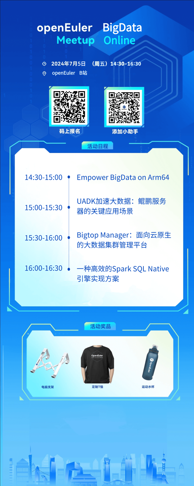

7月5日，OpenAtom openEuler（简称\"openEuler\"） Meetup
Online------大数据Meetup来啦，来自openEuler Bigdata
SIG的4位大咖讲师将带来大数据领域关键技术的分享。

***关键能力展示***

1、大数据项目生态在Arm平台上的应用和性能情况

2、大数据领域使用UADK时的优势以及面临的挑战

3、面向云原生的大数据集群管理平台：Bigtop Manager

4、一种高效的Spark
SQL Native引擎实现方案

**划重点！！！**

***openEuler Meetup Online还准备了多重好礼大放送***

**提问有奖**

每个议题结束后，凡是在线上会议中提问并得到讲师回答的用户，即可获得openEuler社区定制电脑支架
1个，每个议题2个名额，快冲！

**线上抽奖**

本次Meetup
Online分享环节结束后即可参与抽奖，openEuler定制T恤、运动水杯等惊喜好礼等你来拿！答应我！一定要参与到最后～

*会议信息*

