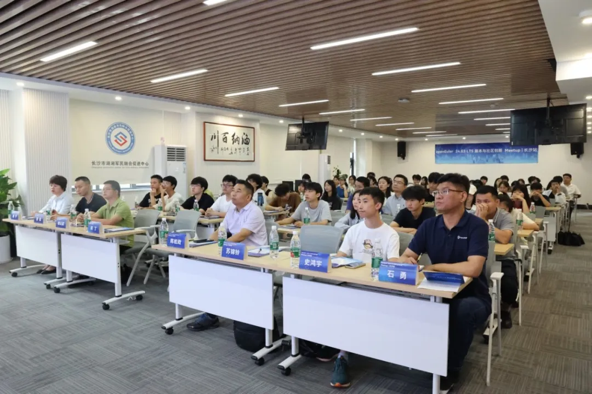
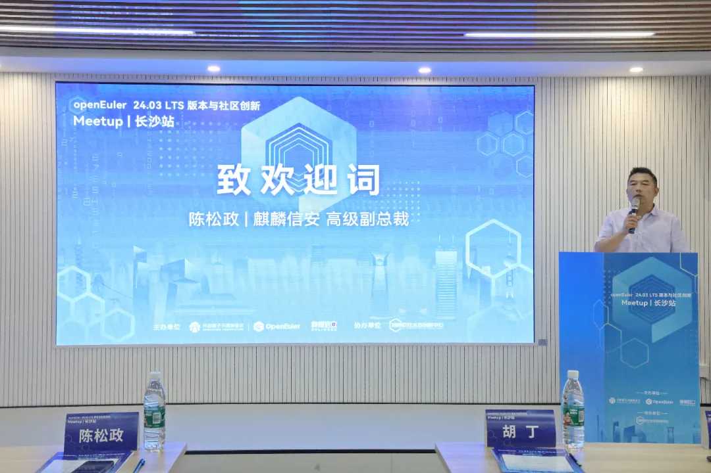
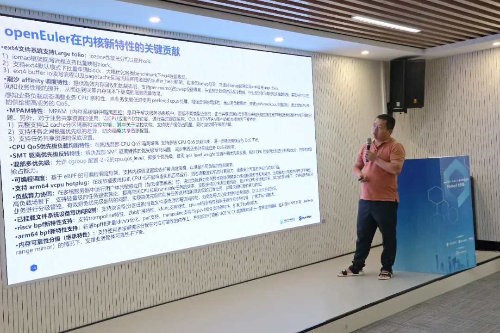
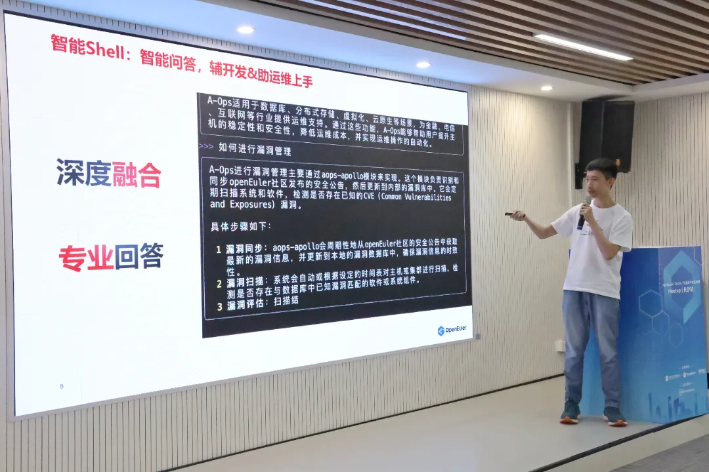
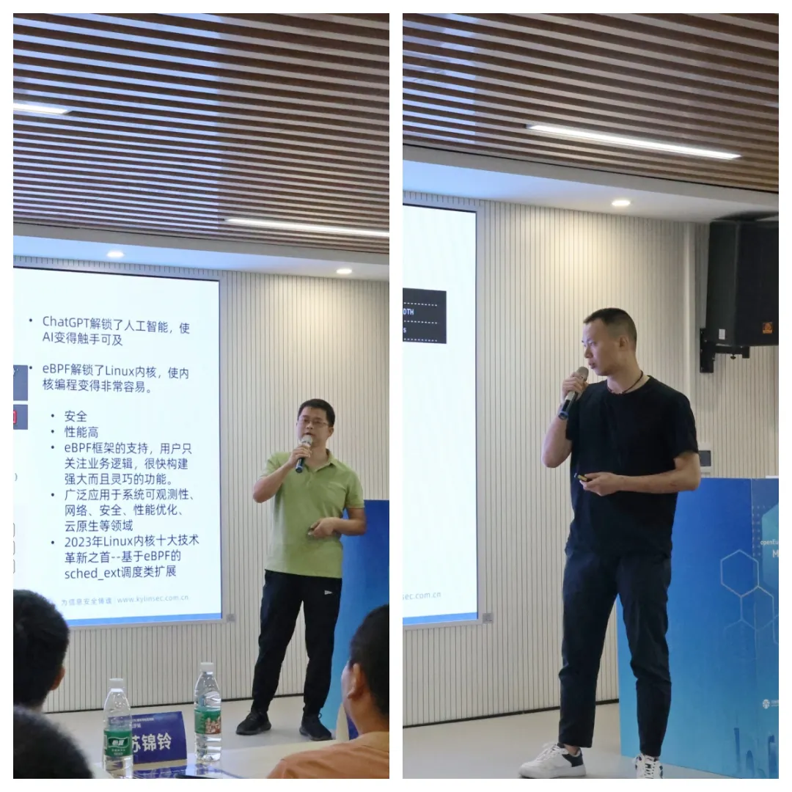
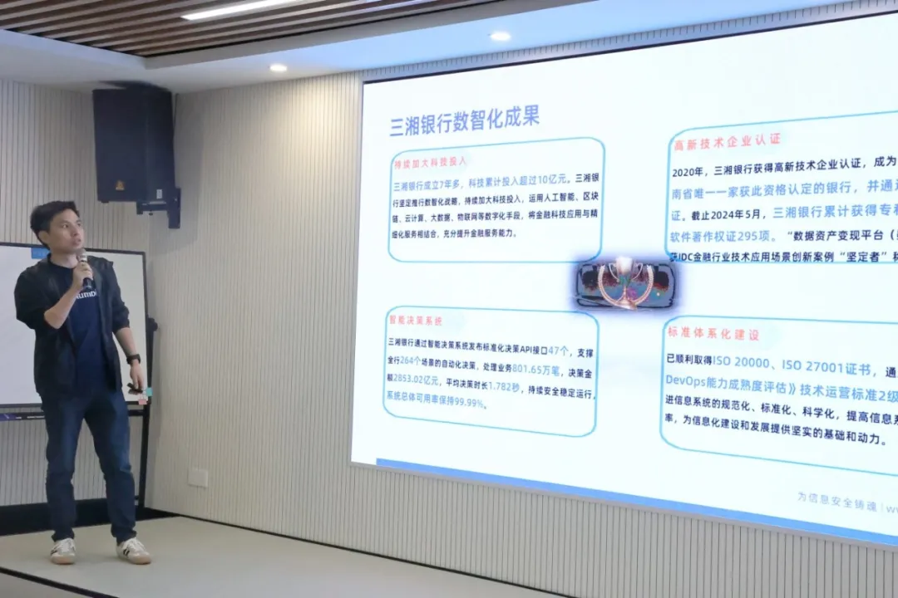

**6月27日下午，由**OpenAtom
openEuler（简称\"openEuler\"）**社区、麒麟信安联合主办的openEuler 24.03
LTS版本与社区创新Meetup长沙站在麒麟科技园举办。**活动对最新发布的openEuler
24.03 LTS版本进行深入分享和解读，吸引了众多技术专家、开发者和用户参加。

麒麟信安高级副总裁陈松政为本次活动致辞。他表示，openEuler社区已成为国内最具活力、最具潜力的操作系统原生根社区，麒麟信安紧跟openEuler同步发布商业版本，见证了openEuler从20.03、22.03到24.03的高速发展。

麒麟信安高级副总裁陈松政致辞

**【特性解读】**

**openEuler 24.03 LTS为用户带来全新体验**

openEuler 24.03
LTS是基于6.6内核的长周期LTS版本，面向服务器、云、边缘计算、AI和嵌入式场景，提供更多新特性和功能，给开发者和用户带来全新的体验。openEuler社区sig-Release-Management
Committer苏锦铃围绕新版本的全年规划、版本特性等内容做深度解读，并表示，社区伙伴及各Sig组maintainer共同规划，将基于6.6内核的新特性、AI、边缘计算等领域及关键技术，持续创新，共同构筑核心竞争力。

openEuler社区sig-Release-Management Committer苏锦铃解读openEuler 24.03
LTS版本

算力逐年拔高，大模型时代来临，sig-inteligence
committer史鸿宇聚焦"openEuler
智能助手赋能开发者及系统管理员"主题，全面介绍openEuler智能Shell产品的优势与使用场景，展现AI
加持的全新shell命令执行、自然语言输入和意图理解、自动问答、操作任务执行、shell
脚本生成等功能。

sig-inteligence committer史鸿宇发表

"openEuler 智能助手赋能开发者及系统管理员"主题演讲

**【商业版发行】**

**麒麟信安率先发布服务器操作系统V3.6.1**

基于openEuler 24.03
LTS，麒麟信安率先同步推出服务器操作系统V3.6.1。麒麟信安操作系统技术工程师秦云高、谭俊重点解析了该版本在供应链安全全生命周期管理、运维工具集、集成Bond3+、增强高可靠网络等方面的特性升级。系列核心创新成果充分展示麒麟信安作为openEuler社区重要贡献者和参与者在国产操作系统领域技术成熟、业内领先。

麒麟信安操作系统技术工程师秦云高、谭俊分析

麒麟信安服务器操作系统V3.6.1

**【应用实践】**

**三湘银行采用基于openEuler的麒麟信安操作系统夯实信息化系统安全底座**

本次活动邀请三湘银行科技处总工胡丁分享《基于openEuler的行业应用实践》，依托麒麟信安提供的Convert2KylinSec可视化迁移工具，三湘银行将原有生产环境中部署的近千套RedHat操作系统平滑迁移为麒麟信安操作系统和openEuler操作系统，迁移过程简单易用、兼容性强、稳定可靠，业务无需重新部署。系统迁移夯实了三湘银行IT信息化系统安全底座，为金融行业自主创新推广提供了可借鉴的技术路线。截至2023年底，openEuler系开源操作系统累计装机量已超过610万套，openEuler操作系统中国新增市场份额达36.8%，快速实现中国服务器操作系统新增市场份额第一，成为推动千行百业转型升级、赋能数智未来的重要根基和支点。

三湘银行科技处总工胡丁分享《基于openEuler的行业应用实践》

本次Meetup长沙站从创新特性、行业应用、生态发展等多维度展现和探讨openEuler
24.03 LTS，相信全新版本的发布将为行业带来更多的可能性。
