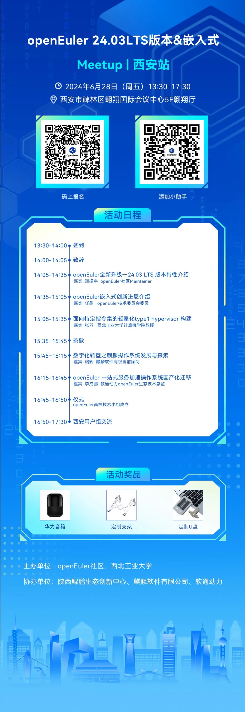

OpenAtom openEuler（简称\"openEuler\"）24.03 LTS
版本有哪新特性？openEuler嵌入式有哪些新进展和应用？6月28日（本周五）openEuler
Meetup西安站邀请社区专家来和开发者与用户进行解读，欢迎大家过来交流\~

**活动信息**
----

**主办单位**

openEuler
社区、西北工业大学

**协办单位**

陕西鲲鹏生态创新中心、麒麟软件有限公司、软通动力

**时间**

2024年6月28日 13:30-17:30

**地点**

西安市碑林区翱翔国际会议中心5F翱翔厅

**活动议程**

----

