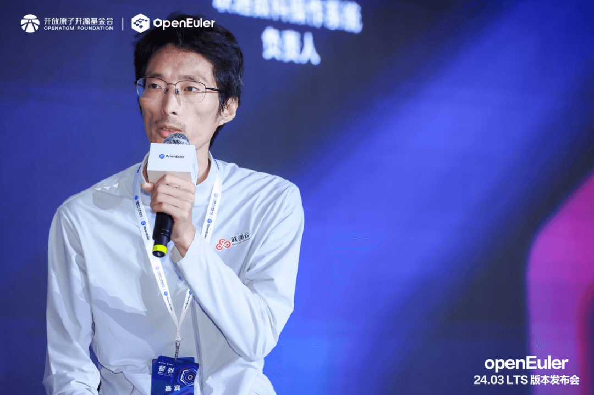

在当前的数字化时代，软硬件协同、云边端协同的发展脉络日渐清晰，云与分布式是未来的技术发展趋势。作为居中调度的中枢神经，操作系统的重要性愈加凸显，市面上众多的操作系统该如何选择？OpenAtom
openEuler（简称\"openEuler\"）作为一款致力于面向全场景、多样性算力的操作系统，在云场景上又有哪些优势？openEuler自诞生以来，便致力于在驱动支持、多样性资源社区接入、构建系统等多方面不断优化。其背后所蕴含的，是对于技术创新的追求和对于开源生态的坚守。而这一切，也为其赢得了来自京东、中国移动、天翼云、联通数科等众多行业领军企业的认可与支持。

从通用算力多样化到智能算力多样化，使能智能时代全场景应用圆桌论坛

在openEuler 24.03 LTS
版本发布会上，来自京东、中国移动、天翼云、联通数科的专家齐聚一堂，围绕"从通用算力多样化到智能算力多样化，使能智能时代全场景应用"的主题展开深入讨论，结合自身业务场景，为openEuler的技术发展及社区生态的打造提供了宝贵的方向及建议。

京东的桑力鹏表示，京东PaaS平台承载了京东所有业务，场景极其复杂。openEuler凭借其**高稳定、高可靠、易维护、多芯多活**等优势，确保了线上业务的稳定运行，将购物时的各种**抖动降到最低**。同时，openEuler强大的扩展性也支撑了京东**200多万容器、1000多万核**的部署规模，为京东的快速发展提供了坚实的技术保障。

中国移动的蔡启申则强调了电信行业对于**高可用、高可靠性**的严格要求。经过严格的对比测试和分析，openEuler在这一方面展现出了**明显的优势**。此外，openEuler社区的**开放性和活跃性**也是中国移动选择openEuler的重要原因。openEuler社区汇聚了芯片领域，包括操作系统领域，以及云计算领域的顶尖厂商，形成了一个非常大的技术联盟，为电信行业提供了更加**稳定、可靠**的操作系统选择。

天翼云的韩怀彤则从使用厂商的角度提出了建议。他认为，使用厂商需要具备一定的研发能力，能够结合自身业务进行一定程度的**定制化开发**。同时，也要积极参与社区，对社区进行有效的反馈，帮助社区改进与发展。这种**双向的互动与协作**，将有助于openEuler不断完善自身，更好地满足用户需求。

联通数科的岳龙广对openEuler的评价简洁而有力：**"稳"**。他表示，在使用和维护openEuler的过程中，基于其**坚如磐石的底座和高度自动化的保障**，解决了很多问题。这使得联通数科在使用openEuler时感到**轻松自如**，也进一步坚定了联通数科对于openEuler的信心和支持。

从这些嘉宾的观点中，我们可以看到openEuler在构建全场景多样性算力操作系统方面的努力和成果。它不仅具备了强大的技术实力和广泛的应用场景覆盖能力，更得到了众多行业领军企业的认可与支持。

未来，openEuler将继续坚持开放、合作、共赢的理念，与全球开发者共同推动openEuler技术的发展和开源生态的打造。同时，openEuler也将积极探索新的应用场景和技术方向，为智能时代的全场景应用提供更加优质、高效、安全的支撑。
