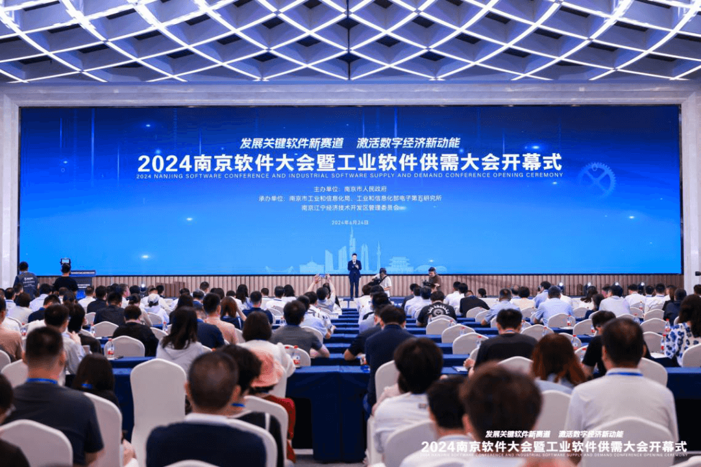
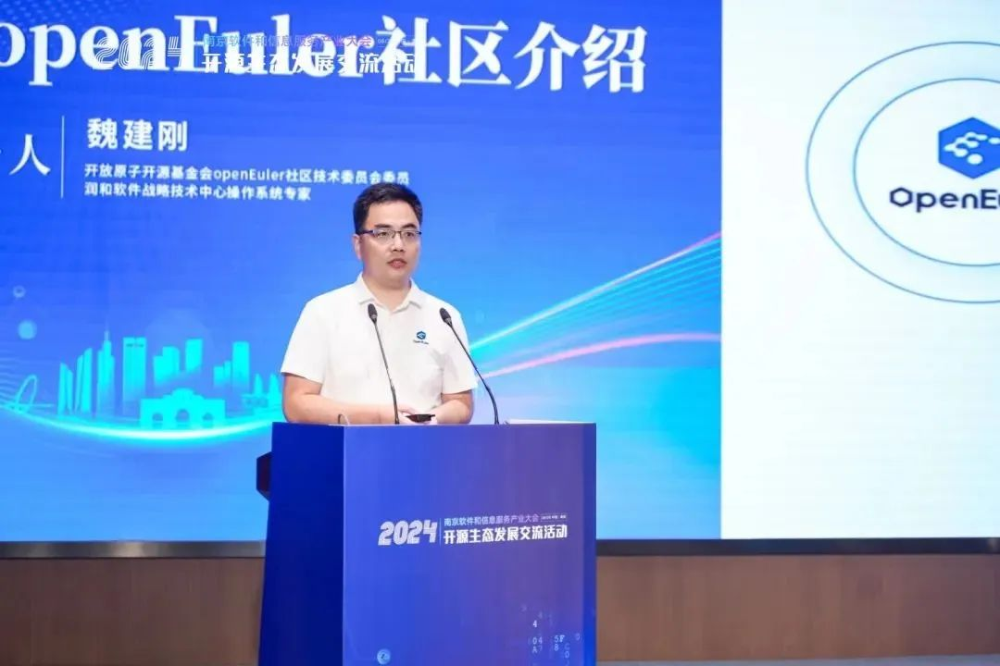

6月24日-26日，2024南京软件大会暨工业软件供需大会在南京上秦淮国际文化交流中心顺利召开。本年度南京软件大会以"发展关键软件新赛道
激活数字经济新动能"为主题，重点围绕工业软件、基础软件、人工智能、开源生态、信息技术应用创新等关键领域，产教融合、数据要素、科技产业金融一体化等前沿课题，以及南京市重点布局的元宇宙、区块链、低空经济等软件新质生产力和数字经济新赛道，打造南京软件产业对外展示的重要窗口、全国软件企业和人才交流合作的重要平台。**OpenAtom
openEuler（简称\"openEuler\"）社区受邀参加本次大会，并进行议题分享。

在"开源实践分享"环节，openEuler社区技术委员会委员、润和软件操作系统专家魏建刚代表openEuler社区做"星火燎原，openEuler社区介绍"的分享。他向与会者详细介绍了openEuler社区组织运营和发展情况。根据IDC数据，2023年openEuler在中国服务器操作系统市场份额达到36.8%。开源四年，openEuler实现了跨越式发展，成长为中国第一服务器操作系统，并在技术创新、生态发展、社区合作、商业落地上建立了完善的发展体系，形成了产业正循环。

南京市作为全国首座中国软件名城，2023年软件业务收入达到了8000亿元，占到江苏全省一半以上，是全省软件产业发展的领头雁。本次大会期间，南京市市长陈之常表示，当前，南京软件业进入了向新而行、提质转型的关键阶段，抓住智能化趋势，加快向"人工智能+"深度转型；顺应融合化趋势，更好为新型工业化赋能增效；紧跟开源化趋势，塑造开放合作产业生态，着力打造万亿级软件和信息服务产业集群，为培育和发展新质生产力提供新的强劲引擎。润和软件作为openEuler社区黄金捐赠人,坚持创新开源技术、推动开源落地、繁荣开源生态,并始终致力于基于openEuler的创新解决方案的产品开发与市场推广,2023年交付重大行业项目的核心业务系统过万套,实现高可靠、高性能运转。2024
年 6 月 6 日，openEuler 24.03 LTS 作为openEuler 首个 AI
原生开源操作系统正式发布。润和软件将以此为契机、依托自身在南京本土数十年的积累，一如既往地深入参与openEuler生态,为江苏本地客户提供更优的操作系统产品与服务。

## openEuler 南京用户组

2022年11月，openEuler南京用户组成立，为南京用户打造一个学习、分享、交流的本地化圈子，至今已在南京举办多场线下Meetup，打造南京地区openEuler交流圈。

openEuler南京用户组成员持续招募中，作为一个区域的用户交流与生态发展平台，用户组成员可以在这里交流openEuler技术、使用经验、案例，向社区反馈用户意见，欢迎加入！

扫码加入openEuler南京用户组
