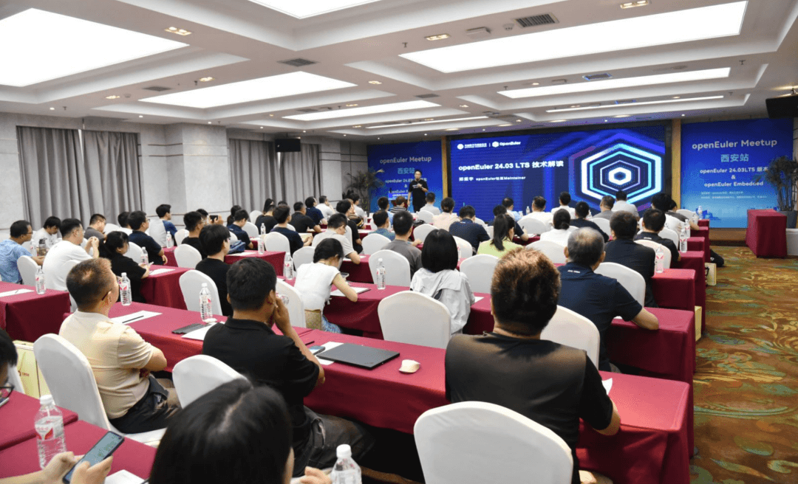
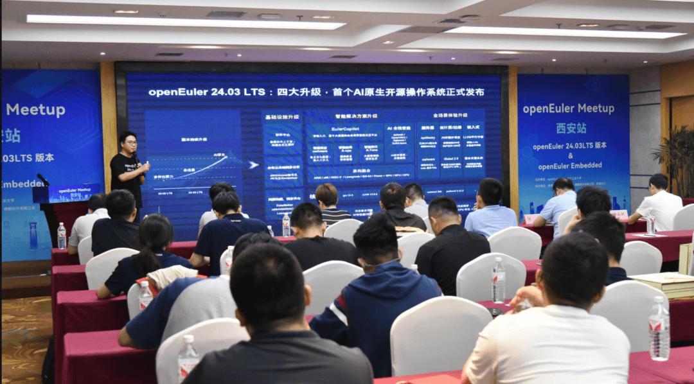
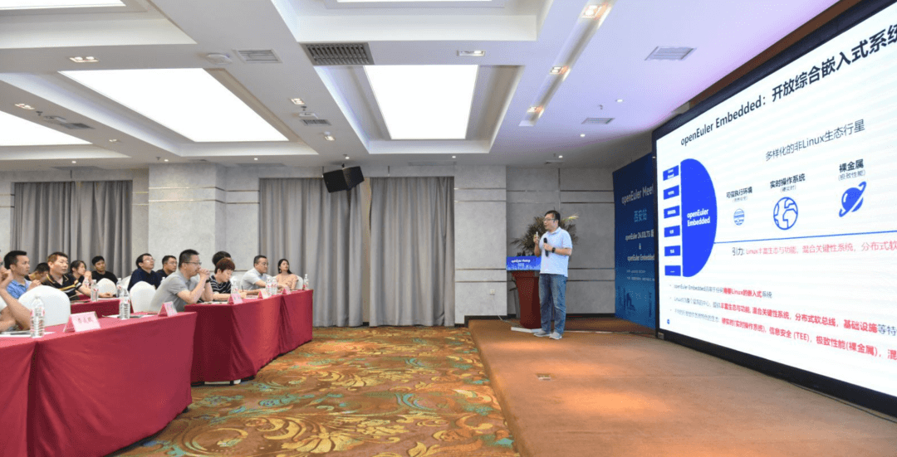
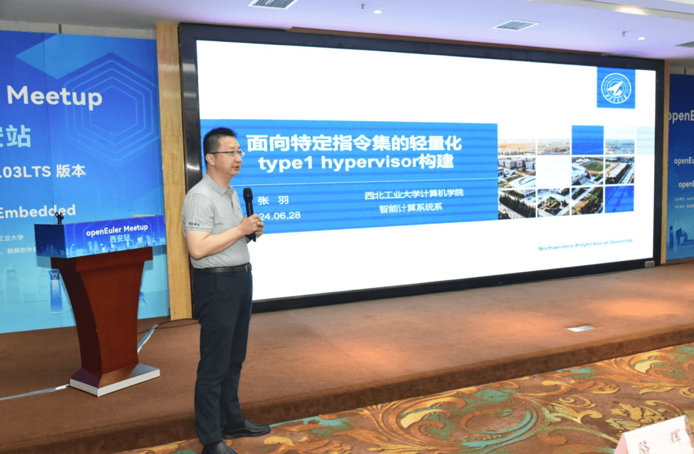
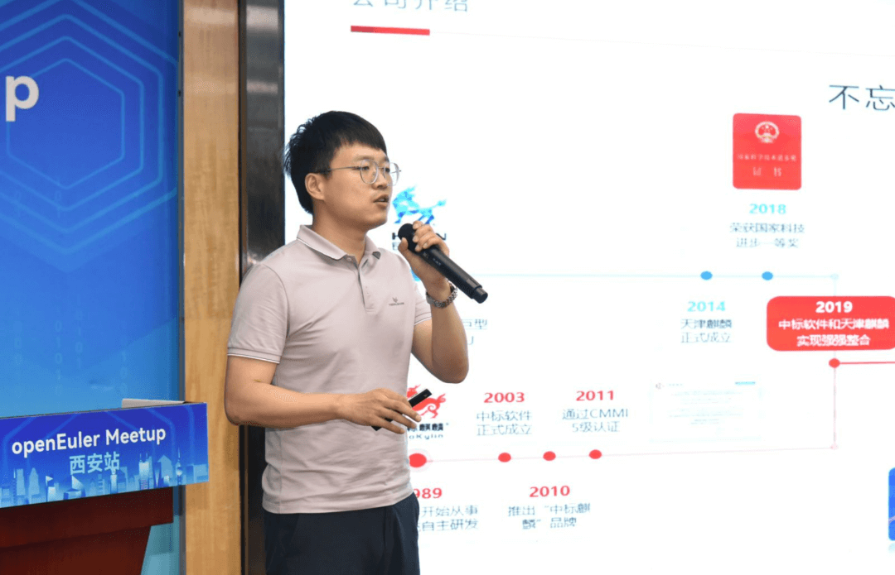
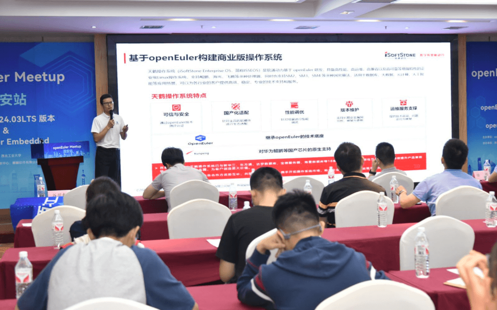
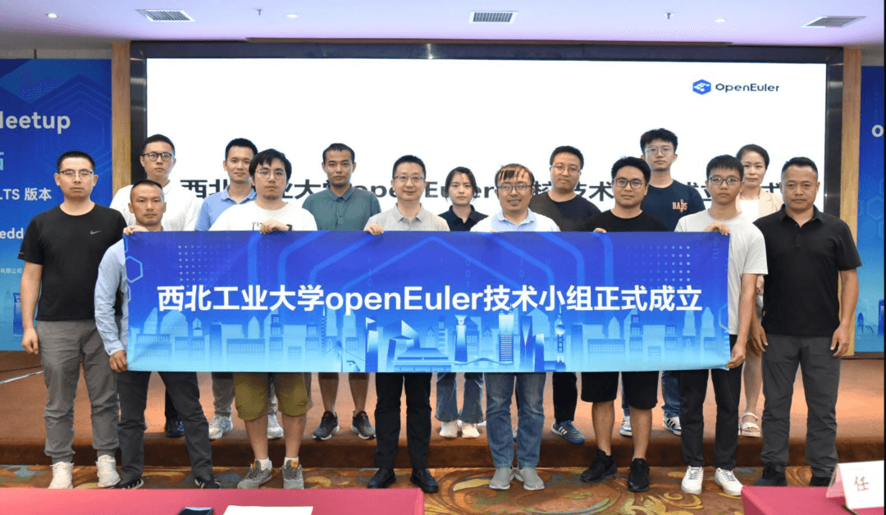
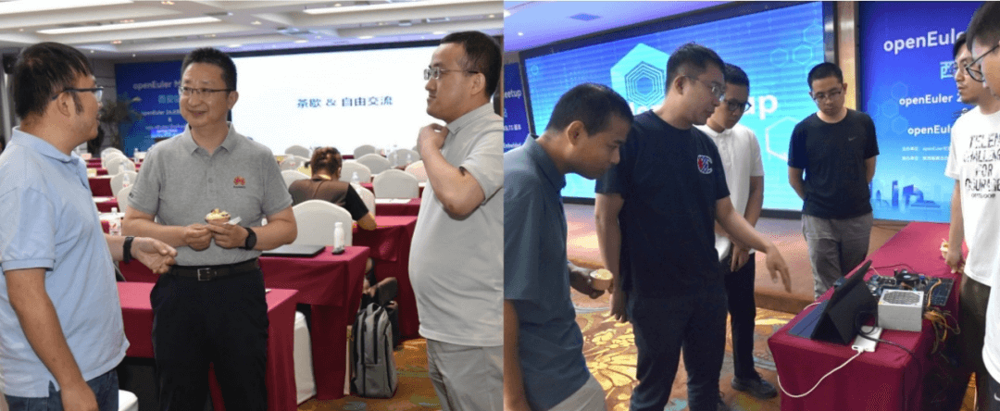
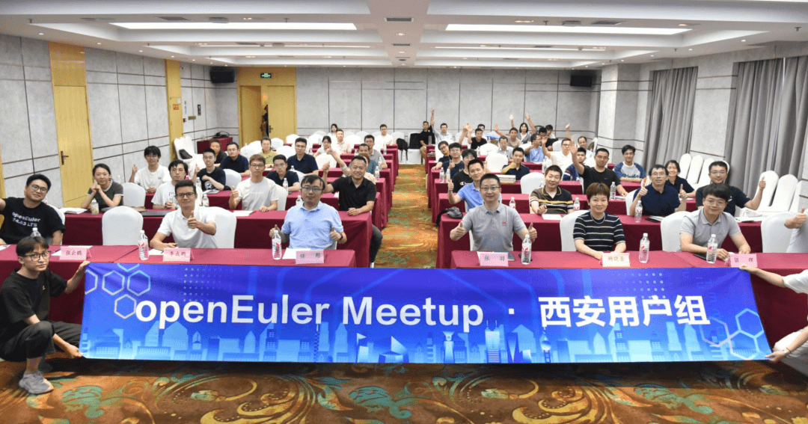

6月28日，OpenAtom openEuler（简称\"openEuler\"） Meetup
西安站成功举办。本次Meetup由openEuler社区、西北工业大学主办，陕西鲲鹏生态创新中心、麒麟软件有限公司、软通动力协办，邀请到来自西安当地工业技术企业、研究所、高校、openEuler西安用户组成员等80余人现场参会。在为期一天的活动中，通过闭门会议和公开分享的形式，**围绕openEuler
24.03LTS版本、openEuler嵌入式和基于openEuler的创新和服务进行交流探讨**。针对西安地区众多对openEuler嵌入式有深入了解和交流诉求的企业和单位，在上午举办了openEuler嵌入式闭门研讨会议，30余位技术专家就openEuler
Embedded当前的技术优势、使用经验、使用案例和未来规划进行了充分的交流。下午场面向现场80余位社区企业用户相关技术人员、感兴趣的学习者，围绕最新发布的openEuler
24.03LTS版本、openEuler嵌入式技术以及社区成员单位基于openEuler的创新和应用进行公开分享。

**下面就让我们来回顾本次 Meetup 的内容**

openEuler社区Maintainer郑振宇在议题"openEuler全新升级\-- openEuler 24.03
LTS 特性介绍"里详细分享了openEuler 24.03 LTS
版本在内核、智能解决方案、全场景体验、基础设施等方面的升级和特性优势。

openEuler Embedded 24.03 LTS
对openEuler嵌入式来说是至关重要的版本，是一个走向成熟的嵌入式版本。openEuler技术委员会委员任慰在议题"openEuler
Embedded创新进展介绍里"为大家分享了openEuler Emdedded在24.03
LTS版本里的重大进展、当前的技术架构和优势，以及在多个领域的创新应用案例。

西北工业大学计算机学院智能计算系教授张羽老师在操作系统创新技术上有着深入研究，本次活动邀请到张老师来分享他的团队在针对嵌入式虚拟机管理方面的技术创新和成果。在"面向特定指令集的轻量化type1
hypervisor构建"议题里分享了他所带团队开发的基于LoongArch指令集的第一个轻量化Type-1型Hypervisor在嵌入式轻量级环境下如何更好地实现系统资源管理。

openEuler社区成员单位麒麟软件在openEuler社区有着深度贡献，麒麟软件高级售前顾问骆辉在议题"数字化转型之麒麟操作系统发展与探索"分享了基于openEuler的银河麒麟高级服务器操作系统v10
SP3
24.03版本更新特性，以及麒麟软件在嵌入式操作系统领域的探索和典型案例，聚焦操作系统安全，持续拓展操作系统生态！

openEuler社区成员单位软通动力持续探索基于openEuler操作系统迁移、运维、适配等方面的专业化服务，软通动力openEuler生态技术总监李成鹏在议题"openEuler一站式服务加速操作系统迁移"里分享了openEuler安装部署、现网问题处理、补丁修复、迁移等方面的专业服务方案和应用实践案例。

同时，在本次活动上西北工业大学openEuler高校技术小组正式成立，
由西北工业大学老师与学生代表、openEuler社区代表、企业代表共同上台发布，通过该技术小组的形式凝聚高校的科研力量、企业资源和社区资源，为openEuler社区贡献创新成果。

议题分享结束后，与会者就所关注的一些openEuler相关问题进一步和社区专家及相关技术人员进一步自由交流。

openEuler
Meetup西安站圆满结束。欢迎更多用户、开发者、企业伙伴加入社区，共同推动社区发展！

**欢迎加入openEuler西安用户组**

【openEuler用户组是由各区域的用户、开发者、操作系统爱好者组成的区域化交流圈子，通过用户组线上社群和线下活动有更多集中交流机会】

扫码申请
