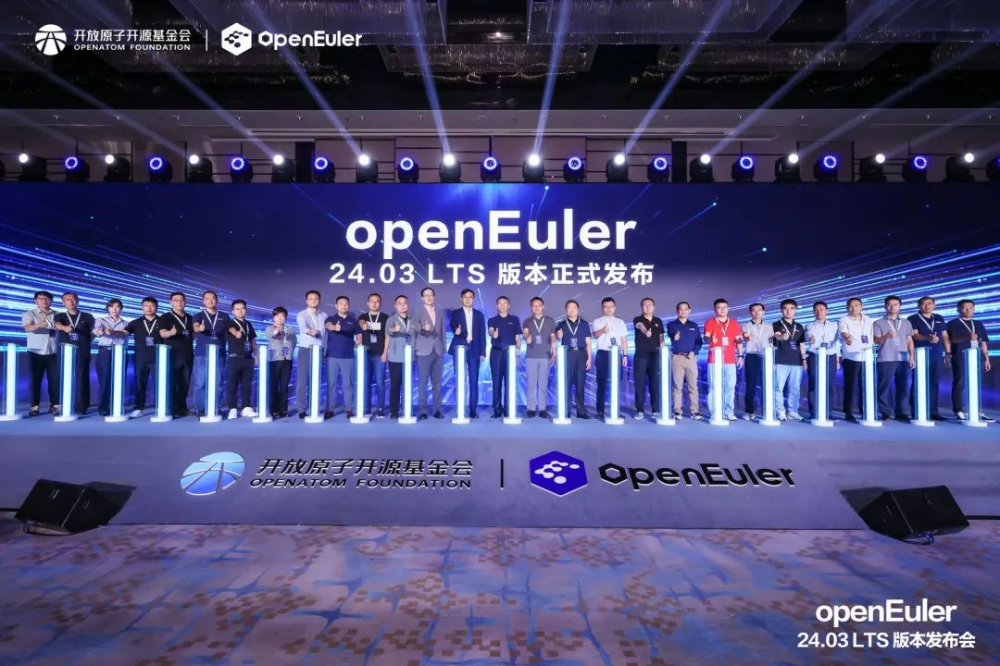
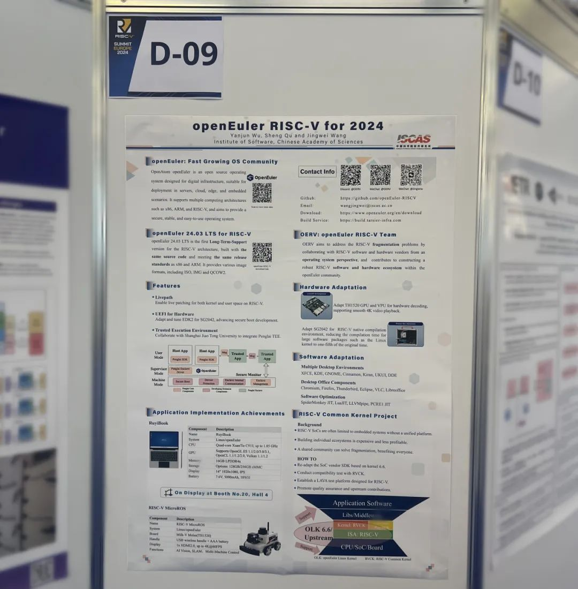
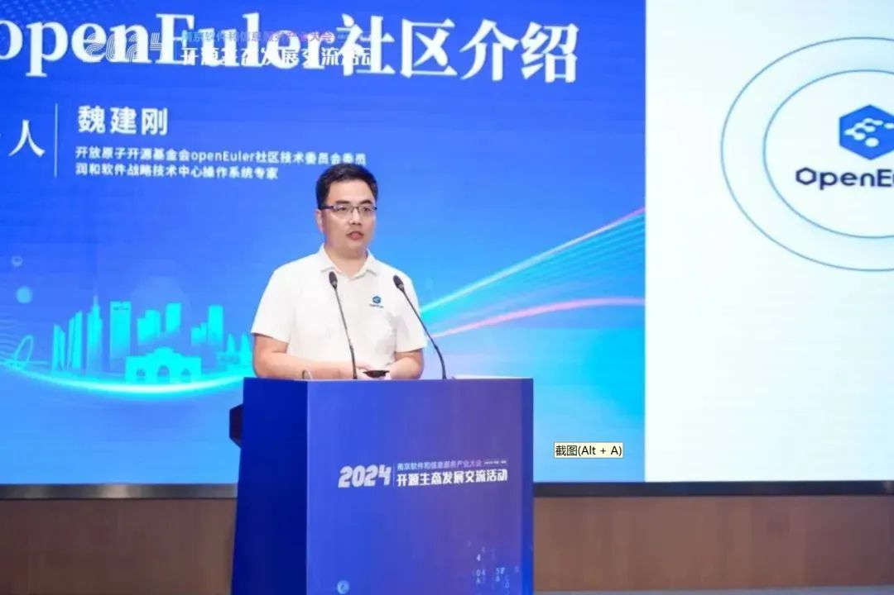
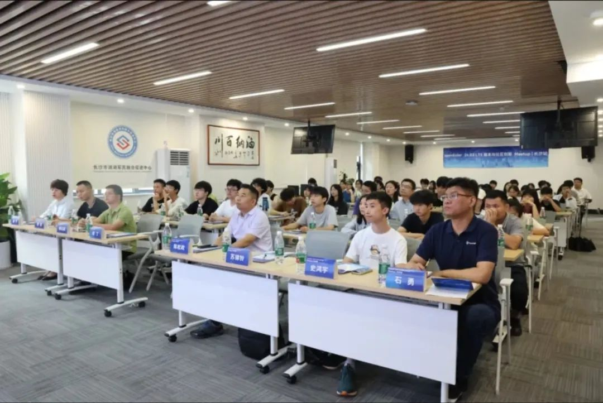
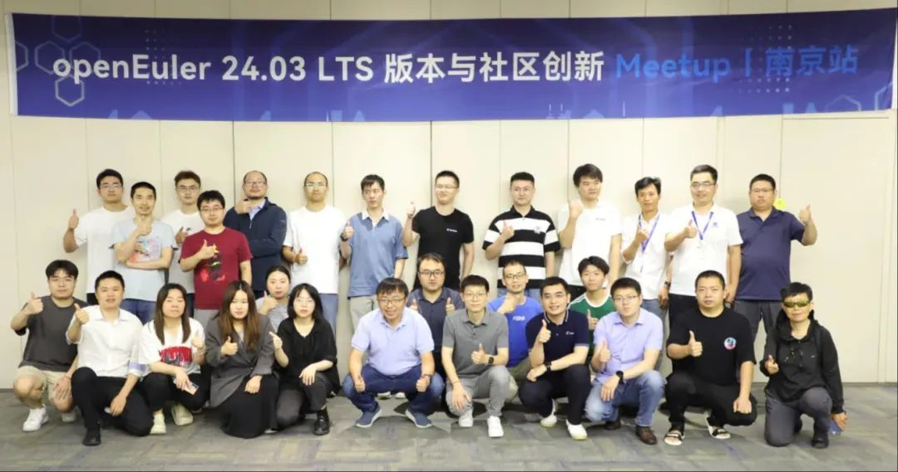
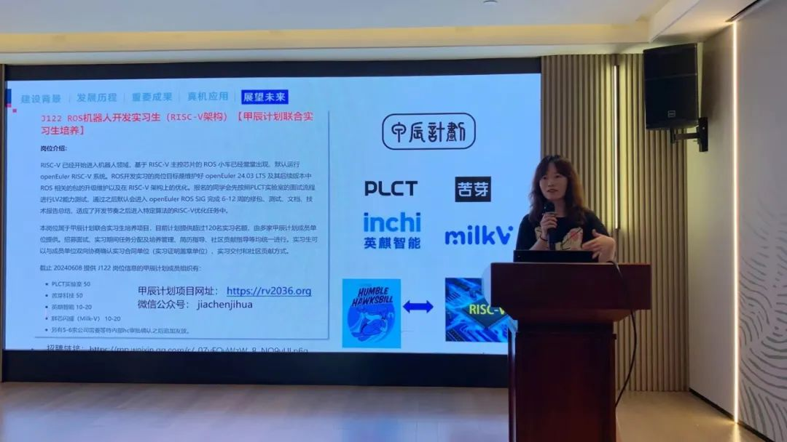
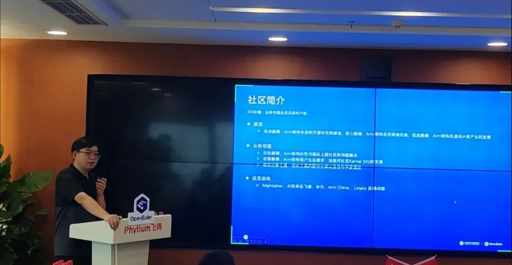
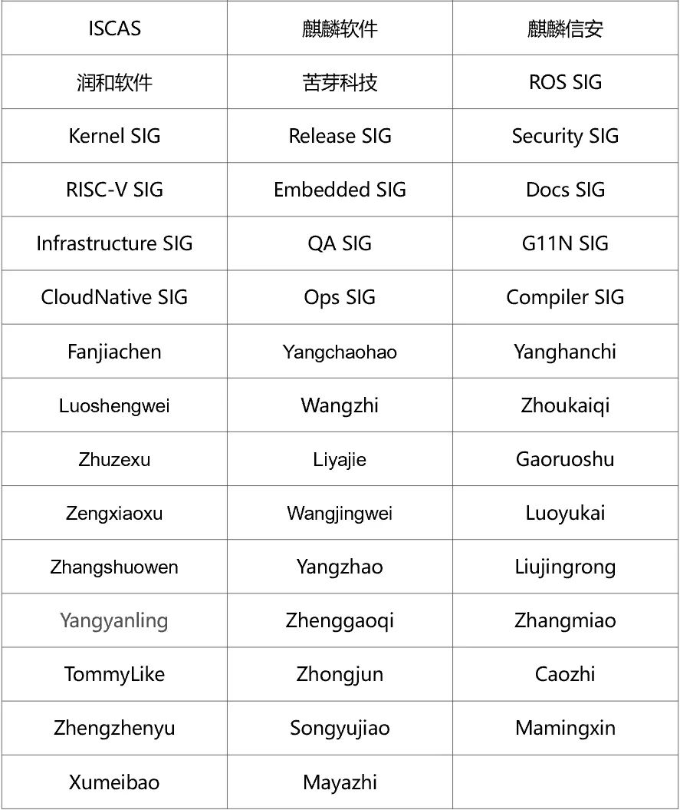

**概述**
-----

6月6日，OpenAtom openEuler（简称"openEuler"）
版本发布会在北京举办，开放原子开源基金会和中国科学院软件研究所、麒麟软件、麒麟信安、统信软件、中移云能、天翼云、联通数科、华为、英特尔（中国）、超聚变、软通动力、润和软件、龙芯中科、粤港澳大湾区国创中心、AMD、新华三、飞腾信息、浙江大华、联想、华鲲振宇、中关村实验室与中科院计算所、京东科技、中软国际、凝思软件、中科方德、Linaro等26位社区伙伴代表共同见证了openEuler首个AI原生开源操作系统------openEuler
24.03 LTS版本发布。

在 openEuler 24.03 LTS 中，RISC-V 架构已成为 openEuler
主流架构之一，其软件生态规模对齐 x86
和Arm。iSulad将CRI接口更新至1.29，并引入Evented
PLEG特性，稳态性能提升30%。同时，openEuler 24.03 LTS 补充了 vCPU
热拔能力，vCPU 热插拔特性得到正式完整的支持。在整个版本的发展方面，24.03
LTS
在基础设施、Linux6.6内核、智能解决方案以及全场景体验四大方面实现了全面升级，为开发者和用户带来了高性能、高可靠、高灵活的开发体验。

6月30日，openEuler 22.03 LTS SP4 发布。该版本是 22.03 LTS
的增强扩展版，面向服务器、云原生、边缘和嵌入式场景的全场景操作系统版本，统一基于
Linux Kernel 5.10 构建，对外接口遵循 POSIX
标准，具备天然协同基础。同时，数据搬运加速引擎SDMA、故障巡检框架sysSentry等项目相继在社区建仓，并随
openEuler 22.03 LTS SP4
发布。另外，系统感知加速服务oeAware实现了轻量化的微架构信息采集，跟随
openEuler 24.03 LTS 和 22.03 LTS SP4 两个版本发布。

由麒麟软件有限公司发起的 MetaGPT 项目已在社区完成建仓运作。openEuler
Embedded与润和软件联合，实现了openEuler Embedded 与
openEuler、OpenHarmony "一机多域"混合部署的验证Demo。

本月，经技术委员会委员审定，Backup
SIG在社区成立。该SIG组致力于构筑开放的备份软件生态，并使其能够无缝地融入服务器生态，同时希望openEuler成为孵化备份开源软件的关键平台，促进该领域的技术发展和创新，丰富应用兼容性。

在社区活动方面，2024年度RISC-V欧洲峰会在德国慕尼黑举行，openEuler RISC-V
SIG于会上展示了相关的工作进展。

openEuler持续在各个城市活跃。RISC-V、 Compiler、ROS、Arm、Mrigation等
SIG
组开发者相继在北京、上海、长沙、西安、南京举办Meetup活动。在高校人才培养方面，由中国计算机学会（CCF）主办的CCF开源创新大赛报名通道已开启，openEuler
贡献了2个赛题，主要聚焦在openEuler操作系统的内存池管理与用户态线程设计与调度两个方向。据了解，两道赛题奖金各5w，共计奖金10w。欢迎感兴趣的朋友报名参加。

为方便开发者更好的使用openEuler，社区文档上线FAQ页面，以提供一些常见问题及解决方法。开发者可以在官网文档-24.03
LTS 版本各领域中查看对应的常见问题，也可以通过官网搜索栏搜索查询。

感谢朋友们对 openEuler 的支持。

本月报阅读时长预计 25 分钟。

**社区规模**
-----

截至2024年6月30日，openEuler
社区用户累计超过305万。超过1.9万名开发者在社区持续贡献。社区累计产生
177.2K个PRs、112.4K条Issues。目前，加入openEuler
社区的单位成员1630家，本月新增55家。

社区贡献看板（截至2024/06/30）

**社区事件**
-----

**openEuler 24.03 LTS版本发布会在北京举办**

6月6日，由 openEuler 社区主办的openEuler 24.03
LTS版本发布会在北京举办。本次发布会汇聚操作系统产业界顶尖力量，共探openEuler社区技术、生态、国际化发展，共建健康可持续发展的开源操作系统根社区。

本次发布会上，开放原子开源基金会和中国科学院软件研究所、麒麟软件、麒麟信安、统信软件、中移云能、天翼云、联通数科、华为、英特尔（中国）、超聚变、软通动力、润和软件、龙芯中科、粤港澳大湾区国创中心、AMD、新华三、飞腾信息、浙江大华、联想、华鲲振宇、中关村实验室与中科院计算所、京东科技、中软国际、凝思软件、中科方德、Linaro等26位社区伙伴代表共同见证了openEuler首个AI原生开源操作系统------openEuler
24.03 LTS 的发布。

**openEuler 参加2024年度 RISC-V 欧洲峰会**

2024 年度 RISC-V
欧洲峰会于6月24日-28日在德国慕尼黑举行。中国科学院软件研究所主导的
openEuler RISC-V SIG 在峰会上展示了相关的工作进展。RISC-V
架构已成为openEuler 24.03 LTS版本主流架构之一，其软件生态规模已经对齐
x86 和 Arm。

在本次欧洲峰会上，RISC-V SIG 透露了近期将推出的 RVCK（RISC-V Common
Kernel）项目，以推动治理 RISC-V 碎片化问题，推动 RISC-V 健康发展。

**openEuler 社区受邀参加2024南京软件大会**

6月24日-26日，2024南京软件大会暨工业软件供需大会在南京召开。openEuler社区技术委员会委员、润和软件操作系统专家魏建刚代表社区出席大会，并在开源实践环节上与大家分享了openEuler社区的发展组织运营和发展情况。

**CCF开源创新大赛openEuler赛题火热报名中**

由中国计算机学会（CCF）主办，长沙理工大学、CCF开源发展委员会联合承办的第七届CCF开源创新大赛正式启动。本届赛事中，openEuler在开源项目贡献赛道中共分为2个赛题，主要聚焦在openEuler操作系统的内存池管理与用户态线程设计与调度两个方向。据了解，两道赛题奖金各5w，共计奖金10w。欢迎感兴趣的朋友报名参加。

**CCF开源创新大赛openEuler开源项目贡献赛**

报名时间：2024年5月27日-2024年9月20日

赛事详情&报名入口：

https://www.gitlink.org.cn/competitions/track1\_openEuler

**openEuler 24.03 LTS 版本 Meetup**

**在西安、长沙、南京举办**

openEuler 24.03 LTS
自发布后引起了广泛关注。为进一步推广该版本特性和技术进展，openEuler
社区联合多家成员单位举办Meetup活动，吸引众多业内技术专家、开发者和用户参会交流。

**openEuler Meetup 西安站**

6月28日，openEuler Meetup
西安站成功举办。本次Meetup由openEuler社区、西北工业大学主办，陕西鲲鹏生态创新中心、麒麟软件有限公司、软通动力协办，邀请到来自西安当地工业技术企业、研究所、高校、openEuler西安用户组成员等80余人现场参会。在为期一天的活动中，通过闭门会议和公开分享的形式，围绕openEuler
24.03LTS版本、openEuler嵌入式和基于openEuler的创新和服务进行交流探讨。

 

**openEuler Meetup 长沙站**

6月27日下午，由 openEuler 社区、麒麟信安联合主办的openEuler 24.03
LTS版本与社区创新Meetup长沙站在麒麟科技园举办。活动从创新特性、行业应用、生态发展等多维度展现和探讨openEuler
24.03 LTS，吸引了众多技术专家、开发者和用户参加。

**openEuler Meetup 南京站**

6月21日，openEuler社区与江苏润和软件股份有限公司在南京举办了一场Meetup活动。活动围绕AI、嵌入式、分布式创新进展等主题进行探讨交流，吸引了来自全国各地近20家单位的
40 余名技术专家、开发者和用户参会交流。

**openEuler 社区携手苦芽科技举办线下Meetup**

6月22日下午，openEuler &
苦芽科技于上海举办线下Meetup。本次活动由openEuler社区的Compiler、RISC-V、ROS等SIG组联合组织，上海苦芽科技有限公司承办。

会上，openEuler
社区活跃开发者、中国科学院软件研究所工程师王晓云分享了ROS
SIG的发展历程和未来规划，并重点介绍openEuler 24.03
LTS版本发布后openEuler ROS
的显著成果，包括无人车和其他机器人的应用案例，如RISC-V MicroROS
小车和生肖机器人等。同时，她还详细介绍甲辰计划的ROS机器人开发实习生项目（编号J122），并作为首席导师协调120名实习生的工作。此外，苦芽科技还将在甲辰计划框架下，定向开放50个开源实习生名额，以支持openEuler
ROS SIG的建设与运作。

**openEuler Arm Meetup 在北京举办**

6月21日， 由openEuler Arm SIG发起的Meetup在北京举办。此次 Meetup
汇聚了Arm软硬件生态的技术专家和行业先锋，交流内容集中在Arm架构软件生态的最新进展。同时还展示了Arm架构在典型应用场景中的最佳实践，深入探讨在Arm服务器上的部署与优化技巧，以及未来的发展方向。

**面向英文开发者的 openEuler 迁移专场Meetup在线上举办**

6月19日，面向英文开发者的openEuler 迁移专场
Meetup在YouTube进行。本次直播通过熊伟博士以及社区众多技术专家的解读，openEuler迁移专家丁嘉辉现场进行CentOS升级到openEuler的一键演示，以及社区开发者王帅讲解在openEuler社区开发的实践过程，为开发者们升级操作系统、参与openEuler社区开发工作等提供宝贵实践经验和参考。

截至到7月1日，该直播及回放累计观看次数为23,220人次，曝光量为467,925人次，互动量为57,302人次

回放链接

YouTube：https://youtube.com/live/w7pIHPq3Nk0

Bilibili：https://url.cy/kIhIZ3

**社区治理**
-----

**2023-2024年openEuler委员会第七次会议摘要**

6月6日，2023-2024年openEuler委员会第七次会议在北京·金茂万丽酒店召开。会上，openEuler社区的品牌委员会、用户委员会、人才SIG和项目群办公室的各位代表总结汇报了社区2024年上半年的运营治理成果和相关经验，规划了openEuler社区2024年下半年的行动计划与落地方案。

openEuler委员会在会上审议决策了社区2024年下半年的工作目标与计划。

**openEuler 技术委员会6月会议摘要**

在6月的例会上，经 openEuler
技术委员会委员们审定，同意开发者在社区成立Backup SIG。

Backup SIG
致力于构筑开放的备份软件生态，并使其能够无缝地融入服务器生态，同时希望openEuler成为孵化备份开源软件的关键平台，促进该领域的技术发展和创新，丰富应用兼容性；其主要职责为洞察数据备份领域开源项目技术发展方向、完成重大技术决策，并负责社区治理相关工作，包括备份开源软件社区版本规划、架构看护、特性代码开发维护、版本及补丁规划等，同时负责组织本SIG的各种社区活动，欢迎感兴趣的开发者关注。

**技术进展**
-----

**首个 AI 原生开源操作系统，**

**openEuler 24.03 LTS 版本发布**

6月6日，经过两年的准备，三个创新版本的积累，openEuler 24.03 LTS
正式发布。该版本在基础设施、Linux6.6内核、智能解决方案以及全场景体验四大方面实现了全面升级，为开发者和用户带来了高性能、高可靠、高灵活的开发体验。

在基础设施方面，首次发布了openEuler软件中心，帮助用户快速掌握openEuler社区各领域丰富的软件生态；帮助开发者实时监控上游软件的更新情况，保持特性与上游实时一致。

内核方面，升级到了Linux
6.6版本，CPU调度更均衡、内存管理更高效，虚拟机场景资源利用更灵活。同时，参与贡献了动态复合页等关键能力，写性能得到两倍提升。

智能解决方案方面，本次发布的24.03
LTS版本中，openEuler正式升级智能解决方案，通过大模型自然语言交互平台接入oeAware、A-ops、A-Tune实现智能调度、智能运维、智能调优。同时，openEuler更广泛地支持了南向硬件，并覆盖了主流的大模型、框架以及工具链，使能全栈AI，支持Faiss、DCN等推理和检索算法，兼容OpenViNO、Pytorch等主流AI框架，使能Numpy、ACL等基础算法库。

全场景体验方面，openEuler持续从服务器、云、边缘到嵌入式夯实全场景能力。在服务器场景中，sysSentry可以将已知的CPU故障100%检出使系统更可靠；在云场景中，内存潮汐调度实现容器速度提升80%。

目前，openEuler 24.03 LTS 版本的ARM 、 x86 、 RISC-V 、 LoongArch
四个架构镜像在社区官网、全球37个镜像点及主流云厂商分发渠道同步上线，12
个 OSV 的商业发行版和企业自用版也将陆续上线。

openEuler 24.03 LTS 下载地址：\
https://www.openeuler.org/zh/download/archive/detail/?version=openEuler%2024.03%20LTS

openEuler 24.03 LTS 技术白皮书：\
https://www.openeuler.org/whitepaper/openEuler%2024.03%20LTS%20技术白皮书.pdf

**openEuler 22.03 LTS SP4 版本发布**

6月30日，openEuler 22.03 LTS SP4版本发布。该版本是 22.03 LTS
版本增强扩展版本，面向服务器、云原生、边缘和嵌入式场景的全场景操作系统版本，统一基于
Linux Kernel 5.10 构建，对外接口遵循 POSIX
标准，具备天然协同基础。同时openEuler 22.03 LTS
SP4版本集成分布式软总线、KubeEdge+边云协同框架等能力，进一步提升数字基础设施协同能力，构建万物互联的基础。

openEuler 22.03 LTS SP4 关键特性：\
https://docs.openeuler.org/zh/docs/docs/Releasenotes/关键特性.html

openEuler 22.03 LTS SP4 技术白皮书：\
https://www.openeuler.org/whitepaper/openEuler%2022.03%20LTS%20SP4%20技术白皮书.pdf

**数据搬运加速引擎 SDMA 已合入openEuler 22.03 LTS SP4，并随版本发布**

鲲鹏解决方案在研项目SDMA模块，经Wayca
SIG审核已成功引入openEuler社区，并合入openEuler 22.03 LTS SP4主线。

System Direct Memory
Access（SDMA）是负责数据的高带宽低延迟搬运的模块，是一种分布式分离式的DMA引擎。利用SDMA，用户可以实现由硬件完成数据搬移的工作方式，不需要CPU参与，通过一套独立于CPU的机制将数据在main
memory与buffer之间进行搬移。典型场景如HPC计算应用可以充分利用SDMA的芯片卸载加速功能，完成计算和通信的并行操作，并利用SDMA的高带宽低时延特性，可以在大包场景下带来带宽优势：

支持3种任务类型：普通memory copy、HBM cache preload和HBM/DDR间搬运。

支持4种任务下发方式：独占通道阻塞等待、独占通道非阻塞等待、共享通道阻塞等待和共享通道非阻塞等待。

模块组件：用户态驱动SDMA-DK，内核态驱动SDMA-DAE

SDMA-DK项目地址:

https://gitee.com/src-openeuler/sdma-dk

SDMA-DAE项目地址：

https://gitee.com/openeuler/kernel/tree/OLK-5.10/drivers/misc/sdma-dae

**sysSentry 故障巡检框架 v1.0.2 版本发布**

sysSentry是一款故障巡检框架，通过提前发现系统中的软硬件故障并及时通知系统运维人员处理的方式，达到减少故障演变为现网事故、提升系统可靠性的目标，为用户提供在后台进行故障巡检的能力。

sysSentry支持对操作系统、硬件等部分统一进行故障巡检、故障预测、故障诊断的管理。所有的巡检功能都将以插件的形式导入到sysSentry中，支持用户自主配置，灵活选择。未来也将持续扩充支持的巡检插件。

目前sysSentry已发布第一个版本v1.0.2，并以rpm包的形式跟随openEuler 22.03
LTS
SP4版本发布。欢迎感兴趣的开发者参与社区贡献，有任何问题也可以在BaseService
SIG中进行讨论。

sysSentry软件仓：

https://gitee.com/openeuler/sysSentry

sysSentry使用指南：

https://gitee.com/openeuler/sysSentry/blob/master/sysSentry-1.0.2/README

邮件列表：dev@openeuler.org

**系统感知加速服务 oeAware 项目在社区建仓**

oeAware是在openEuler上实现自动低负载采集感知调优的插件框架，目标是动态感知系统行为后智能使能系统的调优特性。

传统调优特性都以独立运行且静态打开关闭为主，oeAware将调优拆分采集、感知和调优三层，每层通过订阅方式关联，各层采用插件式开发尽可能复用。oeAware目标是用户可以使用oeAware使能所有调优功能，通过一个用户界面即可完成系统调优。

目前，oeAware已经在openEuler建仓，实现了轻量化的微架构信息采集，并跟随
openEuler 24.03 LTS 和 22.03 LTS SP4
两个版本发布。欢迎社区开发者来oeAware贡献各类插件。

项目地址：\
https://gitee.com/openeuler/oeAware-manager\
https://gitee.com/openeuler/oeAware-collector\
https://gitee.com/openeuler/oeAware-scenario\
https://gitee.com/openeuler/oeAware-tune

**AI智能体框架 MetaGPT 项目在社区建仓**

由麒麟软件有限公司发起，由Intelligence SIG组维护管理的 MetaGPT
项目已在openEuler
社区完成建仓。MetaGPT是一种多智能体框架，其利用SOP（Standard Operating
Procedures，标准作业程序）来协调基于大语言模型的多智能体系统，从而实现元编程技术。

稳定的解决方案：借助标准化操作程序，MetaGPT能够生成更一致和正确的解决方案。

多样化的角色分配：MetaGPT为LLM分配不同角色的能力确保了解决问题的全面性。它模拟了一个虚拟软件团队，包含产品经理、架构师、项目经理、工程师、质量工程师等角色，并引入SOP成为框架的虚拟软件团队的开发流程。

智能体能力增强：通过元编程技术，MetaGPT能够不断提升智能体的能力，使其能够更好地理解和执行复杂任务。

项目地址：\
https://gitee.com/src-openeuler/metagpt

**openEuler Embedded 6月进展**

本月，openEuler Embedded 与社区其他场景发布了 24.03
LTS版本，该版本是openEuler
Embedded的一个重要里程碑。同期与润和软件合作，实现了openEuler
Embedded与openEuler、OpenHarmony"一机多域"混合部署的验证Demo。

在4核的树莓派4B上，1个处理器核分配给openEuler
Embedded用于系统管理，2个处理器核以及GPU、WiFi、蓝牙等资源分配给openEuler
OpenHarmony用以人机交互，1个处理器核及1个GPIO外设分配给实时操作系统用以模拟实时控制，另外还验证了1个openEuler
Embedded（2核）+1个SMP RTOS（2核）以及1个openEuler Embedded(2核）+
2个RTOS（各分配1核）的情况。

在"端云结合"方向，openEuler
Embedded实现了KubeEdge+iSulad组合的支持，通过QEMU仿真平台实现了运行K8S管理节点的openEuler
Server与运行着Kubeedge+isulad的openEuler
Embedded之间通信，容器拉起等功能，后续将进一步完善在真实硬件上验证"端云结合"的能力。

**iSulad 引入 EventedPLEG 特性，稳态性能提升30%**

容器技术在不断发展的过程中，已被广泛应用于多种场景。openEuler
社区容器引擎项目 iSulad 面向 CT、IT
领域的不同需求而生，它具有轻量级、高性能的特点，可以在资源受限的环境中运行。

基于 Sandbox API，在 openEuler 24.03 LTS 中，开始提供对普通容器 CRI V1
接口的支持，将 CRI 接口更新至1.29，并引入 Evented PLEG 特性。

此次 CRI V1 的升级为 iSulad 引进了上游社区最新的特性，同时还为 iSulad
稳态情况下带来了30%左右的性能提升。

原文阅读：

https://mp.weixin.qq.com/s/Qyehm8xZjaZZt6LBrQkApw

**openEuler 24.03 LTS 完整支持 vCPU 热插拔特性**

openEuler 社区早在 20.09 创新版本就率先使能并对外开放了 AArch64 架构
vCPU 热插特性。时隔四年，openEuler 24.03 LTS 版本补充了 vCPU
热拔能力，vCPU 热插拔特性得到正式完整的支持，其更好地满足开发者对 vCPU
资源的弹性伸缩需求，进一步延伸了该特性的使用场景及价值。

原文阅读：

https://mp.weixin.qq.com/s/L6T3vdFhfuFvc8FA09zqsw

**openEuler 文档 FAQ 上线**

为方便开发者更好的使用openEuler，社区文档上线FAQ页面，以提供一些常见问题及解决方法。当前，该页面更新了虚拟化、iSula等13个项目
48个FAQ。开发者可以在 文档官网-24.03 LTS
版本各领域中查看对应的FAQ，也可以通过官网搜索栏搜索查询。

如果您有相关 FAQ 内容希望与社区开发者一起分享讨论，请通过提交 PR
的形式向社区 openEuler docs 仓反馈；如果当前 FAQ
仍然无法解决您的问题，请向 docs 仓库提问。Doc SIG 收到 Issue
后，会及时跟踪问题进度。优秀有效的 Issue 将会进入到案例库或 FAQ。

openEuler 文档官网 24.03 LTS
版本：https://docs.openeuler.org/zh/docs/24.03\_LTS/docs/Releasenotes/法律声明.html

openEuler docs 仓库地址：

https://gitee.com/openeuler/docs

原文阅读：

https://mp.weixin.qq.com/s/brM\_xCog7h9JTt0jVHTUjA

**软硬件兼容性认证**

2024年6月，兼容性方案 1731 个，北向1126个，南向519个个，OS
152个。6月新增 北向34个，南向42个, OS 7个。

社区兼容性列表：

https://www.openeuler.org/zh/compatibility/

**安全公告**
-----

2024年6月，社区共发布安全公告95个，修复漏洞184个（其中 Critical
2个，High 15个，其它167个）。

**重点漏洞提醒**

如下漏洞评估影响较大，请重点关注：

OpenSSL 中发现释放后使用漏洞。在某些情况下，调用 OpenSSL API
SSL\_free\_buffers
函数可能会导致之前释放的内存被访问**（CVE-2024-4741）**

CVSS评分为9.8分

公告链接：

https://www.openeuler.org/zh/security/cve/detail/?cveId=CVE-2024-4741&packageName=openssl

影响范围：

openEuler-20.03-LTS-SP4

openEuler-22.03-LTS-SP1

openEuler-22.03-LTS-SP3

openEuler-24.03-LTS

4.19.0 之前的 GNU Libtasn1 具有影响 asn1\_encode\_simple\_der 的
ETYPE\_OK 离一数组大小检查。**（CVE-2021-46848）**

CVSS评分为9.1分

公告链接：

https://www.openeuler.org/zh/security/cve/detail/?cveId=CVE-2021-46848&packageName=grub2

影响范围：

openEuler-20.03-LTS-SP4

openEuler-22.03-LTS-SP1

openEuler-22.03-LTS-SP3

openEuler-24.03-LTS

**漏洞防护**

openEuler社区针对在维版本例行修复漏洞，发布安全补丁。建议用户关注openEuler官网安全公告，及时安装漏洞补丁进行防护。

openEuler 安全公告：

https://www.openeuler.org/zh/security/security-bulletins/

**感谢每一位朋友、开发者的支持**
-----

因为大家的辛勤贡献，openEuler
的每一天都发生着好的事情。小编限于视野和能力，难免有所遗漏，在此表示歉意。同时，衷心感谢社区朋友、开发者们以及openEuler
SIG组成员的贡献：

\* 以上不分先后顺序

如果您希望在月报中增加您的工作内容，或对内容有任何改进建议，请联系wengqiaozhen@openeuler.sh。
