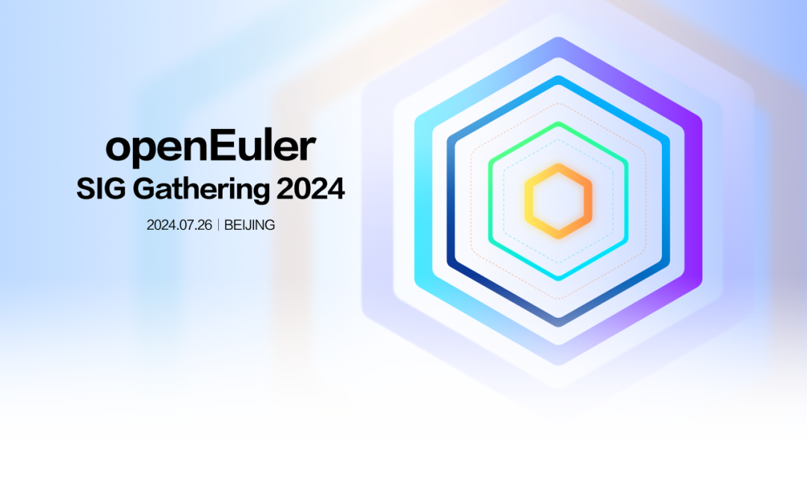
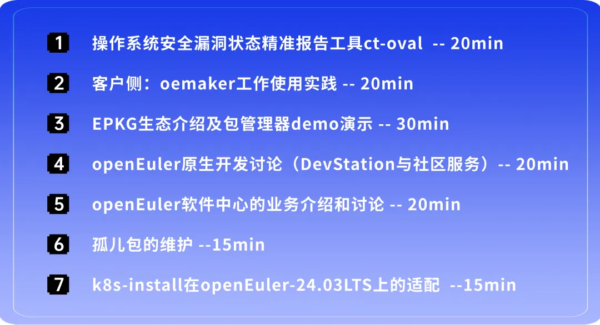

7月26日，openEuler SIG Gathering
2024将在北京香格里拉饭店启幕。本次活动面向社区108个SIG组，旨在共同探讨openEuler的最新技术动态，拓展思维疆界，发现问题、探讨问题并解决真问题。活动将全天候围绕openEuler
24.03
LTS版本的后续关键规划以及下半年重要的技术方案与开发计划进行，通过跨SIG的线下开放式交流，激发创新火花。

"我参与，我做主"------在本次SIG组工作会议中，openEuler社区将开辟六大专题研讨领域，涵盖多样性算力、全场景应用、AI原生支持、openEuler原生开发、上游原生支持、用户体验研究等关键方向。

我们热忱邀请社区的开发者们亲临现场，共同参与线下深度探讨，共同寻觅最佳解决方案。此外，还有精彩纷呈的开发者之夜等互动环节，确保每位参与者都能在此收获满满，实现个人成长与发展。

**活动详情**
------------

**2024年7月26日**

**10:00-20:00**

**北京香格里拉饭店**

**议程**
------------

10:00-10:20

整体介绍

10:20-12:00

专题研讨

12:00-13:30

午餐

13:30-13:50

轻松健身操

13:50-16:00

专题研讨

16:00-18:00

总结分享

18:30-20:30

开发者之夜

**多样性算力**

多样性算力支持是openEuler领先性的核心竞争力之一。openEuler不仅吸引了国际上Intel、AMD、ARM和Linaro等主流平台厂商的深度参与，也为国内众多架构体系和厂商如LongArch、申威、华为等众多ARM或RISC-V厂商的生态发展汇聚了大量的开发资源和软硬件生态。openEuler的多样性发展策略必将为操作系统全架构基础底座奠定最坚实的基础。

本专题将以多样性算力为主题，探讨异构计算架构、多平台支持、CPU/GPU/NPU/加速器协同等话题，并共同协商和规划openEuler的全架构发展计划。

**全场景应用**

openEuler自开源之初就以支撑全场景应用为核心特点，解决不同场景的软烟囱问题。openEuler最新版本在性能、可靠性、安全性、易用性等方面有了进一步提升，以支持服务器、云计算、边缘计算和嵌入式等场景的全面应用和创新。

本专题将结合技术演进和实际案例，探讨openEuler在全场景应用方面的发展和规划以及面向AI生态的结合。

**AI原生支持**

openEuler在2023年提出了"AI for openEuler, openEuler For
AI"的发展方向，在2024年发布了首个AI原生LTS版本24.03
LTS，通过各类创新技术实现了openEuler从通用算力的多样化，到智能算力的多样化三层AI使能架构。

本专题将围绕AI原生支持对以下具体方向展开讨论：

1.基于LLM的智能交互平台，颠覆传统shell命令交付的模式，改进传统学习，开发，调优，运维体验，智能新语义支持应用智能化升级，共建AI生态

2\. CPU/GPU/NPU算力融合，面向训练高可用/推理低成本方向，降本增效

3\. AI主流软件栈4层栈全栈兼容及封装，主流推理框架加速，开箱即用

**openEuler原生开发**

操作系统作为应用与技术创新的底座，其软件生态和原生开发体验是对于应用和创新效率提升至关重要的关键因素，目前openEuler装机量超过680万，社区汇聚了近2万名开发者，如何使能开发者更好地基于openEuler进行原生开发，进一步提升开发效率是openEuler社区的关键工作之一。

本专题将重点讨论openEuler本地开发环境、加包与更新维护、社区开发与协作基础设施、社区构建测试服务等话题。

**上游原生支持**

openEuler始终遵循"上游优先"的策略，帮助上游开源软件原生支持openEuler，让用户可以在开发、集成、使用这些软件时获得便利。

本方向主要涉及：openEuler上游原生支持技术讨论及进展同步，讨论如何做好从上游原生支持到openEuler原生发布的关键环节，包含上游协同，监测，维护管理等。

**用户体验研究**

1\. 深化知识共享：提供高质量的中英文文档，作为知识共享的基石；

2\. 推动技术融合：通过软硬件兼容性测评，促进openEuler生态的健康发展；

3.
提升服务效率：通过多途径服务支撑，沉淀常见案例，不断提升解决问题的效率；

4.
增强系统建设：夯实设计系统能力，增强基础设施建设，打造更优的用户体验。

活力，热情，多元，创新，开放

怎么少得了一件超shining的T-恤？

来openEuler SIG Gathering 2024现场

穿上它你就是社区最靓的崽

**🎉还可获取开发者专属形象照拍摄机会！**

你是否期待有一张焕然一新的照片来展示自己的形象，用于openEuler call for
X- Meetup
技术演讲，用于朋友圈的social，用于颁奖舞台上的高光时刻\...敬请期待！

更有精彩的活动：**开发者之夜**等你来\~才艺展示、幸运抽奖、美食相伴，社交新高度🆙！

