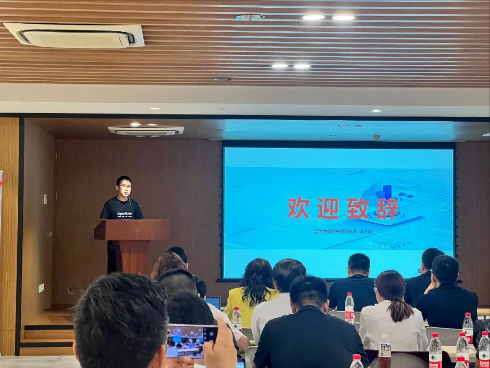
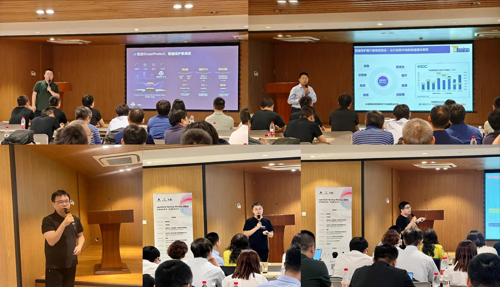
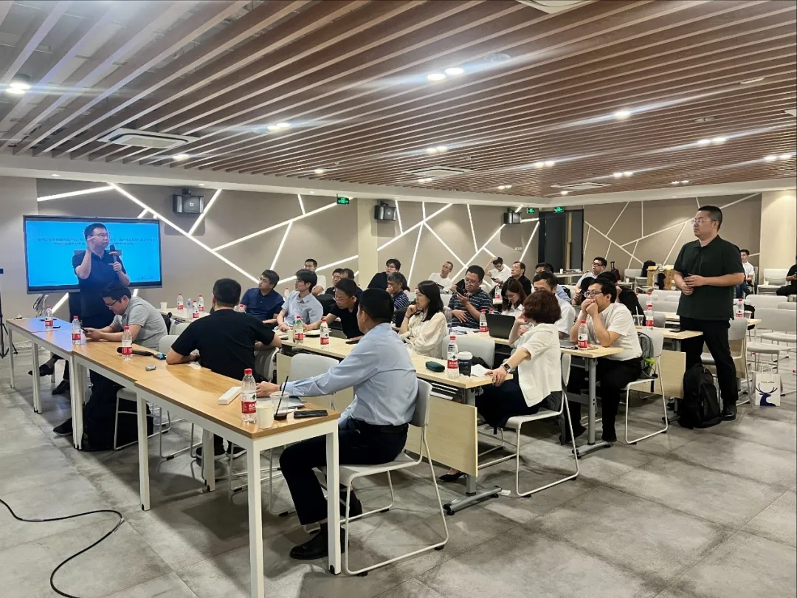

7月22日下午，由OpenAtom
openEuler（简称\"openEuler\"）社区联合华为数据存储产品线、北京中关村创业大街联合主办的openEuler
Backup
SIG首场Meetup在北京中关村创新中心成功举办。本次活动吸引了数据库、虚拟化、备份等多领域的40+生态伙伴及意向使用客户参会，围绕备份软件生态和架构创新进行分享，同时在会上正式成立openEuler
Backup SIG。

**openEuler Backup SIG成立仪式**

openEuler Backup
SIG是openEuler社区针对备份领域在今年7月新成立的开源技术兴趣小组，联合用户、开发者和伙伴共同组建，致力于构筑开放的备份软件生态，促进备份领域的技术发展和创新，解决备份应用兼容性等难题，是国内首个备份软件开源平台。本次活动高潮阶段，现场由来自产学研各界的专家联合宣发了openEuler
Backup SIG的成立仪式。

***[01开场致辞]***

备份软件架构未来发展、备份生态兼容性等开放议题成为本次研讨主要关注点。华为数据保护领域总裁李永健提出，随着AI、大数据等技术的广泛应用，非结构化数据呈指数级增长，传统的数据备份方式已无法满足当前的需求。提高备份软件能力、研发前沿的数据备份技术对于备份产业发展具有重要意义。开源目的在于通过技术共享和生态共建，加快数据备份产业的创新和发展。

华为数据保护领域总裁 李永健

***[02精彩议题回顾]***

本次Meetup，现场专家从云、数据库等角度切入，探讨了数据备份群体的变化、客户数据备份需求的变化等。并围绕实际案例针对备份软件敏捷开发、高效上线、精细化服务等方面进行研讨，给下一步openEuler
Backup
SIG建设的优化方向提供了宝贵经验，为加速开源备份软件的创新发展提供了新鲜思路。

其中，开源备份软件的架构设计及能力规划成为本次交流中伙伴最感兴趣的话题。华为数据备份首席架构师张双民对开源备份软件的架构设计进行详细剖析与互动解答，并表示未来还会利用AI实现敏感数据智能管理、安全合规治理等创新技术。

在未来能力的规划上，华为数据备份首席规划师包发勇表示open-eBackup开源备份软件将提供40+主流的应用备份能力，用户可以按需自行灵活扩展，为客户提供高效、可靠的备份能力。针对目前蓬勃发展的数据库、虚拟化等应用，希望能与产业界的伙伴们共同加速上游备份应用的标准落地，加速备份产业的发展。

在社区运营方面，华为备份社区运营专家郑高启表示预计在今年9月份，openEuler社区将正式上线open-eBackup开源备份软件。作为一家专注数据备份的厂商，华为希望能够通过openEuler社区的土壤，集备份产业之力打造备份软件生态，建设技术领先的备份软件。

***[03热烈互动]***

在本次Meetup上，备份领域的大咖们汇聚一堂，现场专家提问不断，不仅对当前备份行业形式进行了分析及讨论，并围绕实际案例探讨备份软件在提升业务上线效率、提高社区化开发效率，及下一步对openEuler
Backup
SIG 应重点规划的关键需求等方面开展探讨，为加速开源备份软件的创新发展提供了宝贵的思路。

***[04活动赞助]***

本次活动的礼品和茶歇由openEuler社区&华为数据存储赞助，活动场地由北京中关村创业大街科技服务有限公司提供。

***[关于 openEuler Backup SIG]***

**社区地址：**

*https://gitee.com/openeuler/open-eBackup*
