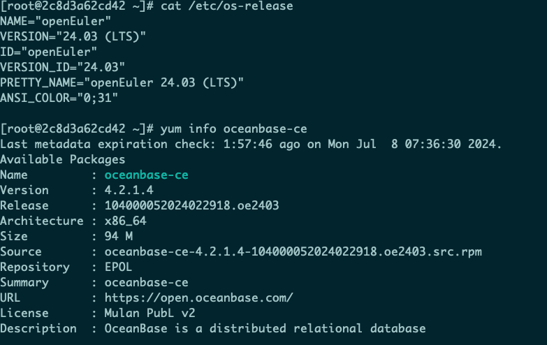
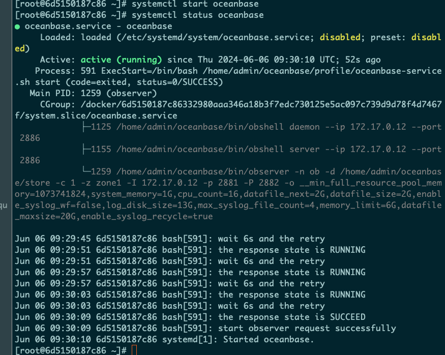
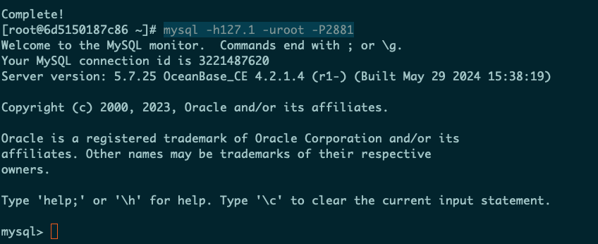
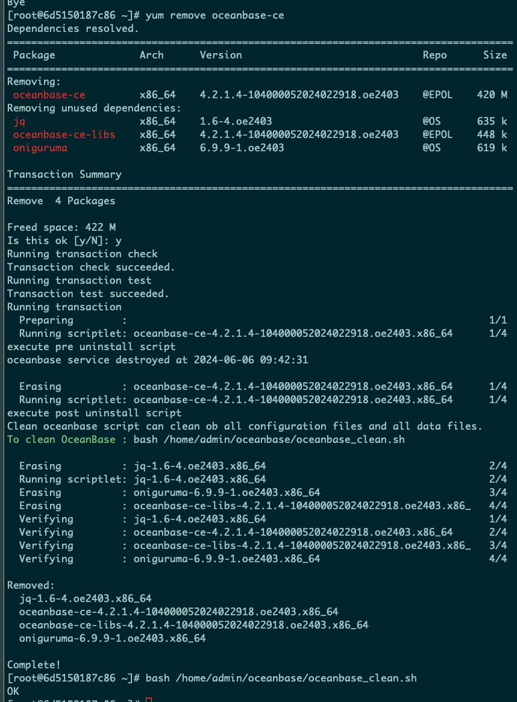
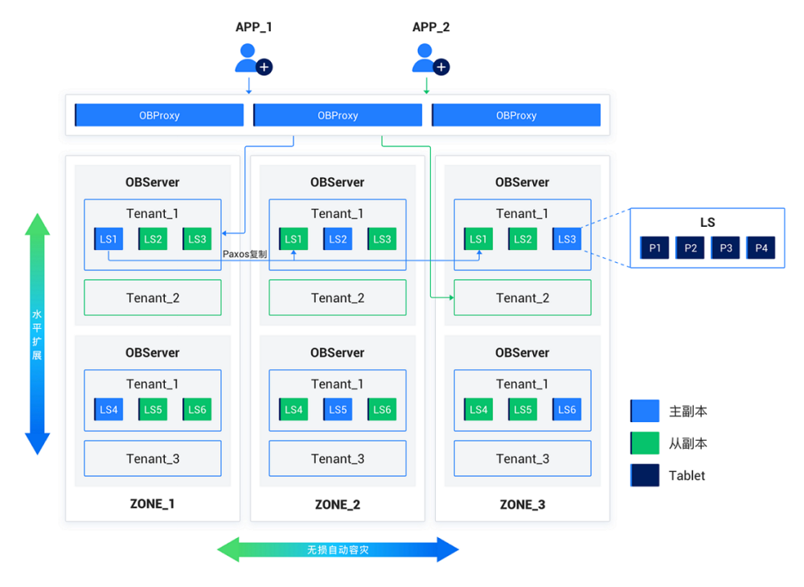

近日，在 OpenAtom openEuler（简称\"openEuler\"）社区和 OceanBase 社区的共同努力下,OceanBase 4.2.1 LTS 成功适配 openEuler 24.03 LTS，并将 OceanBase 软件包上传至 openEuler 的官方源。这一系列举动为企业在推进数字化转型的过程中提供了更多选择。

下文介绍如何在 openEuler 中使用 OceanBase，以及 OceanBase 的全新特性。

**在 openEuler 简单实用 OceanBase**
-----------------------------------

-   安装依赖，安装 oceanbase-ce，并使用 systemd 进行控制管理。

yum install hostname findutils -y\
yum install oceanbase-ce -y\
\
systemctl start oceanbase\
systemctl status oceanbase

-   使用 MySQL 客户端链接 OceanBase。

yum install mysql -y\
mysql -h127.1 -uroot -P2881

-   停止和重启 OceanBase。

systemctl stop oceanbase\
systemctl restart oceanbase

-   卸载 OceanBase。

yum remove oceanbase-ce -y\
bash /home/admin/oceanbase/oceanbase\_clean.sh

**OceanBase 介绍与系统架构**
----------------------------

-   高度兼容 MySQL 及生态: 从数据类型、SQL
    语法，到函数/表达式、优化器，全面兼容 MySQL
    协议，无需修改应用程序代码即可迁至 OceanBase。支持 MySQL Binlog
    协议，无缝对接 MySQL 下游数据生态。

-   性能极佳的可扩展"MySQL":
    兼顾分布式架构的扩展性与集中式架构的性能优势，分布式场景 TPC-C
    基准测试 7.07 亿 tpmC，单机主备 4c 小规格场景性能是 MySQL 8.0 的 1.8
    倍，稳定可靠地应对任何规模的关键工作负载。

-   更强的稳定高可用: 久经考验已有超过 1000
    家用户的实际生产系统中成功应用，满足严苛条件下的业务连续性要求，分布式形态可以做到故障自动恢复
    RPO =0，RTO \< 8s，单机主备形态故障切换时间 RTO \<
    3s，最大限度地减少业务应用延迟中断。

-   新一代数据架构的多租户:
    原生支持多租户架构及资源隔离能力，同集群可为多个独立业务提供服务，为数据库整合、SAAS
    等典型资源隔离租户场景提供 DBaaS
    能力，统一技术栈提升资源利用率，最大程度简化数据库基础设施的运维复杂度。

-   透明的高倍率数据压缩: 通过 LSM-Tree
    存储引擎及先进的数据压缩技术，节约高达
    70-90%的存储成本，为历史库、Hbase
    等大数据量低查询场景提供更卓越的解决方案。

-   HTAP 实时数据分析:
    一套数据同时支持事务处理和实时分析的工作负载。不会干扰关键业务，也不会产生额外的成本，为实时计算、实时数仓等场景提供快速的查询分析能力，加速业务实时洞察。

-   全自研的单机分布式一体化数据库：OceanBase
    数据库采用无共享（Shared-Nothing）分布式集群架构，各个节点之间完全对等，每个节点都有自己的
    SQL 引擎、存储引擎、事务引擎，运行在普通 PC
    服务器组成的集群之上，具备高可扩展性、高可用性、高性能、低成本、与主流数据库高兼容等核心特性。

**未来展望**
------------

openEuler 社区将会与 OceanBase
社区进行更为紧密的合作，包括性能优化，AI，编译，部署易用性等方向，还会将更多的
OceanBase 组件更新到 openEuler 的官方源中。
