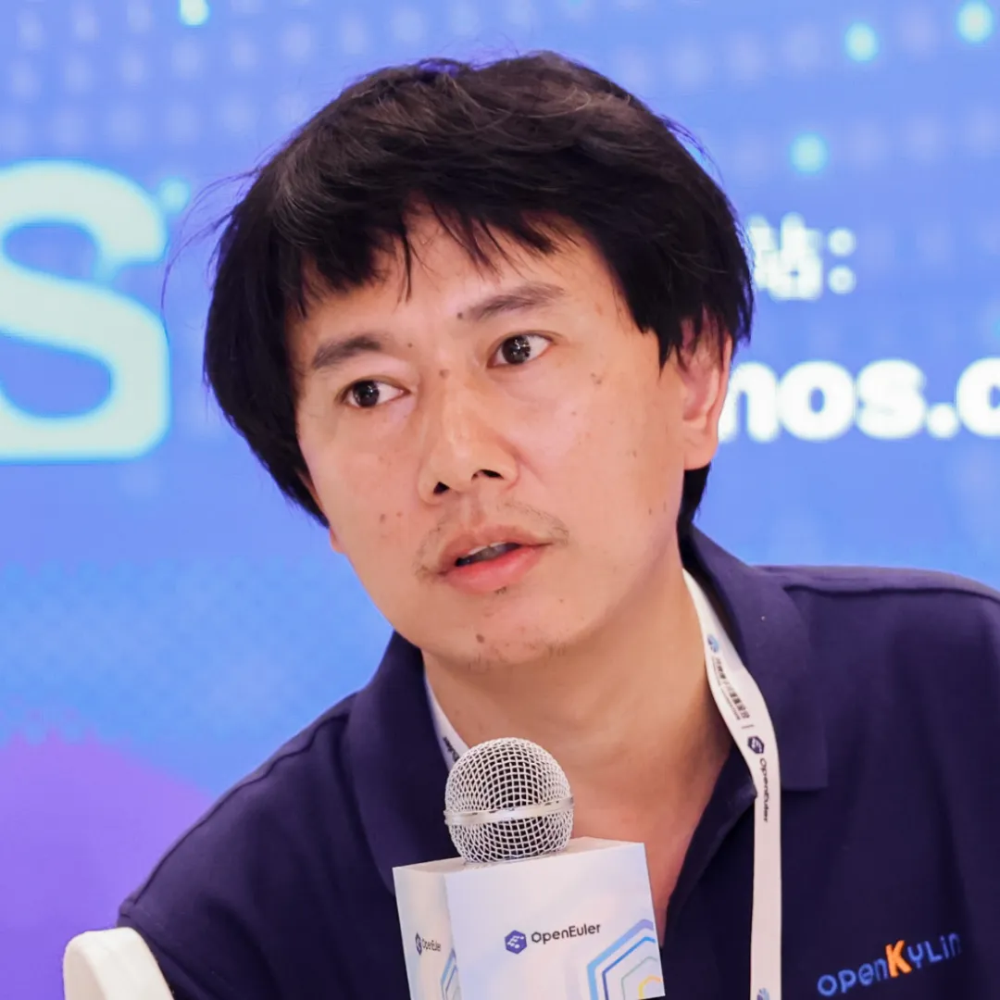
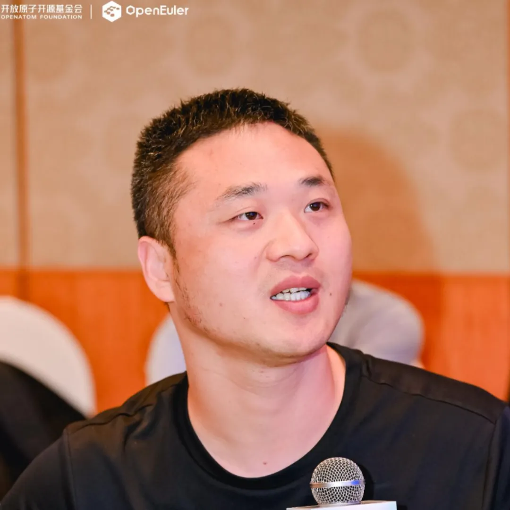
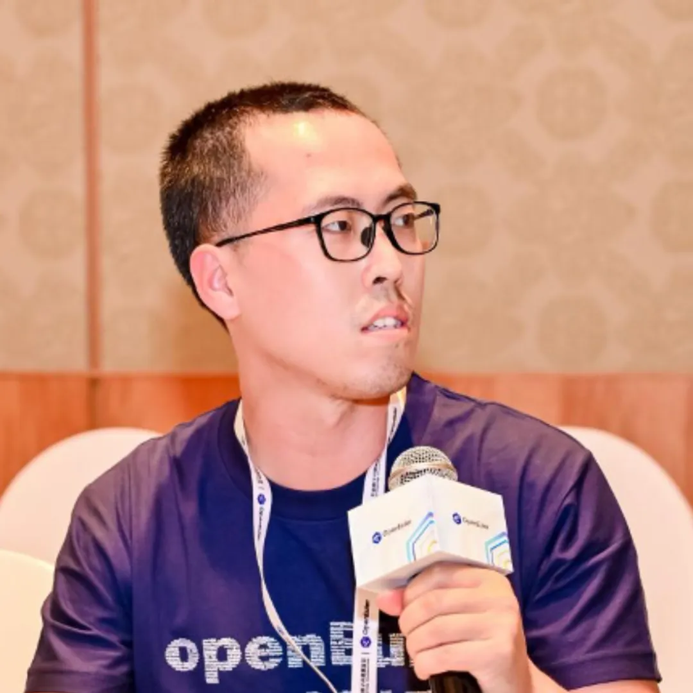
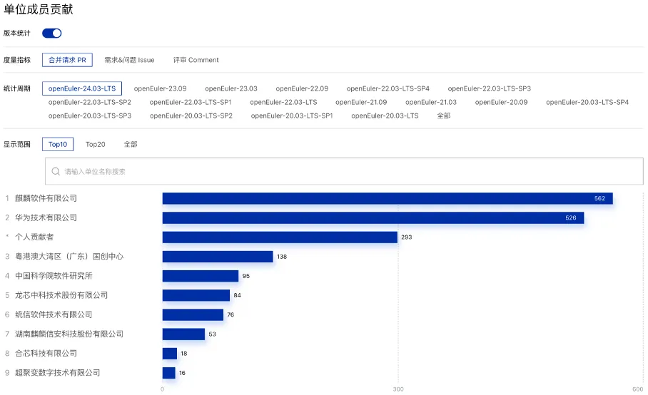

7月26日，以"我参与，我做主"为主题的openEuler SIG Gathering
2024大会在北京成功举办。作为openEuler社区年度盛事之一，本次大会不仅展示了openEuler在技术领域的最新进展，同时也为开发者提供了一个深入交流和合作的平台。

本次活动上，麒麟软件深度参与了本次线下交流会议，共提出了7个专题议题，展示了麒麟软件的最新开源贡献。

**MPTCP**

**在 openEuler 的支持及性能演示**

Linux内核**资深专家**

**MPTCP Maintainer-唐葛亮**

 

MPTCP （Multipath
TCP）是标准TCP协议的扩展，它允许在一条MPTCP连接上同时使用多个网络接口来发送和接收TCP数据包，以增强网络的可靠性、性能和效率。该特性对于带宽需求大、有路径选择需求以及高稳定性、高冗余、高实时性场景有非常高的价值。

从Linux
5.6版本开始，MPTCP陆续进入Linux主线内核，麒麟软件是国内最主要参与MPTCP上游开发的公司。在openEuler
24.03
6.6版本内核上，麒麟软件加入了最完整的MPTCP特性支持，并完成了MPTCP相关的测试及性能演示。目前麒麟软件正在推动openEuler
MPTCP CI验证，docker测试镜像等工作。欢迎用户体验MPTCP功能。

**从NestOS出发**

**不可变操作系统的模式新探索**

  

**云原生技术专家**

**杜奕威**

NestOS是麒麟软件在欧拉社区开源孵化的一款基于不可变操作系统理念设计的云底座操作系统，提供容器云和计算云双模式以及支持容器镜像方式更新。结合双模式的成功实践以及对容器技术的深入理解，我们提出NestOS结合BootC（可引导容器）技术的设想，旨在打通容器与传统Linux操作系统的壁垒，使容器管理工具能够用于Linux系统的部署和更新，实现跨混合云环境的无缝迁移和标准化管理，这将为未来应用程序交付和管理提供了新的思路。

**AI FOR OS给用户带来的价值**

**Linux技术专家**

**刘峯**

 

Intelligence
SIG在AI领域的创新项目包括智能问答Copilot、智能Shell等，麒麟软件在SIG组中积极贡献，包括metaGpt，hugginggpt等主流智能体框架的调研与适配、为社区引入和维护智能体框架，使能AI规划。当前，客户在运维、迁移等方面对AI工具的迫切需求、对操作系统AI调优的准确率期待比较高，未来，麒麟软件将继续与社区紧密配合，致力为客户提供好用的、易用的AI生态，推进AI与操作系统融合，助力社区发展。

**KubeMate：构建从OS升级到Kubernetes集群部署的一体化运维**

**解决方案**

 

**云原生技术专家**

**魏欢欢**

KubeMate
是在全场景应用专题中的一个专注于云原生领域的创新项目，致力于为用户提供高效、稳定的容器化解决方案。它在OS升级、K8s集群部署及节点扩展等方面具有独特优势，能显著提升运维效率。当前，云原生技术的发展趋势和应用前景日益显著，涵盖自动化运维、微服务架构普及、Serverless计算兴起以及DevOps文化深化，麒麟软件将加大研发投入，推出更多基于OpenEuler的云原生解决方案和服务，为推动云原生技术在
OpenEuler生态中的发展积极贡献力量。

**PilotGo架构感知特性**

**运维技术高级工程师**

**王钧琪**

 

PilotGo开源运维平台的架构感知特性基于业务场景需求，与prometheus、elastic
stack等数据平台相结合，由PilotGo-topo插件的拓扑图配置自动生成可观测数据采集、存储策略，使用PilotGo-prometheus插件对接prometheus和exporter来采集和存储metric数据，使用PilotGo-elk插件对接elastic
stack平台来采集和存储log数据，重新设计了一套基于拓扑图的架构可视化及监控方案。通过将具备天然结构可视化图形的拓扑图与复杂多组件的业务集群相结合，来更好地感知业务集群的运行动态，确保其高效稳定运行。

**开发者视角下社区文档的体验与讨论**

 

**社区资深运维专家**

**江新宇**

社区文档是开发者不可或缺的资源，它不仅提供详细的技术指南和实际操作教程，还为开发者之间的互动与协作提供了平台。优质的社区文档对于提高开发者的效率和开源项目的成功至关重要。希望通过此次研讨引起更多社区成员对文档质量的关注，共同推进社区文档的持续改进和优化，为开发者们创造更优质的开发环境。

**基于操作系统的开源合规治理探索**

**开源合规专家**

**丁紫薇**

 

开源合规管理在企业开源管理中占据重要地位，但对于操作系统来说，需要进行合规管理的场景复杂且众多，管理难度较大，但仍是不得不面对的一项任务。通过本次研讨，与行业专家进行了深入交流，共同讨论操作系统开源合规治理方向，不断探索合规治理更好的解决方案。

麒麟软件作为openEuler社区白金捐赠人、常务委员会单位以及开放原子开源基金会理事单位，持续投入社区建设和openEuler社区发行版开发及维护当中。目前，麒麟软件在openEuler社区累计贡献超15000PR和超4800issue，涉及技术领域包括桌面、多媒体、云原生、分布式存储、AI、大数据、高可用、生信、智能运维等，是openEuler社区第二大贡献者；并且在社区最新发布的openEuler
24.03 LTS版本当中，以560+贡献数量排名第一。

 

openEuler 24.03 LTS版本官方贡献数量统计排名（数据截止到2024年7月28日）

openEuler SIG Gathering
2024大会展现了社区的活力与凝聚力。开源已成为全球计算技术和产业发展的重要方式，致力于打造世界级操作系统中国品牌，麒麟软件将持续积极贡献开源，助力推动包括openEuler在内的开源社区健康成长，为打造开源强国作出贡献。
