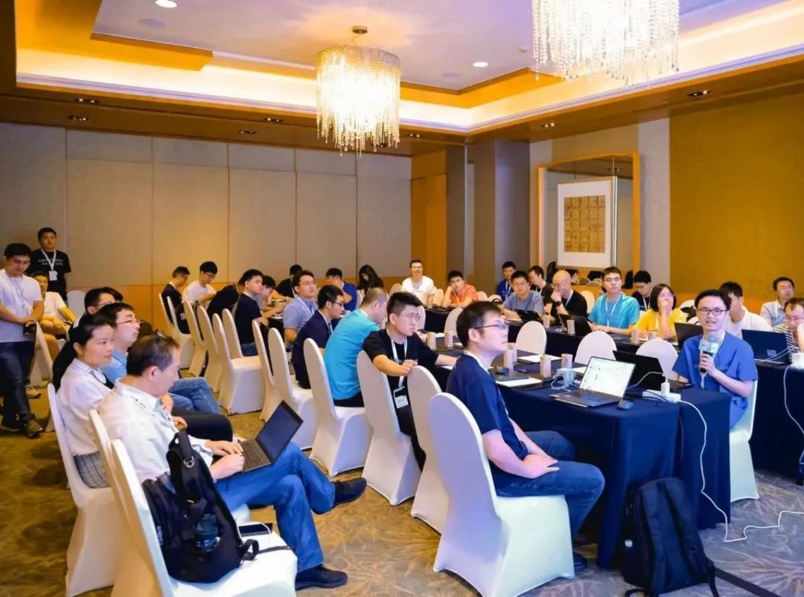
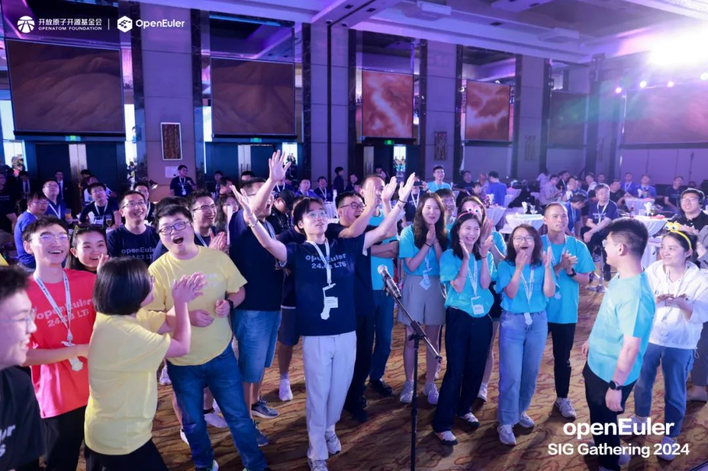

或许很多人认为，软件技术的本质就是一行行冰冷枯燥的代码，其中没有半点"人情味"可言。然而，另一种观点却认为，软件代码是人类思想的一种表现形式，开发者将自己的热情和创新精神融入其中，将其塑造为对他人有价值的工具，当用户使用软件时，自然能够感受到开发者投入的心血和传递的理念，或是体会到软件背后开发社区的个性和价值观。在刚刚召开的OpenAtom
openEuler（简称\"openEuler\"）SIG Gathering
2024大会上，我们亲眼见证了一群富有专业精神、远见和热忱的开发者如何践行第二种理念。

7月26日，来自108个SIG小组的近
300 名开发者聚焦openEuler社区后续重要规划和各SIG小组2024年下半年重要技术方案、开发计划进行了深入的探讨。在一天的会议中，我们充分感受到了**openEuler社区的开放、包容、深度和远见。**

openEuler开源4年多以来，openEuler社区发展迅速，秉持"共建、共治、共享"的理念，目前已发展超1600家成员单位、19495名开发者，下载遍布全球153个国家2000多个城市。开放原子开源基金会TOC副主席、openEuler委员会执行总监熊伟表示，开发者始终是社区发展的核心，现在社区的运作模式已经愈加的成熟和国际化。**未来，会逐渐把更多的需求、项目及活动等社区工作都交给开发者，由他们来主导社区发展。**

开放原子开源基金会TOC副主席openEuler委员会执行总监熊伟

**SIG：openEuler社区健康成长的基石**

openEuler是面向数字基础设施的操作系统，支持服务器、云计算、边缘计算、嵌入式等应用场景，支持多样性计算，致力于提供安全、稳定、易用的操作系统。通过为应用提供确定性保障能力，支持OT领域应用及OT与ICT的融合。为了实现这一宏大而充满挑战的目标，openEuler社区汇聚了来自上述软硬件领域的众多一流企业和优秀开发人员。为了让这些专注于不同技术主题的组织和开发者能够基于同一个社区目标充分协作，发挥各自优势，openEuler社区引入了特别兴趣小组（SIG）这一组织架构。每一个SIG小组的成员都分为Maintainer、Committer、Contributor等多种角色，各自承担不同的职责，**目前openEuler社区至今已有
108 个SIG小组。**

在众多活跃的开源社区中，SIG小组已经被证明为是社区健康成长的基石之一，openEuler社区就是其中的典型。与其他优秀的开源社区SIG小组一样，openEuler社区SIG小组在社区发展中起到了非常重要的作用，有着很多鲜明的优势：

**更开放、更透明**

每个SIG小组的团队项目都有公开的信息、交流方式、成员和联系方式等，任何人都可以通过邮件列表、公开例会等形式查看和参与SIG小组 的交流活动。

**更纯粹，用技术说话**

无论你是社区新人、Contributor、Committer 、Maintainer，都可以自由提出PR、issue或讨论他人的提交，不存在资历、权威压制他人声音的情况，**一切讨论都以技术为准绳。**

**更高效**

每个SIG小组每半年举办一次规划会议确定之后半年的发展方向，每双周都会召开例会跟进目标进度，把控任务执行节奏。这样的设计避免了目标不清、协作松散的问题，还能有效提升成员积极性，增强SIG小组能力输出水平。

刚刚召开的openEuler SIG Gathering
2024大会就将上百个SIG小组共同关心的一系列主题归纳为六大专题进行深度研讨，方向分别为：多样性算力、全场景应用、AI原生支持、openEuler原生开发、上游原生支持、用户体验研究。

**六大专题，为openEuler的未来描绘蓝图**

作为跨平台、跨算力、跨场景的一站式操作系统平台，openEuler社区当前面临着一系列挑战：如何为x86、ARM、RISC-V
、
GPU、NPU等在内的多种算力形式提供更好的适配和优化？如何帮助开发者更方便地构建服务器、云计算、边缘计算和嵌入式等众多场景的应用？如何响应AI大模型的发展趋势？如何为开发者、用户和上游软件提供更好的开发和使用体验？本次大会的六大专题就是为这些挑战量身定制的：

**多样性算力专题**讨论中，包括Kernel SIG、Intel Arch SIG、Arm SIG
、RISC-V
SIG等在内的多个SIG小组讨论了如何加强openEuler对未来各主流架构最新平台的支持、提出了多样性算力认证设想并分享了一些性能优化和应用案例，还展望了Arm机密计算技术的应用场景等。

**AI 原生支持专题**中，AI SIG、Compiler SIG、Intelligence
SIG等小组分享了如何为openEuler构建云原生智能容器、AI
Compiler的规划方案。同时讨论了未来openEuler在AI使能方面的规划，未来openEuler将通过AI异构加速、全栈容器化封装和开箱即用等关键技术进一步加强异构算力上模型及应用的部署和推理，提升整体的易用性，降低部署成本，通过轻量化等技术使得AI可以普惠更多用户和开发者。

**全场景应用专题**中参与的SIG小组包括CloudNative SIG、Compiler
SIG、Embedded SIG、Compliance SIG、SIG
OPS等，开发者们研讨了包括了云和云原生、数据中心内、嵌入式等全场景的应用和未来规划，
还讨论了参天、创新中间件、KubeOS、KubeMate、NestOS等社区原创项目未来在各主流场景的应用和落地计划。

**openEuler 原生开发专题**中，Infra SIG、CICD
SIG、安全SIG等小组重点讨论了openEuler
DevStation、openEuler软件中心、创新软件包格式EPKG等创新方案的进展和未来的规划，通过这些工具和服务，openEuler社区可以为开发者提供更为便利的开发体验，提升开发效率，更好的支持开发者基于openEuler做开发。同时专题上还讨论了漏洞报告工具创新项目ct-oval，可以有效解决第三方漏洞扫描误报的棘手问题。

**上游原生支持专题**主要关注Linux
内核等上游社区对openEuler关键技术特性的支持等问题。介绍了GMEM异构融合内存合入Linux上游社区的计划和进展，讨论了云计算OpenStack支持openEuler的计划，以及Lustre在
openEuler的使能与发布计划等。以及如何从上游协同、监测、维护管理等维度做好从上游原生支持到openEuler原生发布的关键环节。

**用户体验研究专题**中，doc SIG、基础设施SIG、G11N SIG、人才与服务
SIG、openDesign
SIG等小组与开发者共创研讨了文档体验提升、基础设施服务增强，海外信息体验优化、社区论坛技术氛围活跃、前端组件库开放等关键开发者触点，不断探索更优的用户体验。同时，从多维化、多样性、智能化等维度讨论了未来社区信息体系的改进方向。

值得一提的是，六大专题中的诸多议题都是openEuler社区开发者提交的，在现场讨论中各个SIG小组的与会人员更是表现出了高度的专业性和饱满的参与热情。无论是经常提交PR的社区大牛，还是刚刚加入社区的开发新人都能以平等的身份和态度畅所欲言。数百名与会者在这场线下会议中充分展现了整个openEuler社区的协作、分享和进取精神，而这种精神正是openEuler社区持续创新进步的最大动力。

**开放与创新的软件，\
背后一定有开放和创新的社区精神**

为期一天的大会很快落下了帷幕。当晚，openEuler社区安排了轻松的开发者之夜活动，为数百位与会者举办了一场大派对，并特别致谢openEuler
SlG Gathering
2024大会专题出品人及优秀社区开发者，感谢他们为本次大会成功举办作出的重要贡献。

openEuler SIG Gathering
2024大会只是openEuler社区这一年轻而富有活力的开源社区的一个缩影。数百位与会者是整个openEuler社区成千上万开发者的代表，他们的不懈努力让openEuler发展成为了今天这样开放且持续创新的数字基础设施操作系统平台。每一位openEuler社区贡献者的信念和投入化作一行行代码，为openEuler操作系统塑造了创新包容的灵魂，赢得了越来越多用户的认可。
