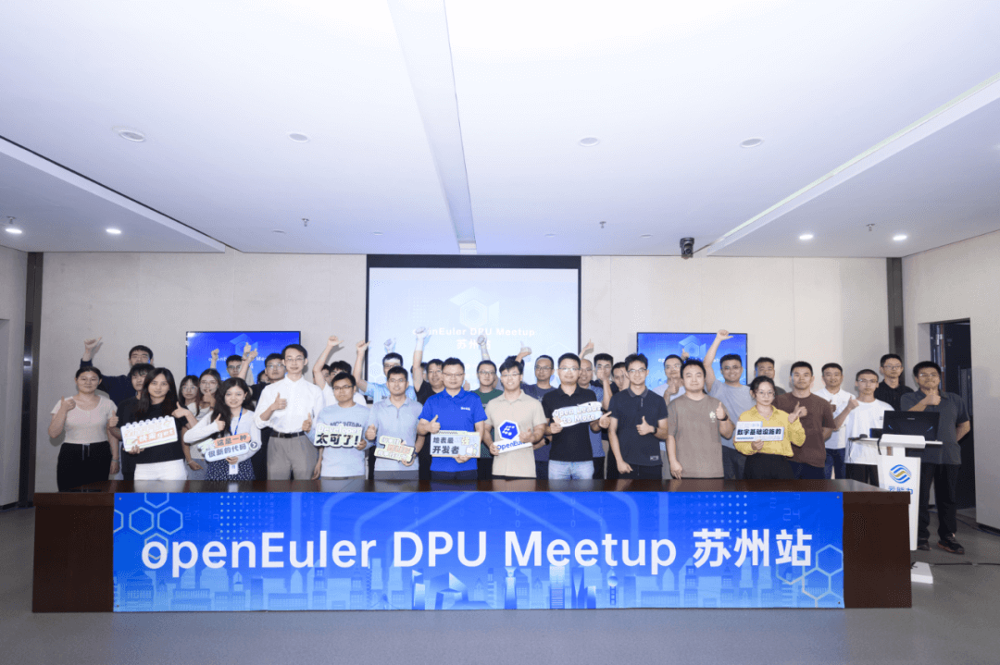
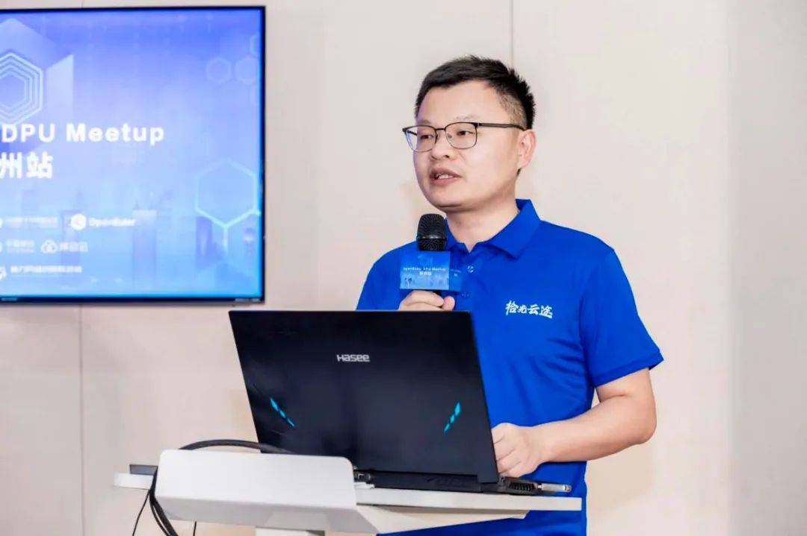
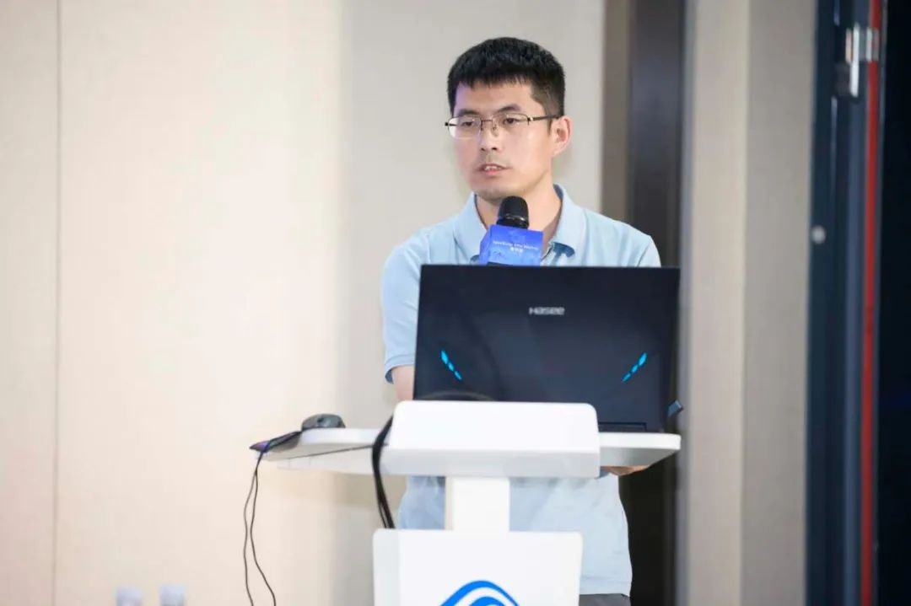
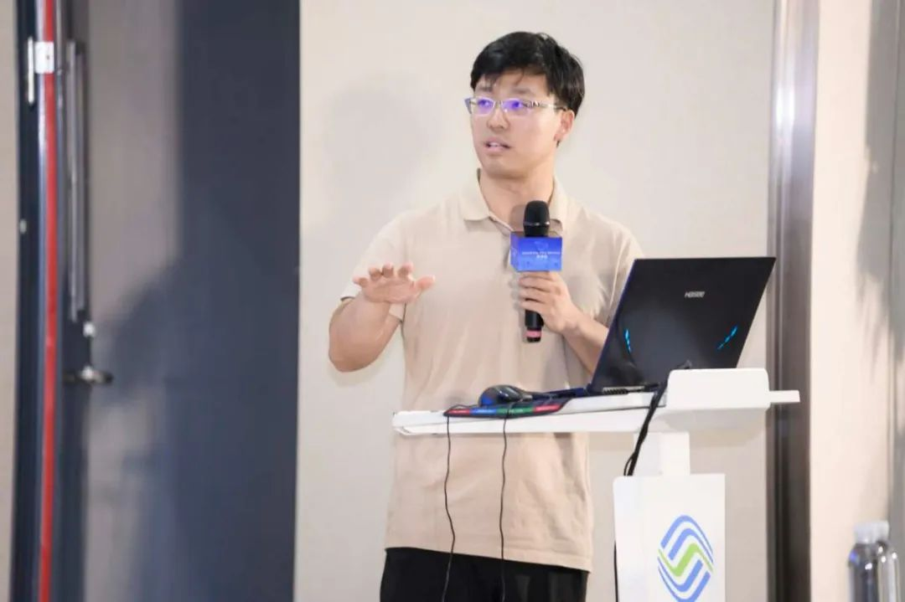
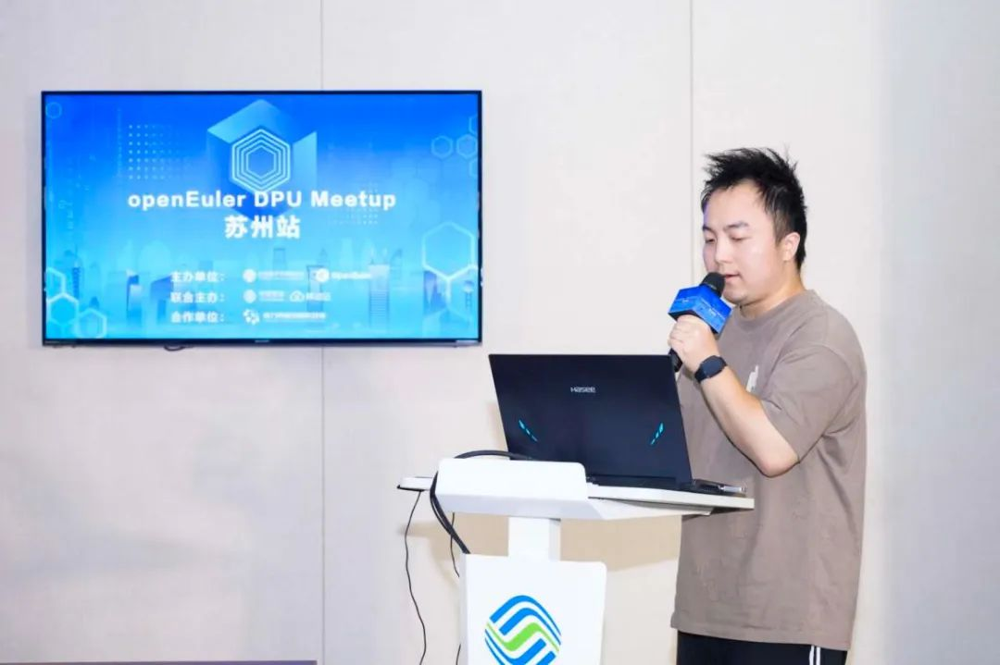
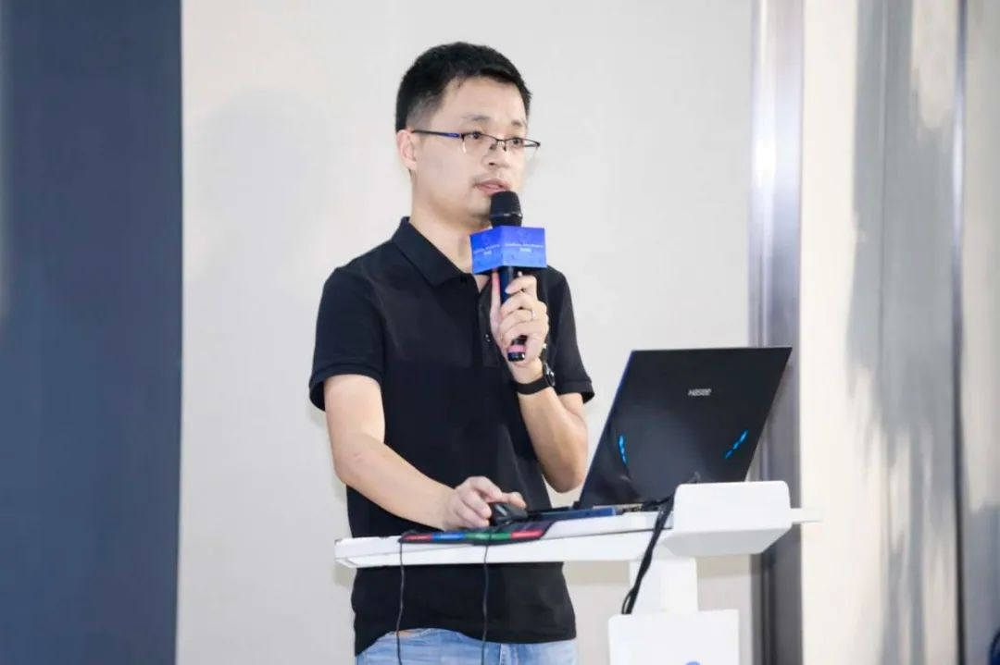
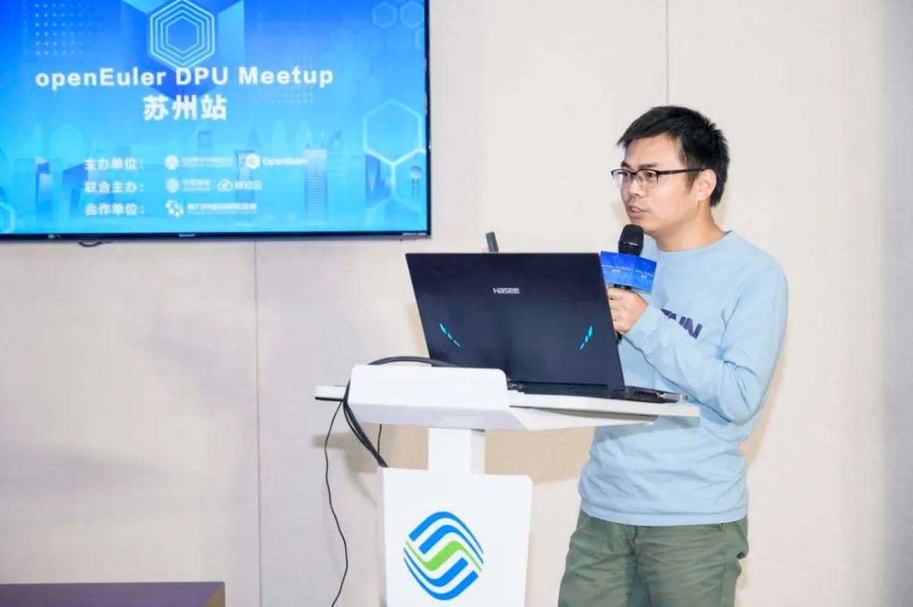

随着云计算、大数据、人工智能等技术的飞速发展，数据处理能力成为衡量云与数据中心性能的关键指标。DPU作为专为数据处理加速设计的计算单元，正逐步成为提升算力供给效率、优化资源利用的关键技术。8月30日，OpenAtom
openEuler（简称\"openEuler\"） DPU
Meetup苏州站成功举办。本次交流活动由openEuler社区和移动云联合主办、算力网络创新联合体协办，邀请多位业内专家，分享在DPU领域的实践经验，积极推动算力网络联合创新，助力算力网络产业链生态融通。

**下面就让我们来回顾本次 Meetup 的精彩内容**

**开场致辞**

openEuler委员会委员/移动云计算产品部副总经理张胜举为本次活动发表致辞。张胜举分享了计算架构经历的三个发展阶段：CPU通用计算阶段、以CPU为中心的异构计算阶段，以及异构计算的融合阶段。他还详细介绍了中国移动云能力中心在DPU方面取得的进展，包括发布的磐石DPU
4.0的卓越硬件能力和COCA
DPU的软件栈优化成果。此外，他还表达了希望中国移动能够与openEuler社区继续携手合作，共同为
openEuler DPU乃至整个DPU行业的发展贡献更多的智慧和力量的美好愿景。

**移动云DPU操作系统，让算力供给更高效**

移动云操作系统架构师、openEuler 兼容性 SIG Maintainer
严海双分享了移动云DPU操作系统是一款针对数据中心设计的高效算力供给系统，旨在解决CPU在处理基础设施算力时的消耗问题，通过高性能网络引擎、全卸载框架、内核态vDPA和高性能虚拟化IO引擎等关键技术，实现了网络加速、存储性能提升和业务卸载。该系统支持多种业务场景，如智能计算、大数据和云游戏，通过定制化镜像和通用业务卸载框架，优化了HOST-DPU通信，实现了算力服务的高效供给。目前，该操作系统已在移动云中得到广泛应用，并将持续优化以适应未来的硬件加速方案标准化和多架构融合需求。

**以开源为路径 推动dpu标准化生态建设**

中国信通院云大所云计算部高级业务主管赵伟博在演讲中强调了DPU在释放CPU算力中的关键作用，并指出国内外DPU产业现状及面临的问题。他提出通过开源推动DPU软件生态标准化建设的解决思路，介绍了中国信通院在推动DPU软件生态标准化工作方面的研究成果，包括成立开源组织、创建开源项目ODPU、建立标准研究体、深入产业研究和积累生态资源等。他还提出了下一步研究计划，包括持续推进开源工作、标准化工作和ODPU落地验证，以促进DPU软件生态建设和应用落地。

**移动云磐石DPU规模化应用中运维能力提升实践**

移动云DPU网络引擎开发工程师周文东在演讲中分享了移动云磐石DPU规模化应用中的运维能力提升实践。他介绍了三个主要技术：1)
高效流表查询与对账技术，通过优化流表查找方式和自动化对账，显著提升了DPU性能和软硬件流表一致性；2)
virtio用户态设备数据监控，通过监控和自动诊断，提高了数据监控和故障自愈能力；3)
软硬融合的自动化测试平台，通过标准化测试流程和问题解决机制，提升了测试效率和问题定位能力。这些技术的应用，有效提升了DPU的运维效率和系统稳定性。

**针对DPU的软件无感卸载方案探索**

openEuler sig-DPU
Committer李强在演讲中探讨了DPU软件无感卸载方案，旨在将管理面软件卸载到DPU以加速网络、存储和安全等数据处理。他提出了一个框架，包括文件系统、IPC和进程生命周期管理的协同，以实现软件管理面的无缝卸载。通过qtfs实现文件系统协同，udsproxy实现IPC协同，rexec管理业务进程生命周期。该方案已应用于虚拟化管理面libvirt卸载和容器管理面卸载，相关项目已在openEuler开源。

**virtio-fs在dpu上的卸载**

云豹智能软件系统首席架构师&总监陈安庆在演讲中介绍了virtio-fs在DPU场景中的应用，强调了其与virtio-blk的区别，指出virtio-fs提供文件语义接口，适合云计算中的数据共享和AI计算场景。他提出了corsica
virtio-fs卸载方案，旨在将文件系统服务无缝卸载到DPU，以提高性能并减少宿主机资源消耗。该方案基于开源组件，通过JMND
VFS和SPDK技术实现高效文件系统服务。他还讨论了性能测试和潜在收益，以及未来的改进方向，如支持dax特性和零拷贝技术。

**彩蛋！！！**

本次 Meetup 的分享材料已上传至 openEuler
Gitee仓库。欢迎前往下方链接获取，期待您的下次参与！

链接：

https://gitee.com/openeuler/presentations/tree/master/meetup

本次 Meetup 直播回放已上传至 openEuler
视频号。如果您错过了本次线下活动，可前往**视频号（OpenAtom-openEuler）**查看活动回顾，期待您的下次参与！
