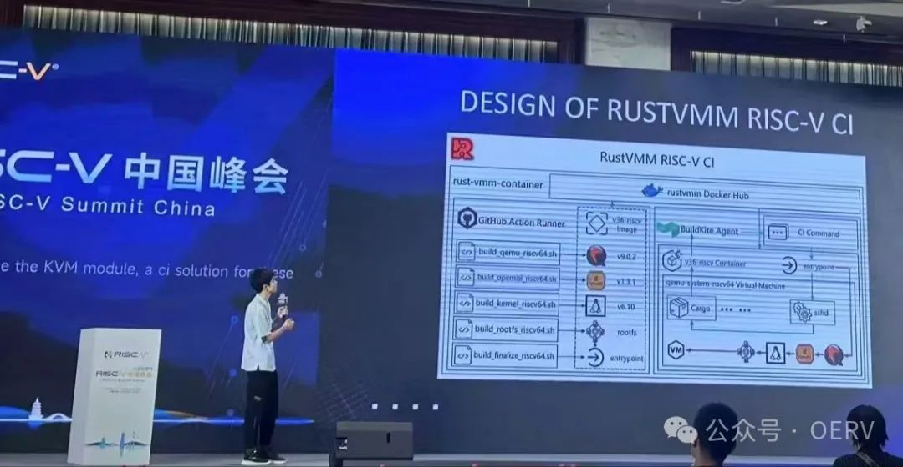
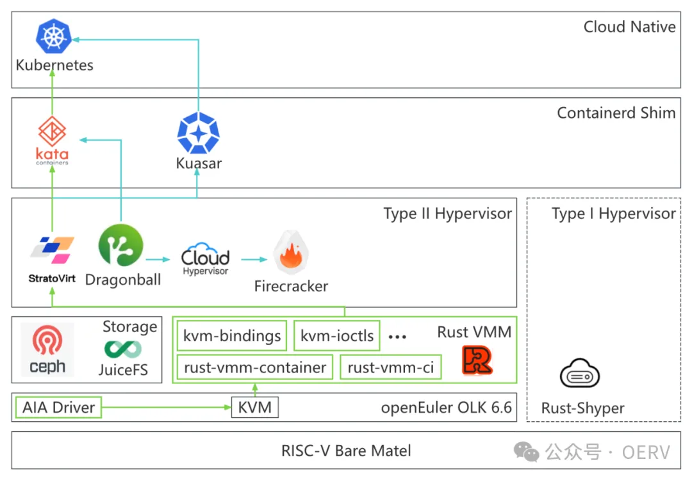
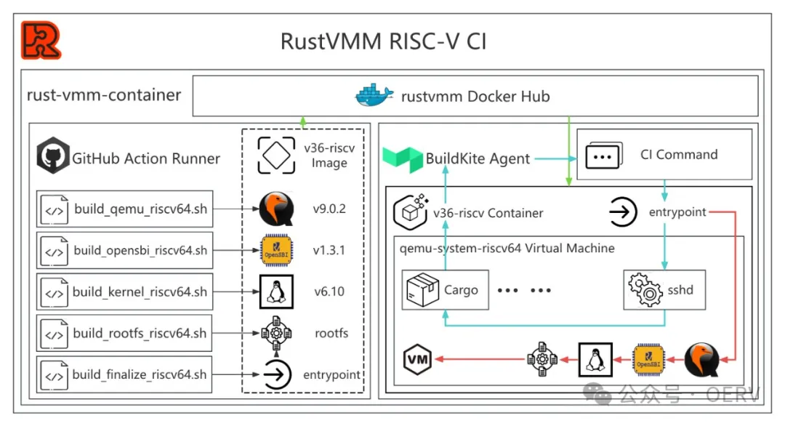
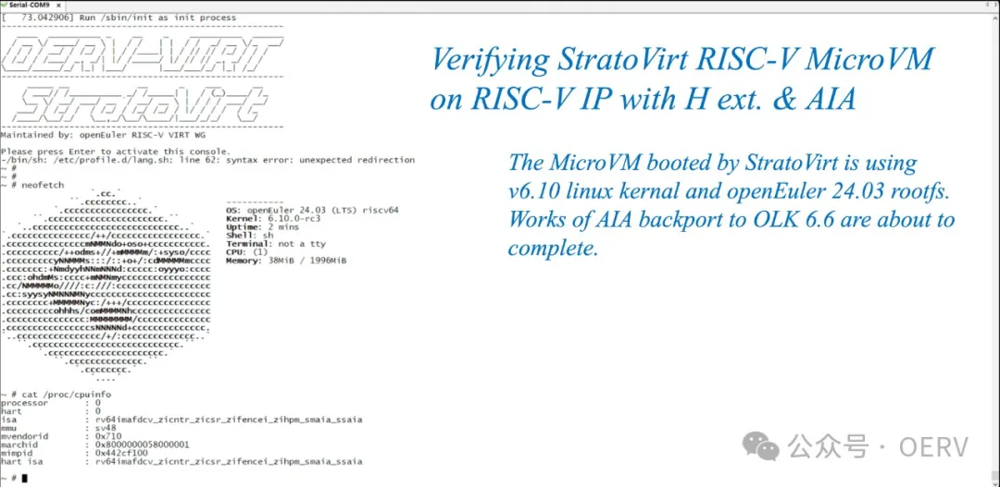

第四届 RISC-V 中国峰会（RISC-V Summit China 2024）于 8 月 21 日至 23
日在杭州成功举办。中国科学院软件研究所 OERV
虚拟化小组组长何若轻在峰会上分享了 「从 StratoVirt 到 KataContainers:
基于 H 扩展的软件生态建设」的主题演讲，介绍了虚拟化小组规划的 RISC-V
虚拟化和安全容器生态建设路线图，以及 OERV
虚拟化小组在虚拟化方面的技术成果。

**虚拟化和安全容器生态建设路线图**
----------------------------------

虚拟化软件发展至今，已经有了相当广泛的用户群体。对虚拟化相关软件的优化已经深入到指令集设计层面，对于学术界和工业界非常重要。但虚拟化在
RISC-V 架构上的软件栈还不够成熟，还有很多工作亟待完善。截止至 2024 年 8
月，支持 H 扩展，sxaia 扩展以及 AIA 高级中断架构的，符合 RVA23 标准的
SoC 尚未问世。真实硬件的缺失导致所有的工作都在基于 QEMU
进行开发和验证，也是阻止代码贡献到上游的主要阻力。

OERV 虚拟化小组的愿景是在 RISC-V
架构上打造成熟的虚拟化和云原生软件生态。为了达成这个目标，目前已经规划了两个阶段的工作任务：

-   第一个阶段：打通 RISC-V 架构上的基于虚拟化技术的安全容器路径;

-   第二个阶段：为 RISC-V 架构提供性能可以媲美 x86, arm 虚拟化能力.

**成果**
--------

目前，何若轻在没有真实硬件的条件下，使用 RustVMM 设计了在异构平台上执行
RISC-V 虚拟化相关 CI 的方案。这个方案通过在 CI 逻辑上一定程度的 完善, 让
RISC-V 的测试落到为 x86 的机器上执行，并通过对运行在 container 中的
QEMU-system 的环境准备，制作出了一个运行在其他架构上的 RISC-V QEMU
SYSTEM 镜像，供异构的 runners 拉取，并进行 RISC-V 架构的 CI
测试。

此外，何若轻也完成了 StratoVirt RISC-V
MicroVM 的开发工作, 并与进迭时空的林俊彦, 郑文斌工程师通力合作, 在带有 H
扩展以及 AIA 的进迭时空 X100 FPGA 上完成了 StratoVirt
的功能验证，相关的工作已在社区推进合入。StandardVM
的开发也在有序进行中。