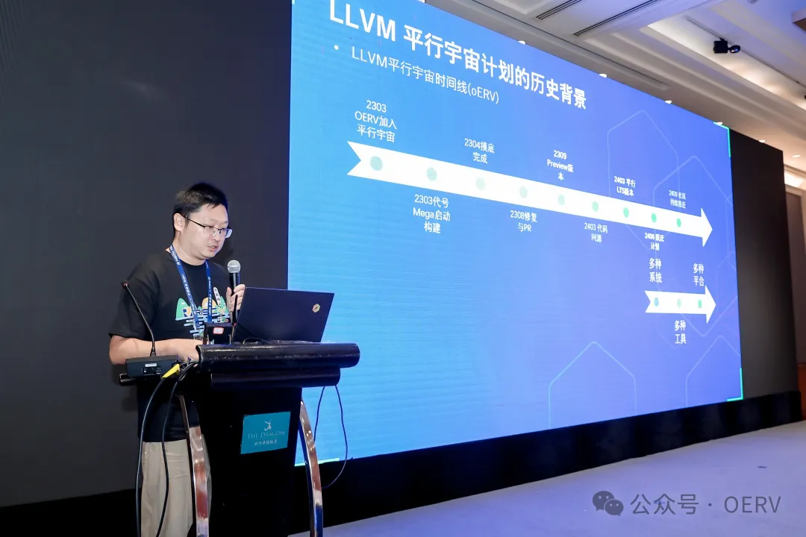

8 月 23 号 上午由 OpenAtom
openEuler（简称\"openEuler\"）社区和中国科学院软件研究所联合主办的RISC-V
中国峰会同期活动\--openEuler RISC-V SIG 开发者日与杭州 Meetup
在杭州黄龙饭店珍珠厅 2 如期举行。

本期会议邀请了开芯院香山、达摩院玄铁、算能科技和进迭时空等知名厂商，同时也邀请了
RedHat、苦芽科技和 openEuler Compiler SIG 等活跃建设 RISC-V
生态的同伴们，共同讨论了香山 IP、UEFI
启动、开放算力、虚拟化、固件、内核同源、图形化、质量管理、生态扩展仓、llvm
平行宇宙计划以及衍生商业发行版操作系统的相关议题。

**开场**

中国科学院软件研究所高级工程师屈晟介绍了 openEuler RISC-V
前一阶段的工作重点是实现 x86/ARM/RISC-V 代码同源，并在 24.03 LTS
实现了三架构同源构建，下一阶段将重点围绕软硬件生态协同开展工作，欢迎广大厂商共同参与
openEuler RISC-V
建设。

**香山 IP 与 openEuler**

北京开源芯片研究院项目经理张健带来了香山 IP 与 openEuler
的演讲，首先介绍了香山 IP
的研发现状和后续计划，然后说明由于丰富的南向支持经验和丰富的系统软件支持选择了
openEuler，并通过完善相关指令集测试用例和软件包的 upstreamming 来支持
openEuler。计划给 openEuler 贡献改进的 riscv-hyp-tests 用例和自研 gos
用例到 LAVA 框架中。

**The progress in UEFl within the RlSC-V community: A use case and
collaboration with openEuler**

来自玄铁的 UEFI 专家柴春阳老师带来了 RISC-V 社区的 UEFI
进展的演讲，详细说明了社区里 RISC-V 固件的进展，以及 RISC-V 上 UEFI
启动流程的介绍，和玄铁与 openEuler 的合作成果，包括在 LicheePi 4A /
RuyiBook 成功应用 UEFI 解决方案等。

**开启算力新纪元:基于RISC-V的开放算力探索与展望**

算能高级副总裁高鹏先生带来了基于 RISC-V
的开放算力探索和展望的演讲，分享了 RISC-V
建设开放算力过程中，算能的思考、探索、成果和展望，认为 RISC-V
最重要的发展机遇在于 AI 算力需求，然后详细介绍了算能从 TPU 到 Processer
再到 NOC 的技术发展，和目前的产品成果，最后展望了将 RISC-V 引入智能 PC
和边缘服务器市场的前景。

**基于RISC-V架构的设备虚拟化实践**

来自进迭时空的工程师郑文斌带来了基于 RISC-V
架构的设备虚拟化实践的演讲，介绍了 RISC-V 的虚拟化架构演进，目前的
RISC-V
国际标准也正在快速满足数据中心场景的需要，然后分享进迭在虚拟化方向做的工作和成果，最后展望未来进一步完善相关内容。

**Linux on RlSC-V-Firmware & OS ecosystem update**

来自 Red Hat 的 RISC-V 大使傅炜先生带来了关于 RISC-V 上的固件和 Linux
操作系统生态的演讲，详细介绍了基于 RISC-V
的固件开发历程和相关组件的演进，最后感谢各大发行版和各类组织和厂商们对于推动
RISC-V 做出的进展。

**RVCK:RISC-V同源内核项目与进展**

中国科学院软件研究所工程师邢明政带来了 RVCK: RISC-V
同源内核项目与进展的演讲，RVCK 的项目背景是为了整合各厂商的 6.6
内核，形成统一的 6.6 LTS
内核，详细介绍了项目的维护策略，分支管理，发布件，以及后续工作，然后是
OLK-6.6 项目是为了获得 openEuler 专属 6.6 LTS 内核，目前的进展是对
SG2042 的支持更稳定，对 TH1520 的支持更全面。

**RISC-V 图形化软件栈的现状和展望**

中国科学院软件研究所工程师刘鑫带来了 RISC-V
图形化软件栈的现状和展望的演讲，详细介绍目前 openEuler RISC-V
的软件渲染现状，并为 Mesa 引入 LLVMpipe JIT
来提升渲染性能，相关贡献已被上游合入。介绍了 LLVMpipe 的下一步工作，以及
ROCm 在 RISC-V 上的可能性与展望。

**openEuler RISC-V 质量管理体系**

中国科学院软件研究所工程师吴洁带来了 openEuler RISC-V
质量管理体系的演讲，详细介绍了 openEuler RISC-V
的测试流程以及质量管理体系架构，包括 Mugen，openQA，以及 Kernel CI
的相关内容，后续会对每个项目不断地进行优化。

**LLVM平行宇宙计划\--LLVM与openEuler协同的进展与展望**

来自 openEuler Compiler SIG 的 Maintainer 赵川峰带来了 LLVM
平行宇宙计划：LLVM 与 openEuler 协同进展与展望的演讲，详细说明 LLVM
有着良好的架构，更多的新架构新语言支持，支持编译器安全特性，活跃的社区等优势。LLVM
在嵌入式，云，服务器场景与 openEuler 协同进展，下一步会加强 LLVM 编译器
LTS 构建，持续迭代 LLVM 平行宇宙 openEuler 版本。

**「跃迁路径」工程计划:Karsieros，启动!**

苦芽科技 CTO
王俊强带来了「跃迁路径」工程计划：KarsierOS，启动！的演讲，详细介绍了
KarsierOS，第一款基于 LLVM
平行宇宙成果的商业发行版，有着深度优化与适配，提供嵌入式与服务器版本。跃迁计划下一步为
Linker Matrix 链接器矩阵，使用包含 LLVM Linker、Mold
在内的多个链接器对平行宇宙进行再次维度展开。

**OEPKGS/openEuler RISC-V 生态拓展仓**

中国科学院软件研究所工程师殷佳毅带来了 OEPKGS openEuler RISC-V
生态扩展仓的演讲，详细介绍了 OEPKGS 扩展仓和 OEPKGS
软件包服务的相关内容，一些受限于各种原因的软件包可以引入到 OEPKGS
扩展仓过渡，OEPKGS 软件包服务提供欧拉官方仓与扩展仓 260
万二进制软件包的检索和下载。

**合影留念**

**相关链接：**

-   Gitee 协作主页:

    -   https://gitee.com/openeuler/RISC-V

-   构建仓库协作地址:

    -   https://build.tarsier-infra.com

-   第三方 repo 源:

    -   https://repo.tarsier-infra.isrc.ac.cn/openEuler-RISC-V

-   OERV 工作中心：

    -   https://github.com/openeuler-riscv

-   邮件列表:

    -   riscv@openeuler.org

-   Discord 邀请链接:

    -   https://discord.gg/f9znRFjh
