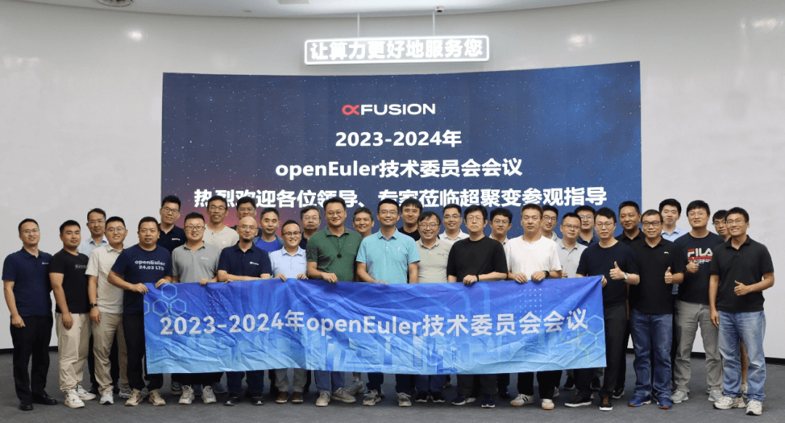
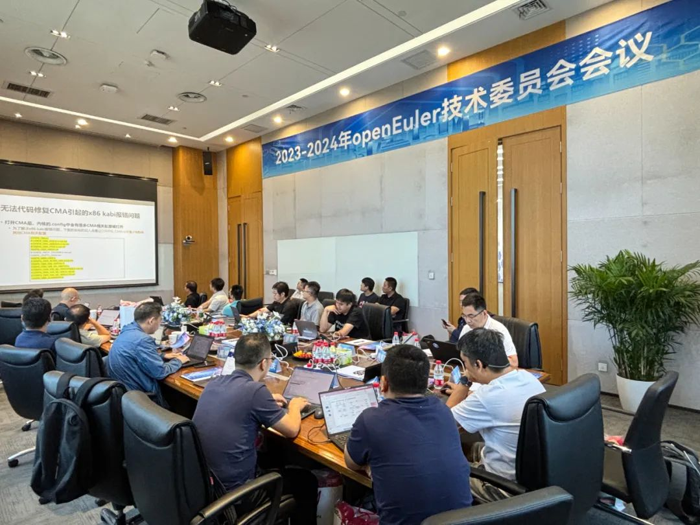
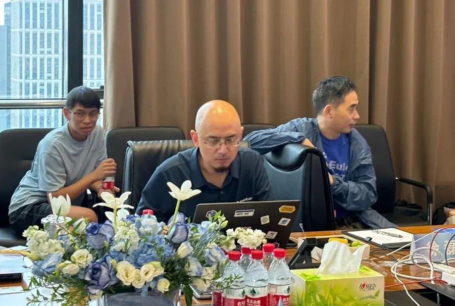
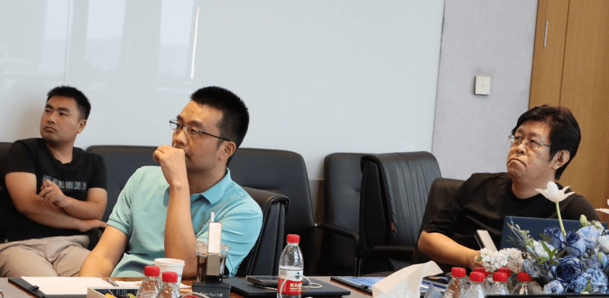

2024年8月29日，2023-2024年 OpenAtom
openEuler(简称\"openEuler\")技术委员会第六次线下会议由超聚变数字技术有限公司承办并在河南省郑州市信息产业大厦圆满召开。

超聚变服务器操作系统研发部部长徐磊代表承办方致辞，openEuler委员会执行总监、开放原子开源基金会TOC副主席熊伟，openEuler技术委员会主席胡欣蔚及多位技术委员会委员和业内众多专家及企业代表齐聚一堂，围绕openEuler社区技术最新进展及未来发展规划方向开展深入研讨。

徐磊表示超聚变作为openEuler社区黄金捐赠人，始终坚持与社区开展创新合作、推动新技术的开源及商业落地，共同繁荣社区生态。随着信息技术的快速发展，openEuler作为操作系统的重要一环，已成为覆盖服务器、云计算、边缘计算、嵌入式等场景的面向数字基础设施的操作系统，随着AI时代的来临，未来将在智能驾驶、人工智能等领域持续发挥重要作用。超聚变将继续携手openEuler社区为操作系统产业发展持续贡献力量，并期待通过本次会议促进与社区的更多技术创新和合作。

本次会议中openEuler技术委员会委员们及相关企业代表就社区多个关键技术领域进行了集中研讨。

其中在多样性算力支持方面，涵盖英特尔最新的roadmap及在AI的整体布局、海光芯片架构下在安全方面的支持；

在多场景支持方面，包含面向开发者的DevStation工作站最新进展支持，以及面向智能驾驶基础软件平台的构建可行性讨论；

在内核方面，针对内核分级维护开展了初步讨论，计划与社区运营团队以线下meetup的方式进行下一步具体方案的讨论和制定；

在基础设施建设方面，针对EPKG新型软件包及社区基础设施工作的最新进展聚焦高效运维管理在会上进行了深入的讨论；

在24年下半年社区版本规划方面，达成社区将持续在云原生、AI原生、开箱最优及生态服务支持四个维度持续创新发展的共识；

此外，技术委员会委员们全票通过金蝶内存数据库项目开源到openEuler社区并在大数据SIG组进行管理。

技术委员会主席胡欣蔚围绕构建面向数字基础设施全场景的操作系统社区，社区技术演进和发展规划会持续面向数字化、信息化和智慧化的基础软件进行创新。

开放原子开源基金会TOC副主席、openEuler委员会执行总监熊伟对本次会议进行总结，会议展示了openEuler在多个领域的最新技术成果，并为未来的发展规划形成了宝贵积累和共识，希望通过社区各方力量深入交流与开源协作，进一步推动openEuler系操作系统在众多行业的持续创新与发展，持续推动社区出海扬帆远航。

超聚变公司将继续加强与社区的联合创新，加大科技创新力度，加快技术架构转型，构建领先的算力基础设施技术底座，为用户提供更加便捷、高效、优质、安全的算力服务。
