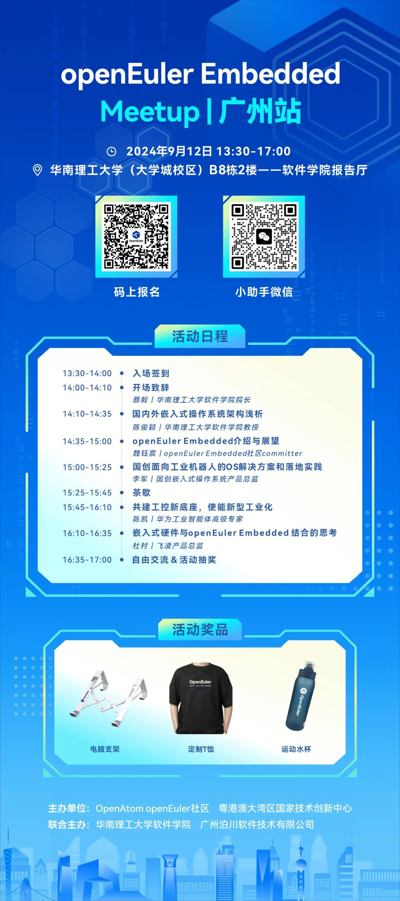
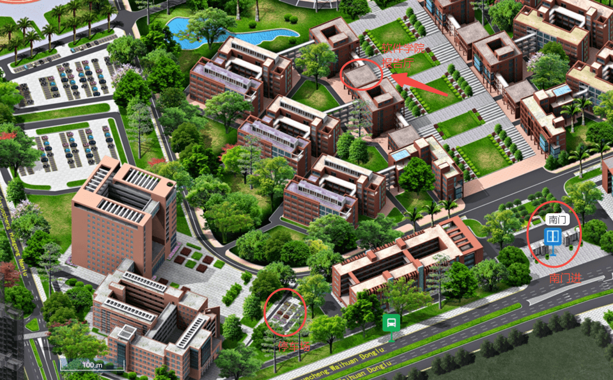

随着物联网、智能设备及工业控制等领域的迅猛发展，嵌入式技术作为连接物理世界与数字世界的桥梁，其重要性日益凸显。为了深入探讨嵌入式技术的最新趋势，加强产学研的交流与合作，OpenAtom
openEuler（简称\"openEuler\"）社区将**于9月12日在华南理工大学举办一场嵌入式交流的Meetup。**本次交流活动将邀请多位业内专家，分享在嵌入式领域的实践经验。欢迎大家踊跃报名，与现场嘉宾和贡献者分享交流嵌入式相关技术实践和畅想。

**Embedded Meetup 广州站**

**活动信息**

 

**组织单位：**openEuler**社区、粤港澳大湾区国家技术创新中心、华南理工大学软件学院、广州泊川软件技术有限公司**

时间：2024年9月12日 13:30-17:00

地点：华南理工大学（大学城校区）软件学院报告厅

**本次Meetup活动将围绕以下主题展开：**

1.openEuler 嵌入式技术社区介绍与应用案例分享：**主要介绍openEuler
Embedded社区的起源，架构设计，重点特性，应用案例及未来规划。

2.嵌入式操作系统架构的对比分析：**深入剖析国内外知名嵌入式操作系统的架构特点，探讨它们之间的异同点，为开发者提供全面的视角和参考。

3.面向工业场景的嵌入式操作系统技术分享：**分享面向未来工业场景的价值主张和核心技术能力。

4.openEuler Embedded开发实践分享：**介绍基于openEuler
Embedded开发的轻量化桌面xfce及嵌入式软硬件生态融合的策略和思路。

**活动议程&报名**

**路线指引**

从华南理工大学（大学城校区）的南门进入之后，向北上阶梯直行，靠西侧一路走到B8栋，上二楼即到达软件学院报告厅；若有停车需求，则车辆从南门进入后左转直行到图示处停车场，再原路步行返回至南门处，步行至报告厅。（需要校内停车请务必扫描上文的报名码，在报名表内填写车牌号和身份证号后四位登记）

