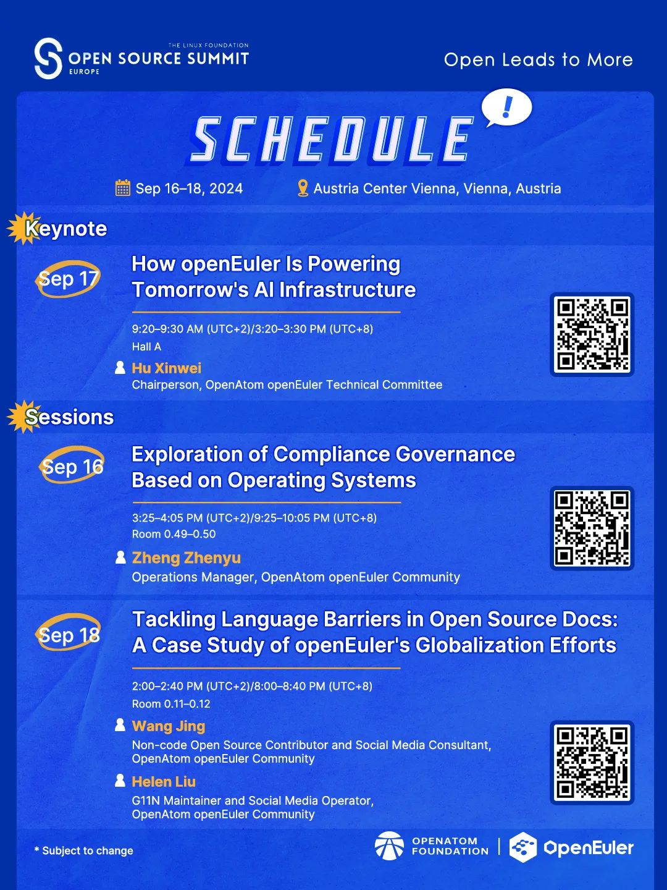
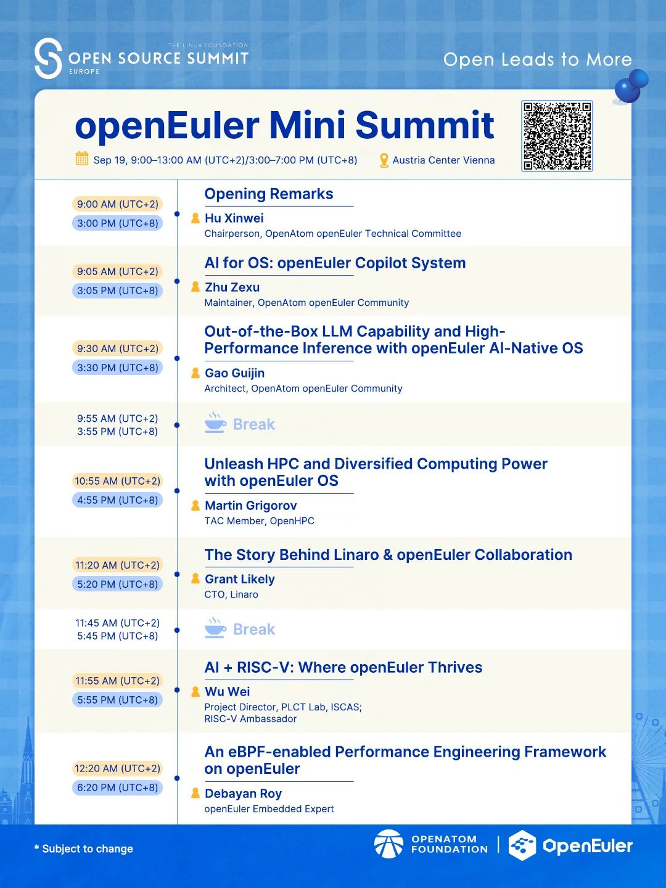

2024年9月16日-19日，由Linux基金会主办的Open Source Summit Europe
2024（简称 OSSummit EU
2024，欧洲开源大会2024）将在奥地利·维也纳举办。OpenAtom openEuler（简称
openEuler）将迎来第三次亮相该大会的重要时刻。值得一提的是，9月19日上午，openEuler专题分论坛将作为大会的一部分，与全球开发者深入探讨开源操作系统与AI的前沿趋势，欢迎朋友们关注！

日程链接：https://osseu2024.sched.com/event/1iWLB

**openEuler 参会议程**

**openEuler 专题分论坛**

