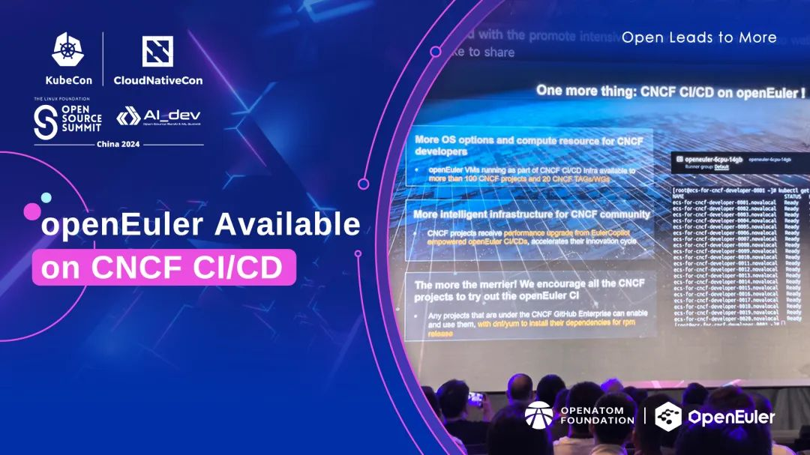
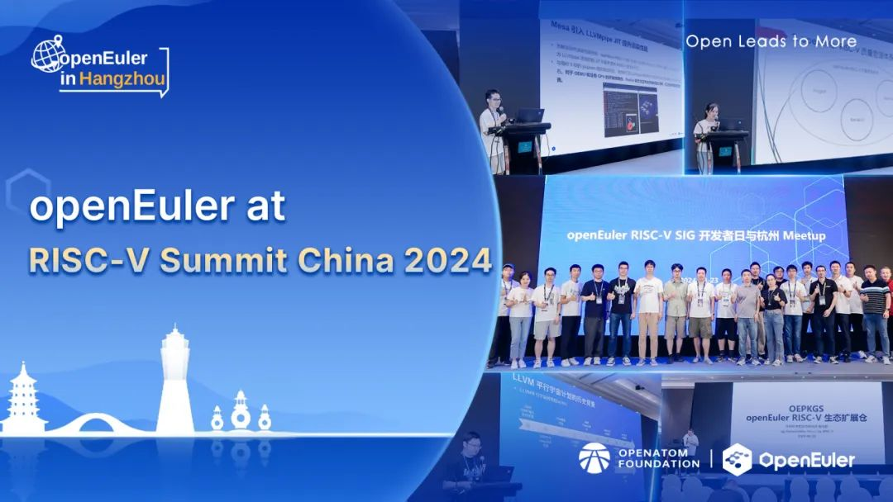
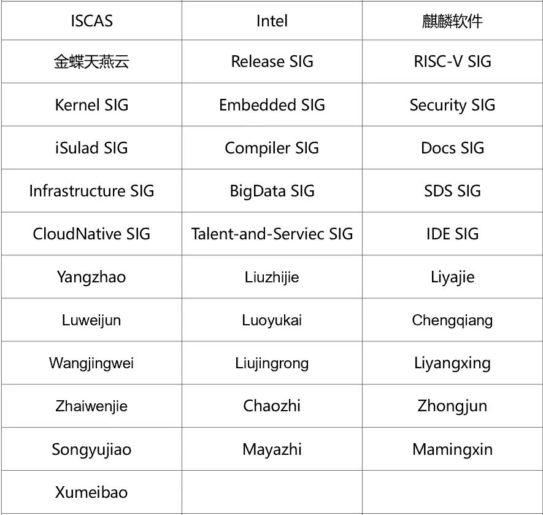

**概述**

本月，OpenAtom
openEuler(简称\"openEuler\")与云原生计算基金会(CNCF)的合作进一步加深，openEuler成为CNCF的持续验证资源提供者。这标志着openEuler的计算资源已成功接入CNCF的基础设施中，开启了双方合作的新篇章。

在技术进展方面，kyclassifier工具、openAMDC内存数据库项目以及基于AI的操作系统异常检测平台gala-anteater等均迎来新的发展。oebuild工具的发布，进一步简化了openEuler
Embedded的构建流程。同时，openEuler软件中心新增了协作平台和软件包详情信息，适配了手机版并新增了dark模式，提升了用户体验。

在社区治理方面，2023-2024年openEuler技术委员会第六次线下会议在郑州举办，会上深入探讨了社区未来的技术创新和规划、基础设施建设与优化、软件维护策略等，推动社区的发展。

第七届CCF开源创新大赛、2024 年度 Hackathon
软件难题挑战赛等开源赛事正在报名阶段，欢迎感兴趣的开发者参加。

openEuler继续扩大其全球影响力。9月16-19日，openEuler 将迎来第三次亮相
Open Source Summit Europe
2024的重要时刻。openEuler专题分论坛将作为峰会的一部分进行，与全球开发者深入操作系统与AI的发展。欢迎朋友们关注。

本月报阅读时长预计15分钟。

**社区规模**

截至2024年8月31日，openEuler
社区用户累计超过347万。超过1.9万名开发者在社区持续贡献。社区累计产生
185.2K个PRs、114.5K条Issues。目前，加入openEuler
社区的单位成员1734家，本月新增58家。

社区贡献看板（截至2024/08/31）

**社区事件**

**openEuler助力云原生计算基金会(CNCF)：提供持续验证资源，强化云原生生态**

8月底，KubeCon + CloudNativeCon + Open Source Summit + Al\_dev China
2024 在中国香港举办。一项重大合作成果在会上发布：在openEuler Infra
SIG与CNCF基础设施团队的共同努力下，openEuler已正式成为CNCF的持续验证资源提供者。这一成就标志着openEuler的计算资源已成功接入CNCF的基础设施中，开启了双方合作的新篇章。

**openEuler将第三次亮相Open Source Summit Europe 2024**

9 月16日，openEuler 将迎来第三次参加 Open Source Summit Europe
2024的重要时刻。值得一提的是，9月19日上午，openEuler专题分论坛将作为峰会的一部分，届时将与来自世界各地的开发者们深入探讨开源操作系统与AI的前沿趋势。欢迎朋友们关注。

**openEuler 深度参加第四届RISC-V中国峰会**

8月21日，第四届 RISC-V 中国峰会在浙江杭州举办；同期，由 openEuler
社区和中国科学院软件研究所联合主办的 openEuler RISC-V SIG 开发者日与杭州
Meetup也在会上顺利进行。

openEuler RISC-V SIG组 Maintainer
王经纬及其项目主要开发者刘鑫、周嘉诚、何若轻、苏运强、张定立、罗君等在峰会上分享了
openEuler RISC-V  24.03
在虚拟化、云原生、运行时、工具链、嵌入式、硬件测试等技术领域的未来规划和技术成果。

**第七届CCF开源创新大赛启动，欢迎报名openEuler赛题**

由中国计算机学会（CCF）主办，长沙理工大学、CCF开源发展委员会联合承办的第七届CCF开源创新大赛已经启动，并于9月20日截止报名。

本届赛事中，openEuler贡献了两道赛题，分别聚焦在openEuler操作系统的内存池管理与用户态线程设计与调度两个方向。据了解，两道赛题奖金各5w，共计奖金10w。欢迎感兴趣的朋友报名。

**CCF开源创新大赛openEuler开源项目贡献赛**

报名截止：2024年9月20日

赛事详情&报名入口：

https://www.gitlink.org.cn/competitions/track1\_openEuler

**2024 年度 Hackathon 软件难题挑战赛报名中**

2024年度Hackathon软件挑战赛启动，诚邀社区开发者们参加。赛事分为预赛和决赛两个阶段。参赛者需根据赛事要求，在指定的时间内完成组队报名（3人/组），并在规定的时间内完成预赛的在线编程，方可为有效参赛。入围决赛的团队可获得大赛参赛证书、大厂实习机会、与软件专家们面对面交流等。欢迎感兴趣的开发者报名，参与解决openEuler社区难题。

**社区治理**

**openEuler 技术委员会8月会议摘要**

8月29日，2023-2024年openEuler技术委员会第六次线下会议在河南郑州召开，本次会议由超聚变数字技术有限公司承办。

会上，全体技术委员会委员就openEuler社区的未来一些技术创新和发展进行了集中探讨，包括智能驾驶基础软件平台的构建、英特尔在社区的技术路线图更新及AI整体布局、内核配置优化、内核分级维护、使能GCC
LTO、EPKG软件包创新等，并对社区基础设施建设、软件维护策略进行审视和进一步提升的规划研讨。

**技术进展**

**分层分类工具kyclassifier在社区完成建仓**

由麒麟软件发起，由 Compatibility-Infra SIG组维护管理的 kyclassifier
项目已在 openEuler
社区完成建仓。kyclassifier是用于在x86\_64、aarch64、loongarch64等CPU架构下，对主流服务器版Linux操作系统按软件包维度进行自动化分层分类扫描识别的操作系统分析工具。工具特点：
 

> 支持多架构：支持x86\_64、aarch64、loongarch64等CPU架构。
> 支持多输入形式：支持ISO、本地系统环境、系统仓库等输入形式。
> 模块化设计：系统分层与分类算法模块解耦。

项目地址：https://gitee.com/openeuler/kyclassifier

**金蝶openAMDC内存数据库项目加入社区**

经openEuler技术委员会委员审定，由金蝶天燕云发起，BigData
SIG维护的内存数据库项目openAMDC在社区开源运作。

openAMDC(open Advance Memory Data
Cache)是一个开源且高性能的键值内存数据库，兼容RESPv2/v3协议，支持所有Redis命令以及数据结构，可平滑替换Redis。\
另项目具有多线程架构和冷热数据交换等特点，在多线程场景比Redis
6.0性能提高2x\~3x，多级数据交换扩大存储容量降低缓存综合成本。

**gala-anteater：搭建基于 AI 的操作系统异常检测平台**

在操作系统中，系统故障会导致各种问题，例如系统崩溃、数据损坏、服务停止等。这些问题会严重影响用户的使用体验，甚至会导致业务中断，从而对企业的生产和经济效益造成巨大损失。基于
openEuler 构建的 gala-anteater 搭建了基于 AI
的操作系统异常检测平台，其集成了多种异常检测算法，针对不同场景和应用，实现实时的系统级故障发现。

gala-anteater 项目的相关源码均已在 openEuler
社区开源，欢迎访问了解：https://gitee.com/openeuler/gala-anteater

**oebuild已随openEuler 24.03 LTS发布**

oebuild是一款用于构建和配置 openEuler Embedded 的工具， 能够为用户简化
openEuler Embedded 的构建流程，自动化生成定制化的 openEuler Embedded
发行版，主要功能包括：

自动化下载不同版本的构建依赖，包括 yocto-meta-openeuler , yocto-meta-openembedded 等。

根据用户的构建选项（机器类型，功能特性等等），创建出定制化的构建环境配置文件。

使用容器创建一个隔离的构建环境，降低主机污染风险，简化构建系统的配置和依赖管理。

启动 openEuler Embedded 镜像构建。

对不同特性环境的sdk进行编译环境的管理。

 对qemu镜像进行在线仿真。

对当下软件包进行在线部署以及卸载。

目前，oebuild 已经随着 openEuler 24.03 LTS 正式发布了 0.1 版本。

项目地址：https://gitee.com/openeuler/oebuild

**openEuler软件中心新增特性**

为帮助开发者更好地维护社区软件包仓，openEuler软件中心新增以下特性：

 
 **新增协作平台**

协作平台是软件中心下的一个子模块，该平台能够帮助Maintainer及时反馈修改软件包仓的CVE状态、版本状态等。同时，协作平台还提供贡献组织数目、贡献人员活跃度等关键指标，帮助Maintainer更好地管理软件仓库。

 **新增软件包详情信息**

src-openEuler组织维护着众多软件包源码仓库。为方便用户能够快速定位软件包，软件中心展示了每个软件包的具体信息，包括软件包对应的维护者与源码仓库地址，让开发者能够更好地进行代码审阅、贡献，也能够及时与维护者联系，共同推动软件包的持续改进及更新。

**适配手机版，并新增dark模式**

软件中心支持开发者使用手机浏览，同时新增了dark模式，开发者可根据自己的浏览习惯切换界面模式。

欢迎访问软件中心：

https://easysoftware.openeuler.org

**软硬件兼容性测评**

截至8月底，openEuler 社区软硬件兼容性测评通过方案累计
2079 个，其中北向1364个，南向554个，OS 161个。8月新增
北向148个，南向26个, OS 4个。

社区兼容性列表：

https://www.openeuler.org/zh/compatibility/

**安全公告**

2024年8月，社区共发布安全公告178个，修复漏洞506个（其中 Critical
13个，High 73个，其它420个）。

**重点漏洞提醒**

如下漏洞评估影响较大，请重点关注：

Flatpak是一个Linux应用程序沙盒和分发框架。在 1.14.0 和 1.15.10
版本之前，使用持久目录的恶意或受感染的 Flatpak
应用程序可以访问和写入它本来可以访问的文件之外的文件，这会对完整性和机密性的进行攻击。**（CVE-2024-42472）**

CVSS评分为10分

公告链接：

https://www.openeuler.org/zh/security/cve/detail/?cveId=CVE-2024-42472&packageName=flatpak

影响范围：

openEuler-20.03-LTS-SP4

openEuler-22.03-LTS-SP1

openEuler-22.03-LTS-SP3

openEuler-22.03-LTS-SP4

Docker
Authz认证插件用户控制和限制对Docker守护进程的API请求。受影响版本中，攻击者可以使用Content-Length为0的API请求绕过权限检查，导致docker守护进程将没有正文的请求发送到Authz插件，进而导致未授权操作的权限提升。**（CVE-2024-41110）**

CVSS评分为9.9分

公告链接：

https://www.openeuler.org/zh/security/cve/detail/?cveId=CVE-2024-41110&packageName=docker

影响范围：

openEuler-20.03-LTS-SP4

openEuler-22.03-LTS-SP1

openEuler-22.03-LTS-SP3

openEuler-22.03-LTS-SP4

**漏洞防护**

openEuler社区针对在维版本例行修复漏洞，发布安全补丁。建议用户关注openEuler官网安全公告，及时安装漏洞补丁进行防护。

openEuler 安全公告：

https://www.openeuler.org/zh/security/security-bulletins/

**感谢每一位朋友、开发者的支持**

因为大家的辛勤贡献，openEuler
的每一天都发生着好的事情。小编限于视野和能力，难免有所遗漏，在此表示歉意。同时，衷心感谢社区朋友、开发者们以及openEuler
SIG组成员的贡献：

\* 以上不分先后顺序

如果您希望在月报中增加您的工作内容，或对内容有任何改进建议，请联系wengqiaozhen@openeuler.sh。

**- END -**
