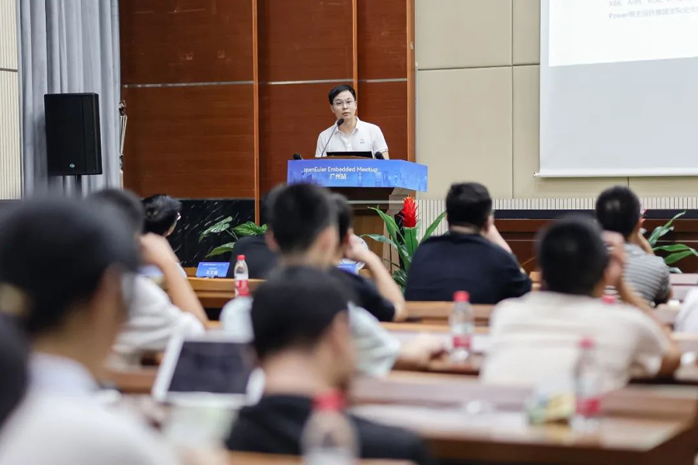

9月12日，OpenAtom openEuler（简称"openEuler"）Embedded
Meetup广州站成功举办。本次Meetup由openEuler社区、粤港澳大湾区国家技术创新中心（以下简称"大湾区国创中心"）、华南理工大学软件学院与广州泊川软件技术有限公司共同主办，邀请到来自广州当地的工业技术企业、高校、openEuler广州用户组成员等80余人现场参会。为期一天的活动分为了上午的闭门会议和下午的公开分享这两大环节。

上午的openEuler嵌入式闭门研讨会议，主要是针对广州地区众多对openEuler嵌入式有深入了解和交流诉求的企业和单位。openEuler社区携手大湾区国创中心，特别邀请了华南理工大学软件学院的院长、书记和资深教授，以及来自南网数研院、广州实验室、华为、拓斯达、飞凌、米尔电子、英码、明珞等知名企业的20余位技术专家。与会者们围绕四大核心议题展开了热烈而深入的讨论：工业操作系统的发展蓝图与未来趋势、企业对该领域的核心需求、嵌入式技术自主创新的机遇与面临的挑战，以及如何携手共建国内基础软件生态，培育相关人才。

下午的开放会议则面向现场80余位社区企业用户相关技术人员、感兴趣的学习者，以"openEuler引领工业领域技术创新"为主题，聚焦openEuler嵌入式、企业面向工业场景的解决方案以及基于openEuler的产学研合作进行公开分享。

**下面就让我们来回顾本次 Meetup 的精彩内容**

**开场致辞**

华南理工大学软件学院院长蔡毅为本次活动发表致辞。蔡院长在致辞中勾绘了华工软件学院人才培养的宏伟蓝图，指明了关键软件人才培养的重要性和紧迫性。他希望通过这一次meetup的会议，为更多的软件企业与华工软件学院搭建合作的桥梁，融合高校和企业的优势，实现互利共赢和共同发展，培养出更多具备创新精神与实践能力的优秀人才，引领数字化时代的未来。

**国内外嵌入式操作系统架构浅析**

华南理工大学软件学院教授陈俊颖通过比较国内外三种硬实时操作系统架构方面的异同点，剖析了它们在核心理念、架构设计及应用等方面的优劣势。随着智能化与安全性需求的提升，嵌入式实时操作系统将面临更多挑战，但也蕴含巨大的发展机遇。希望今天的内容能为大家在系统选型、优化设计等方面带来启发，共同迎接未来工业界的技术革新。

**openEuler Embedded介绍与展望**

openEuler Embedded社区committer魏钰宸介绍了openEuler
Embedded的定位、技术架构、应用案例以及生态推广方面的成果。openEuler
Embedded作为综合嵌入式系统软件平台，提供从南到北完善的技术架构和独特的竞争力特性，致力于整合碎片化的嵌入式领域。社区已与多家伙伴合作，打造多种实际场景的解决方案，如米尔和海思的工业场景解决方案，体现了openEuler在混合部署和实时能力上的优势。同时，社区积极与高校合作，如与北航和湖南大学联合打造工业解决方案和实时嵌入式虚拟机，推动了嵌入式技术的创新与发展。未来，社区将继续加强伙伴合作与高校联创，推动openEuler嵌入式在更多领域的应用与发展。

**国创面向工业机器人的OS解决方案和落地实践**

国创嵌入式操作系统产品总监李军介绍了大湾区国创中心以关键技术研发为核心使命，产学研协同推动科技成果产业化，汇聚产业力量，从技术共享，社区共治，生态共建等多维度深度参与openEuler
Embedded社区共建，基于开源开放的理念发布面向工业场景的嵌入式操作系统，为多行业企业的数字化转型提供了创新引擎，也希望更多的社区爱好者参与进来，繁荣社区，发展社区，共建国内操作系统根社区。

**共建工控新底座，使能新型工业化**

华为工业智能体高级专家陈凯在演讲中分享了华为面向未来新型工控相关的技术趋势和构想，未来工业加速走向云、边、端三层新架构，传统OT和ICT走向深度融合，不管是装备侧还是产线、工厂侧，都有越来越多样化的业务需求，华为面向端侧提供算力芯片/模组、操作系统及工业通信三件套，使能行业伙伴、客户打造智能控制系统，未来华为将持续与产业、学术、行业伙伴推进新型工控在工业领域的落地。

**嵌入式硬件与openEulerEmbedded结合的思考**

飞凌嵌入式产品总监杜村在演讲中分享了嵌入式核心板硬件产品，包括NXP
i.MX6、i.MX8、i.MX9三大系列，TI
AM62系列、AM335x系列等及在泛工业场景中的应用。杜总表示希望通过工业机械臂控制器开发过程中企业对于操作系统的实时化、混合部署等需求，结合openEuler
Embedded操作系统以及国创中心嵌入式工业操作系统在工业特性的优势，呼吁更多的开发者、企业客户参与到openEuler
Embedded的建设和落地应用，共同打造一个开源的、健壮的、中立的嵌入式工业操作系统！openEuler
Embedded在推动工业技术创新和人才培养方面上持续发力，通过本次活动深入的技术交流和思想碰撞，进一步推动产学研各方力量共同探索嵌入式技术的无限可能，为工业领域的数字化转型注入新动力。期待未来有更多的企业、高校和开发者加入我们的行列，共同构建一个更加开放、创新、协同的嵌入式技术生态系统。

