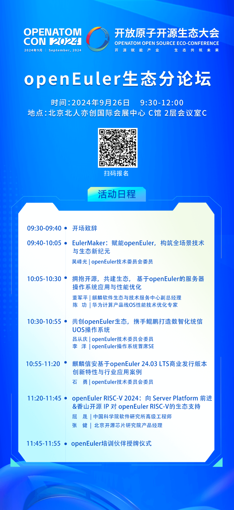

2024开放原子开源生态大会将于9月25-27日在北京盛大开幕，来自政府、企业、学术界、研究机构的专家学者，共同探索开源赋能各领域创新的有效路径，推动开源生态可持续发展。

9月26日上午，openEuler社区将在大会上举办openEuler生态分论坛。届时将由来自openEuler社区的核心成员单位分享基于openEuler
24.03 LTS版本和即将发布的openEuler
24.09版本的技术创新、社区贡献、商业计划、生态发展等方面的成果和经验，呈现openEuler社区如何汇聚产业力量打造一个开放、创新、协作的开源生态系统。

欢迎报名参与！

