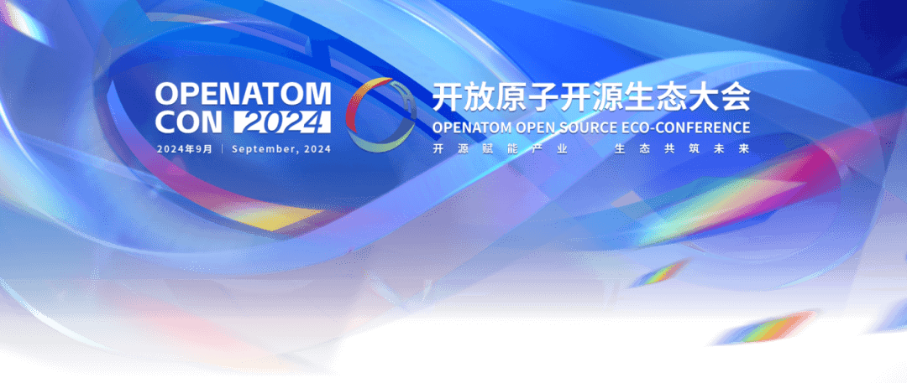

在数字化时代的浪潮中，开源技术正以前所未有的创新力量，重塑各行各业的生态格局。作为这股潮流中的璀璨明星，openEuler不仅以其领先的技术实力和深厚的商业实践积累，照亮了数字化转型的道路，更以开放共赢的姿态，携手区域伙伴，共同推动开源生态的发展。

**01**

**实践案例精彩纷呈**

在加快建设现代化产业体系的背景下，openEuler凭借其稳定可靠的系统性能、丰富的生态资源以及持续的技术创新，成功吸引了众多行业巨头的青睐。从云计算、大数据到人工智能，openEuler的应用场景不断拓宽，为企业的数字化转型提供了坚实的支撑。

**2023年openEuler系的操作系统在中国新增服务器Host
OS市场占有率达到36.8%，openEuler已经成为中国新增服务器Host
OS市场份额第一的品牌**。openEuler已构筑关键技术根基和创新机制，并实现规模部署在各行各业核心系统，形成商业的正循环，多个行业标杆案例不断涌现。例如实现了对建行现有信用卡核心系统的创新，支持单日交易量达1亿笔。此外，中国移动大云天元操作系统融合openEuler技术路线，构筑了坚实的算网底座，为60PB存储数据服务提供良好支撑，并持续稳定运行。

**02**

**赋能区域开源生态建设**

openEuler不仅专注于实践应用，更致力于促进区域开源生态的蓬勃发展。社区通过举办技术研讨会、开发者大会等各类活动，积极打造交流平台，推动开源技术的广泛传播与应用。此外，openEuler还与地方政府、高等教育机构、企业等多方展开合作，共同构筑完善的开源生态体系，为区域经济的增长注入了新的活力。

以成都为例，openEuler与当地政府合作，打造成都市关键政务应用"智慧蓉城"
的核心云底座，全力保障"智慧蓉城"安全、稳定运行，提升城市综合治理水平，打造出智慧城市发展的更高形态。

**03**

**全球影响力逐步扩大**

openEuler自建立伊始便确立了全球化的目标，致力于融入全球产业生态圈，并致力于将中国的开源创新资源分享给世界各地的用户和开发者。在国内市场取得突出成就的基础上，openEuler的国际声誉和影响力也在稳步提升，逐步在全球开源领域占据一席之地。

openEuler社区积极和全球的开源社区、开源项目相互协作，相互融合，与Linux、CNCF、OpenInfra、Eclipse等基金会建立了良好的合作关系，和openHPC、OpenStack等开源项目互相进行了适配和认证。此外，社区还支持上下游企业积极参与海外项目合作，为当地的IT基础设施建设贡献力量。

其中，**社区合作伙伴基于openEuler构建的云平台，与非洲当地金融科技公司共同打造了移动支付系统。在这个系统中，openEuler作为云平台的主机操作系统，承载了云的基础设施部分。金融支付系统的重要特征之一是高可靠性，openEuler通过增强的RAS等技术，为云平台提供了高可靠性，保证了该系统的持续稳定运行。**

openEuler社区在商业实践领域的卓越成就，以及其对区域开源生态建设的深度参与和推动，彰显了openEuler在开源创新方面的竞争力和影响力，为推动全球开源社区的繁荣与进步贡献了独特的创新和智慧。

**9月26日，2024开放原子开源生态大会------openEuler生态分论坛上，社区核心成员单位将分享openEuler
24.03 LTS版本的商业计划、生态成果，openEuler
24.09版本的参与情况、技术创新等，并联合生态伙伴同台演讲，以实际案例展示和证言。内容上重点体现全场景、多样性计算、AI领域技术领先形象与社区共建的凝聚力，展现openEuler在产业创新的引领力量和生态繁荣。敬请关注。**

**扫描二维码**

**即刻报名**

