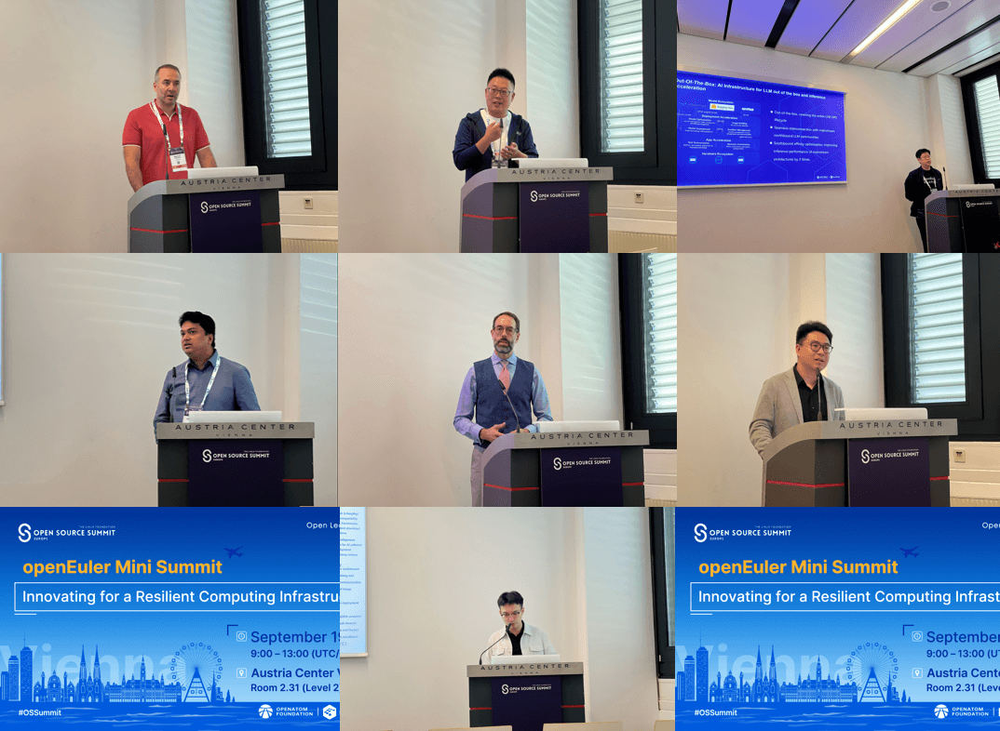

2024年9月16-19日，全球顶级开源大会 OSSUMMIT EU 2024
在奥地利-维也纳正式开场。openEuler 作为钻石级别赞助参会。这是 openEuler
连续第三年全面参加该大会。本次会议，openEuler
不仅在主会场进行Keynote分享，还设置了openEuler专题分论坛，与全球开发者深入探讨开源操作系统与AI的前沿趋势。

9月17日上午，openEuler技术委员会主席胡欣蔚在Keynote环节，发表了题为《How
openEuler is Powering Tomorrow\'s AI
Infrastructure》的技术演讲，为全球开发者阐述了openEuler在推动全场景创新、增强多样性算力及AI技术发展方面的最新进展。openEuler通过持续的技术迭代、开放的社区治理和广泛的商业化应用，构建了一个高度可扩展且充满活力的操作系统平台。

胡欣蔚深入探讨了openEuler在全场景创新的支持和对多样化计算架构的兼容能力，并展望了其在构建通算智算融合算力底座、推动智能计算应用发展的战略蓝图。同时，他还介绍了openEuler在AI领域的布局，包括为AI应用提供的全面生命周期支持框架，并特别指出openEuler通过MICA技术，在嵌入式场景下能够同时兼顾AI与控制应用的混合部署。

除了精彩纷呈的Keynote，OSSUMMIT EU 2024
现场还设置了openEuler专题分论坛，来自openEuler社区的开发者与全球开发者深入探讨开源操作系统与AI的前沿趋势。

位于会场最中心位置的openEuler展区也空前火爆，通过大屏幕精美的展示内容，现场生动讲解，现场demo体验等为开发者提供了全面了解openEuler的窗口。来自不同社区和企业的开发者来到openEuler展台，与openEuler社区专家们进行了详尽的技术探讨，更深入地了解openEuler。

openEuler的成功离不开社区开发者的贡献和持续努力。经过过去5年的发展，openEuler已成为一个充满活力和创新的社区项目。未来，openEuler将继续发展，为各种场景和应用提供强大的操作系统支持，推动智能化未来的实现。
