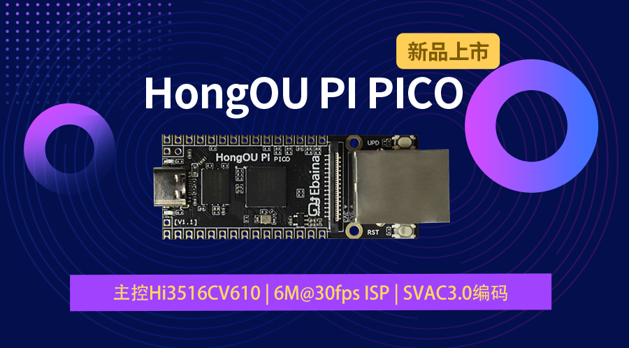
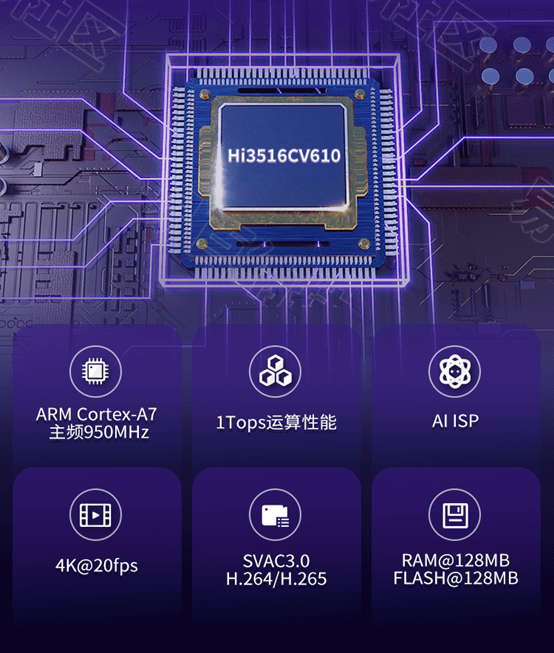
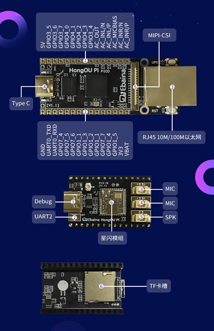
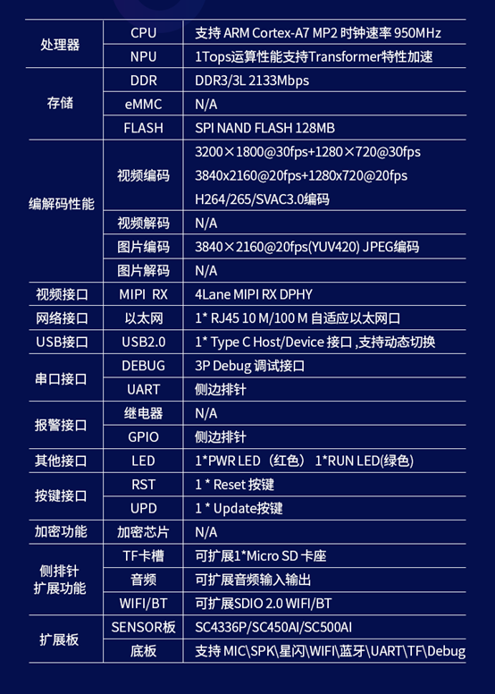
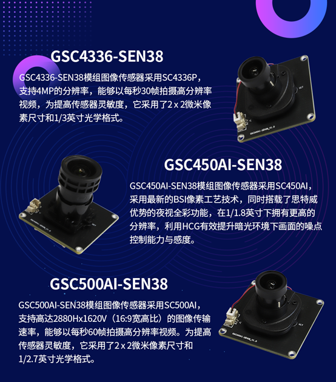
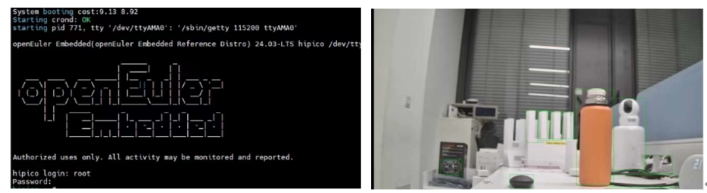
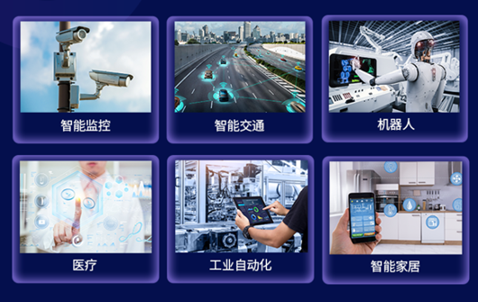

HongOU PI
PICO是易百纳社区自主研发的专为机器视觉和智能监控领域设计的低成本、高性能解决方案。该方案不仅提供了完整的硬件平台，还极大地简化了开发流程，降低了开发成本和时间，助力客户产品快速落地。HongOU
PI
PICO全面适配openEuler社区和星闪。广泛应用于视频监控、智能家居、智能交通等领域。

**Hi3516CV610主控芯片**

HongOU PI PICO搭载Hi3516CV610主控芯片。该芯片基于ARM Cortex-A7
MP2架构，主频高达950MHz，专为安防市场的IPC
SoC设计。支持最高6M@30fps的ISP图像处理能力，以及SVAC3.0编码标准，确保了图像的高清晰度和流畅性。同时，它还支持多级降噪等多种传统图像增强和处理算法，进一步提升了图像质量。此外，Hi3516CV610还内置了高效的神经网络推理引擎，最高算力可达1Tops，支持业界主流的神经网络框架，为AI应用提供了强大的算力支持。

**丰富的接口**

HongOU PI PICO内置 DDR3/3L 2133Mbps，支持H264/265/SVAC3.0
编码，最高可支持3200×1800@30fps的视频输出。同时拥有1Tops 运算性能支持
Transformer 特性加速。支持1路4Lane MIPI RX DPHY接口，1\* RJ45 10 M/100 M
自适应以太网口，1路USB2.0 Host/Device接口（支持动态切换）。

**搭载SC4336/SC450AI/SC500AI摄像头模组，全面上架**

SVAC3.0是中国安防监控编码标准，高效低延迟，支持多分辨率，增强鲁棒性，保障安全隐私，广用于公共安全等多领域，持续推动技术发展。

**演示效果**

HongOU PI PICO
搭载openEuler操作系统，适配YOLOV8目标检测模型，进行实时图像识别与对象检测的演示。

**应用领域**

**体验**

前往"易百纳技术社区"官网的AI市场中了解详情：https://www.ebaina.com/ai/61

**\*
openEuler社区发布本文仅为阐明企业产品搭载openEuler，不提供任何关于企业信誉和产品质量等方面的担保。**
