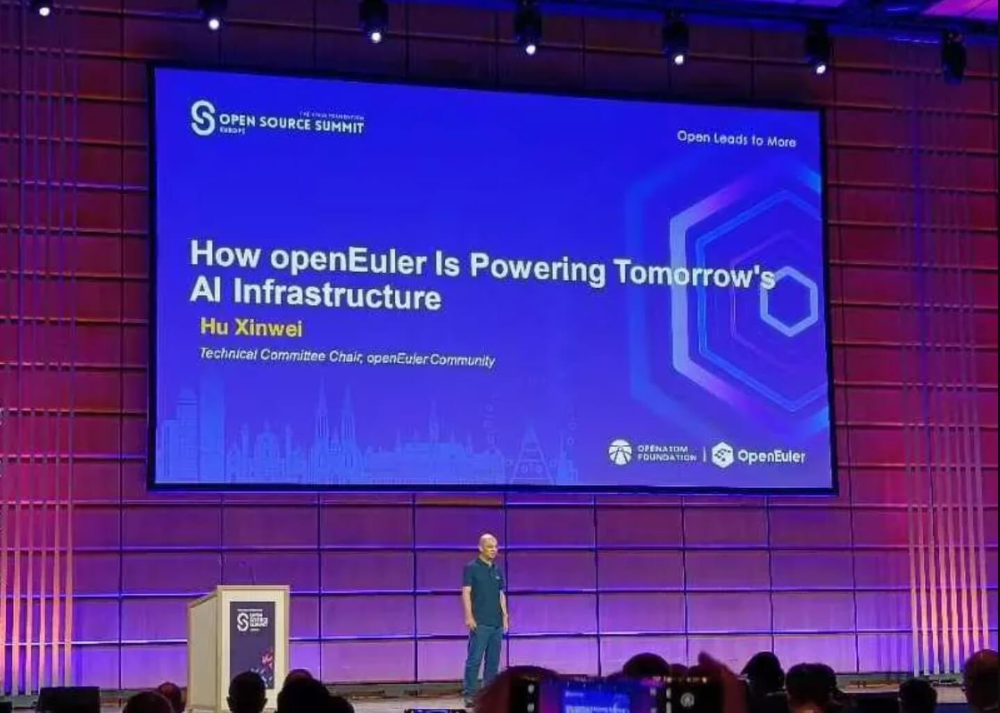
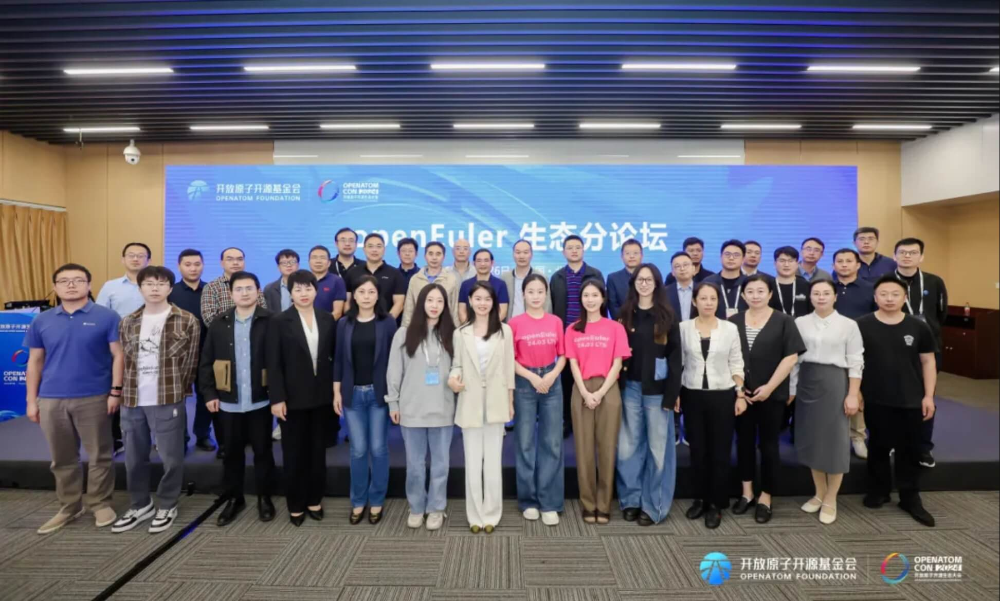
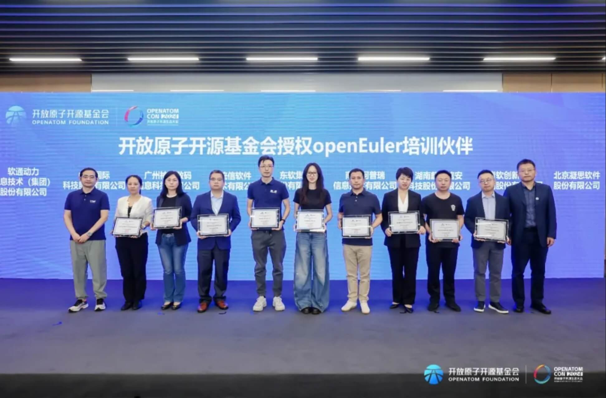
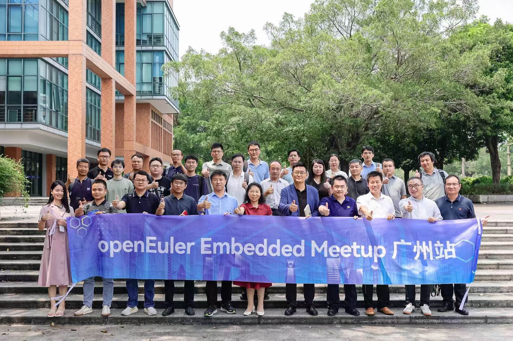
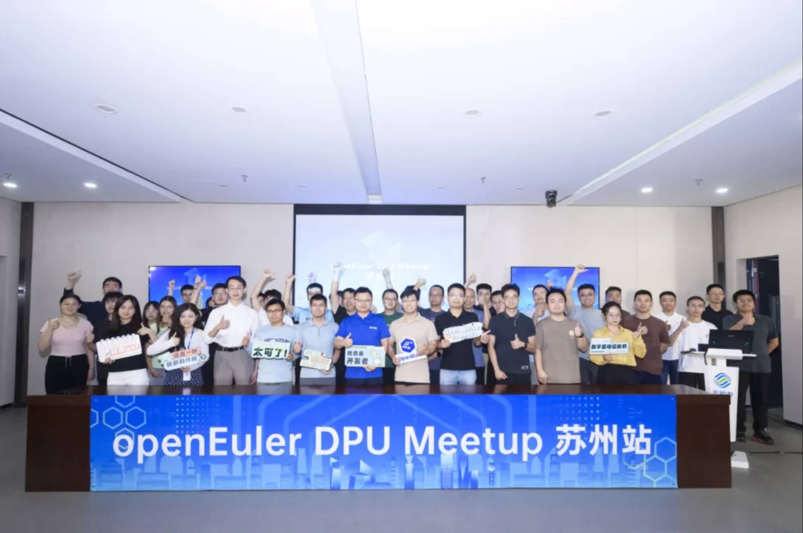
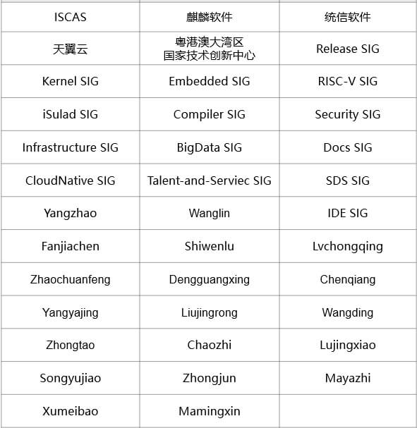

### 概述
---

9月30日，OpenAtom openEuler(简称：openEuler) 24.09 创新版发布。该版本采用 EulerMaker 构建服务器、云计算、边缘计算镜像。openEuler 24.09 版本是基于Linux 6.6内核构建的首个创新版本，内核代码新增8万行，主要吸收了Linux社区高版本内核的有益特性及社区创新特性：内存管理folio特性、MPTCP特性支持、按需加载支持failover特性等。epkg新型软件包、GCC-14副版本编译工具链支持、iSula支持NRI插件式扩展等特性已随 24.09 版本一起发布。

在其他方面，分层分类工具pkgs-categorizer、系统安全评估工具CT-OVAL和security-baseline、高性能的键值内存数据库openAMDC、全栈加速解决方案uadk-bigdata等项目相继在openEuler社区建仓，进一步丰富社区技术生态。

在社区活动方面，openEuler于9月16日亮相[Open Source Summit Europe 2024（简称：OSSUMMIT EU 2024）](https://www.openeuler.org/zh/news/openEuler/20240923-osseu/20240923-osseu.html)，并在Keynote环节、专题分论坛和展区上持续输出，向全球的开发者分享社区的最新进展和成果。这是社区连续第三年全面参加该大会，吸引了来自ARM、AWS、微软、Sony等开发者的关注。

在[2024开放原子开源生态大会](https://www.openeuler.org/zh/news/20240930-kfyz1/20240930-kfyz1.html)、[华为全联接大会](https://www.openeuler.org/zh/news/20240930-hc/20240930-hc.html)等其他一系列活动上，openEuler携手伙伴积极参加，向全球开发者多方面展现社区繁荣生态。

为规范人才培养体系运作，开放原子开源基金会及openEuler社区共同构建了[openEuler人才认证](https://www.openeuler.org/zh/news/20240930-rc/20240930-rc.html)体系，吸引了多家企业申请加入openEuler人才生态共建。同时openEuler社区人才认证纳入开放原子开源基金会开源人才认证体系。

[操作系统大会&openEuler Summit 2024](https://www.openeuler.org/zh/interaction/summit-list/summit2024/)将在11月15日-16日北京举办。Call for Speaker、Call for SIG、Call for Sponsor、Call for Demo 现已全面开放，诚邀大家申报，参与社区建设。

感谢成员单位与开发者对openEuler的贡献和支持。

本月报阅读时长预计20分钟。欢迎细品。

### openEuler 24.09 创新版发布
---

9 月 30 日，openEuler 24.09 创新版正式发布，该版本采用 EulerMaker 构建服务器、云计算、边缘计算镜像。版本代码总计9.48亿行，相比 openEuler 24.03 LTS，新增代码0.3亿行。

openEuler 24.09 版本是基于Linux 6.6内核构建的首个创新版本，从master拉取相关代码并进行演进，整体与24.03 LTS版本选型相近，代码量和软件范围基本保持不变。其内核代码新增8万行，吸收了Linux社区高版本的有益特性及社区创新特性：内存管理folio特性、MPTCP特性支持、按需加载支持failover特性。

下载地址：<https://www.openeuler.org/zh/download>

技术白皮书：[https://www.openeuler.org/whitepaper/openEuler 24.09 技术白皮书.pdf](https://www.openeuler.org/zh/showcase/technical-white-paper/)

### 社区规模
---

截至2024年9月30日，openEuler 社区用户累计超过355万。超过2万名开发者在社区持续贡献。社区累计产生 189K个PRs、118.4K条Issues。目前，加入openEuler 社区的单位成员1775家，本月新增41家。

社区贡献看板（截至2024/09/30）

### 社区事件
---

#### [openEuler亮相全球开源盛会OSSUMMIT EU 2024](https://www.openeuler.org/zh/news/openEuler/20240923-osseu/20240923-osseu.html)，持续推动智能化未来的实现

024年9月16-19日，全球开源盛会Open Source Summit Europe 2024（简称 OSSUMMIT EU 2024）在奥地利维也纳开场。openEuler 作为钻石级别赞助参会。这是 openEuler 连续第三年全面参加该大会。

9月17日上午，openEuler技术委员会主席胡欣蔚在Keynote环节，发表了题为《How openEuler is Powering Tomorrow's AI Infrastructure》的技术演讲，为全球开发者阐述了openEuler在推动全场景创新、增强多样性算力及AI技术发展方面的最新进展。

在本次大会的openEuler专题分论坛及展台上，openEuler持续输出，向全球的开发者分享社区的进展和成果，深入交流开源操作系统与AI的前沿趋势。

#### openEuler深度参加2024开放原子开源生态大会

2024年9月25-27日，开放原子开源生态大会在北京举办。作为本次大会的一部分，[openEuler生态分论坛](https://www.openeuler.org/zh/news/20240930-kfyz1/20240930-kfyz1.html)顺利召开。麒麟软件、统信软件、麒麟信安、中科院软件所等社区成员单位分享了基于openEuler 24.03 LTS 和 24.09 创新版的成果和经验，从技术创新、社区贡献、商业计划、生态发展等多个方面呈现openEuler社区如何汇聚产业力量打造一个开放、创新、协作的开源生态系统。

为规范人才培养体系运作，开放原子开源基金会及 openEuler社区共同构建了openEuler人才认证体系，吸引了多家企业申请加入openEuler人才生态共建。开放原子开源基金会授权openEuler培训伙伴仪式在会上进行，共同推动openEuler人才生态的发展和繁荣。

同时，[openEuler社区人才认证](https://www.openeuler.org/zh/news/20240930-rc/20240930-rc.html)纳入开放原子开源基金会开源人才认证体系，并在开放原子开源生态大会的“开源驱动·产教融合”教育分论坛正式发布。

#### 华为全联接大会2024，openEuler 分论坛成功举办

9 月 20 日，在华为全联接大会 2024 期间，以“openEuler使能 AI 和全场景创新，夯实算力底座”为主题的 [openEuler分论坛](https://www.openeuler.org/zh/news/20240930-hc/20240930-hc.html)在上海举办。

会上，openEuler社区单位成员和行业用户分享了 openEuler 与产业结合的技术创新和最佳落地实践。同时，openEuler社区11家成员单位在现场举行了 openEuler 伙伴智能助手产品联合发布仪式。

#### openEuler Embedded Meetup在广州举办

9月12日，[openEuler Embedded Meetup 在广州举办](https://www.openeuler.org/zh/news/openEuler/20240923-emvedded/20240923-emvedded.html)。粤港澳大湾区国家技术创新中心、华南理工大学软件学院、南网数研院、广州实验室、华为、拓斯达、飞凌、米尔电子、明珞、泊川软件等多位技术专家参与本次活动，围绕openEuler嵌入式技术、企业面向工业场景的解决方案以及基于openEuler的产学研合作进行深入探讨，以期共同构建更加开放、创新、协同的嵌入式技术生态系统。

#### openEuler DPU Meetup在苏州举办

随着云计算、大数据、人工智能等技术的飞速发展，数据处理能力成为衡量云与数据中心性能的关键指标。DPU作为专为数据处理加速设计的计算单元，正逐步成为提升算力供给效率、优化资源利用的关键技术。9月初，[openEuler DPU Meetup苏州站成功举办](https://www.openeuler.org/zh/news/openEuler/20240914-DPU/20240914-DPU.html)。本次交流活动由openEuler社区和移动云联合主办、算力网络创新联合体协办，邀请多位业内专家，分享在DPU领域的实践经验，积极推动算力网络联合创新，助力算力网络产业链生态融通。

### 技术进展
---

#### openEuler 24.09 支持GCC-14副版本编译工具链

openEuler 24.09 的 GCC 主版本为 12.3.1，为了使能 X86，ARM 多样算力新特性，满足不同用户对不同硬件特性支持的需求，推出 openEuler GCC Toolset 14 副版本编译工具链，为用户提供了更加灵活且高效的编译环境选择。通过使用 openEuler GCC Toolset 14 副版本编译工具链，用户可以轻松地在主副两个不同版本的 GCC 之间进行切换，以便充分利用新硬件特性，同时享受到 GCC 最新优化所带来的性能提升。

当前，该工具链已随 openEuler 24.09 一起发布，代码仓由 Compiler SIG维护管理。

项目地址：https://gitee.com/src-openeuler/gcc-14

#### QSemOS-plugin 已随 openEuler 24.09 发布

QSemOS-plugin是一套适用于嵌入式OS开发场景插件，面向企业和个人开发者提供从项目向导、开发、编译、调试到烧录的一站式解决方案，使用户能够快速构建开发平台，该工具包括混合部署、软实时、硬实时三大插件功能。

用户可以根据自己的需求进行内核开发、Yocto 项目开发、C/C++、RTOS 开发等。以用户为中心，为三大内核用户提供 MVP（hello world），同时支持图形化调试方法，包括断点、单步调试、栈打印、内存段数据查看等功能；首次发布基本vscode的混合部署、软实时、硬实时三大插件：

- botron-hybrid-deployment-plugin：混合部署插件
- botron-soft-reattime-plugin：软实时插件
- botron-hard-realtime-plugin：硬实时插件

QSemOS-plugin 由粤港澳大湾区国家技术创新中心发起，IDE SIG维护管理，目前已随着 openEuler 24.09 正式发布。

此外，项目团队基于QSemOS-plugin孵化第二基座opensumi，通过模块化实现混合部署、软实时、硬实时的开发工具链路，目前opensumi基座已经发布到openEuler社区。

**项目地址**：

1. https://gitee.com/src-openeuler/botron-platform

2. https://gitee.com/src-oepkgs/QSemOS-plugin/tree/openEuler-24.09/

#### iSula支持NRI插件式扩展

NRI (Node Resource Interface), 是用于控制节点资源的公共接口, 是CRI兼容的容器运行时插件扩展的通用框架。它为扩展插件提供了跟踪容器状态，并对其配置进行有限修改的基本机制。

iSulad的NRI特性可用于k8s场景下资源的管理。用户可通过实现NRI插件，订阅容器生命周期事件来跟踪容器资源状态，并根据资源管理逻辑对NRI API范围内允许的容器配置进行修改。当前，该特性已随 openEuler 24.09  一起发布，代码仓由 iSulad SIG 维护管理。

项目地址：https://gitee.com/openeuler/iSulad

#### 分层分类工具pkgs-categorizer在社区建仓

由统信软件发起、Compatibility-Infra SIG维护管理的pkgs-categorizer项目已经在openEuler社区完成建仓。

pkgs-categorizer项目使用Bert大语言模型，旨在辅助linux系统的构建，提供不同场景所需的软件包列表，为生成不同客户所需ios镜像提供支持。

基于Linux内核，来自不同领域的开发人员开发了各种各样的应用程序、管理软件和工具。由于不同的发行版面向不同的场景，具有不同的特点，包的开发和管理流程并不完全统一，这些包相互依赖且复杂，这给Linux操作系统发行版的构建和维护带来了巨大的挑战。pkgs-categorizer项目可对repo源的软件包做数据处理，可以帮助识别软件包在操作系统中所处的"位置"，便于开发者更好地了解软件包的功能信息。

分层是指根据软件包对操作系统分布的重要性将它们垂直划分为不同的层。我们将Linux操作系统包按照内核层、核心层、系统层和应用层的顺序分为四个层(L1-L4)。通过分层包，我们可以在构建Linux发行版时从L0-L3有序地选择软件，并可以评估替换组件的影响，帮助在有限的人力资源下高效地实现操作系统发行版的集成构建。

分类指是根据库中的Linux包所提供的内容属性，将库中的Linux包分为工具类、库类、服务类和其他类，该分类方式是依据软件包的主要文件在系统中的存在方式而定义的，因此将这种分类方式也被称为形态分类。

pkgs-categorizer项目已完成技术架构方案设计，9月底完成核心功能开发（包括repo源软件包解析、分层模型实现、分类模型实现和分层分类结果输出等） 。

项目地址：https://gitee.com/openeuler/pkgs-categorizer

#### 系统安全评估工具CT-OVAL在社区完成建仓

CT-OVAL是一个基于golang实现的系统安全评估工具，主要用于天翼云自研Linux操作系统CTyunOS的系统安全评估。主要有以下亮点功能：

- 把不同来源的CVE数据并转化为对应的oval数据，并存入数据库；
- 利用平台、时间、严重程度、关键字、类型等多种方式筛选生成oval xml；
- 重用：在数据库中归纳清洗OVAL相关的数据元，分级分类唯一化定义、主体、测试、状态等；
- 可利用标准openscap工具批量执行OVAL定义的测试，并对测试结果进行分析和展示。它允许用户根据自定义OVAL测试策略，对目标系统进行安全评估，并获取详细的测试结果报告。

项目地址：https://gitee.com/openeuler/ct-oval

#### security-baseline 在社区完成建仓

由天翼云发起，安全SIG维护的项目security-baseline已在社区建仓，该项目旨在对系统安全加固，以确保系统符合各类安全加固基线，提升系统安全性。支持用户账户设置、系统服务加固等系统安全加固、回退、检测。

security-baseline 采用 Python 语言开发，并以 RPM 形式提供。这使得工具具备良好的跨平台兼容性和易用性，同时集成了多种常见加固工具的优点，提供了一个全面的安全加固解决方案。

同时，security-baseline 提供了一键加固功能，用户只需简单操作即可完成系统的全面加固。该功能覆盖了系统安全加固的检测、备份、回退等各个环节，确保系统加固的安全性和有效性。

项目地址：https://gitee.com/openeuler/security-baseline

#### BigData SIG工作进展

BigData SIG持续构建和完善openEuler社区下的大数据生态，打造活跃的大数据交流平台，丰富和提升大数据组件功能和性能，发掘用户大数据需求，孵化有潜力的大数据组件。

本月，BigData SIG工作主要在以下几个方面：

**创新项目的发展:**

1. openAMDC:

    本项目是一个开源且高性能的键值内存数据库，兼容RESPv2/v3协议，支持所有Redis命令以及数据结构。目前，openAMDC已完成建仓申请，初始代码已上传dev分支。

    项目地址：https://gitee.com/openeuler/openAMDC

2. uadk-bigdata:
    
    本项目旨在为大数据领域构建一个从硬件到应用层的全栈加速解决方案，整合UADK的能力和OpenSSL 3.0建立一个有效的通路，并将JDK与OpenSSL 3.0连接起来，从而为大数据应用提供一个完整的硬件加速方案。该项目已完成建仓工作，正设计解压缩在HBase适配方案。

    项目地址：https://gitee.com/openeuler/uadk-bigdata

**开源实习:**

- 由Bigdata SIG贡献的开源实习项目中，项目'Bigtop Manager：AI Chat 功能的引入'已完成，代码已合入，已结项。项目'Bigtop-manager：Dashboard动态显示磁盘使用功能开发'也有学生承接，目前需求已对齐，正在进行方案设计。

BigData SIG：https://gitee.com/openeuler/bigdata

#### k8s-install完成适配openEuler多个发行版

k8s-install适配项目在summer of code活动中已基本完成，新版本不仅适配了 openEuler 24.03 LTS、openEuler 23.09等多个发行版，还增加了 k8s 1.29、1.25两条新版本基线的支持。此外还有大量小功能增强、问题修复、提供离线集成安装包下载，大大提高了社区开发者在各种系统下的适用性。

#### 多操作系统跨社区生态融合发展的探索与实践

为了探索多操作系统跨社区生态融合发展的路径，润和软件选取 openEuler 与OpenHarmony 两大项目完成了单硬件多系统融合与多硬件多系统间互联互通([原文阅读](https://mp.weixin.qq.com/s?__biz=MzkyMjYzNjU0Ng==&mid=2247511337&idx=1&sn=7f090b84b5dd317f9c10ed6d3b8ab7c3&chksm=c1f3b544f6843c522a185b81b079c5a375616e4cd641e7845f64d14004b13faf051bd3acb844#rd))。openEuler 提供一个高性能、稳定和安全的计算、通信和管理平台，OpenHarmony为用户带来直观、友好的跨平台交互体验。

基于混合部署框架的openEuler与OpenHarmony高效协同：openEuler Embedded 提供了混合关键性部署框架MICA，能够实现管理域和实时域的部署+隔离+调度，并移植适配了OpenHarmony，在混合部署框架中增加了HMI域。

基于分布式软总线的openEuler与OpenHarmony互联互通：润和软件与openEuler社区一起完成了分布式软总线新版本移植适配，实现了openEuler与OpenHarmony互联互通，并探索基于分布式软总线的两者场景化应用，实现高阶中间件能力。

### 软硬件兼容性测
---

截至2024年9月30日，openEuler社区软硬件兼容性方案通过2231个，北向1500个，南向569个，OS 162个。9月新增 北向136个，南向15个, OS 1个。

社区兼容性列表：https://www.openeuler.org/zh/compatibility/

### 安全公告
---

2024年9月，社区共发布安全公告134个，修复漏洞261个（其中 Critical 9个，High 54个，其它198个）。

- **重点漏洞提醒**

  如下漏洞评估影响较大，请重点关注：

  **在2.6.3版本之前，libexpat库中存在一个漏洞。xmlparse.c中的dtdCopy函数在32位平台上（其中UINT_MAX等于SIZE_MAX）可能会导致nDefaultAtts发生整数溢出。（[CVE-2024-45491](https://www.openeuler.org/zh/security/cve/detail/?cveId=CVE-2024-45491&packageName=expat)）**

  CVSS评分为9.8分

  影响范围：

  openEuler-20.03-LTS-SP4、openEuler-22.03-LTS-SP1、openEuler-22.03-LTS-SP3、openEuler-22.03-LTS-SP4、openEuler-24.03-LTS

  **Apache HTTP Server 2.4.59及更早版本的核心漏洞容易受到信息泄露、SSRF或通过响应头恶意或可利用的后端应用程序执行本地脚本的攻击。建议用户升级到2.4.60版本，该版本修复了此问题。（[CVE-2024-38476](https://www.openeuler.org/zh/security/cve/detail/?cveId=CVE-2024-38476&packageName=httpd)）**

  CVSS评分为9.8分

  影响范围：

  openEuler-20.03-LTS-SP4、openEuler-22.03-LTS-SP1、openEuler-22.03-LTS-SP3、openEuler-22.03-LTS-SP4、openEuler-24.03-LTS

- **漏洞防护**

  openEuler社区针对在维版本例行修复漏洞，发布安全补丁。建议用户关注[openEuler官网安全公告](https://www.openeuler.org/zh/security/security-bulletins/)，及时安装漏洞补丁进行防护。

### 致谢
---

因为大家的辛勤贡献，openEuler 的每一天都发生着好的事情。小编限于视野和能力，难免有所遗漏，在此表示歉意。同时，衷心感谢社区朋友、开发者们以及openEuler SIG组成员的贡献：

* 以上不分先后顺序

如果您希望在月报中增加您的工作内容，或对内容有任何改进建议，请联系wengqiaozhen@openeuler.sh。

**- END -**

