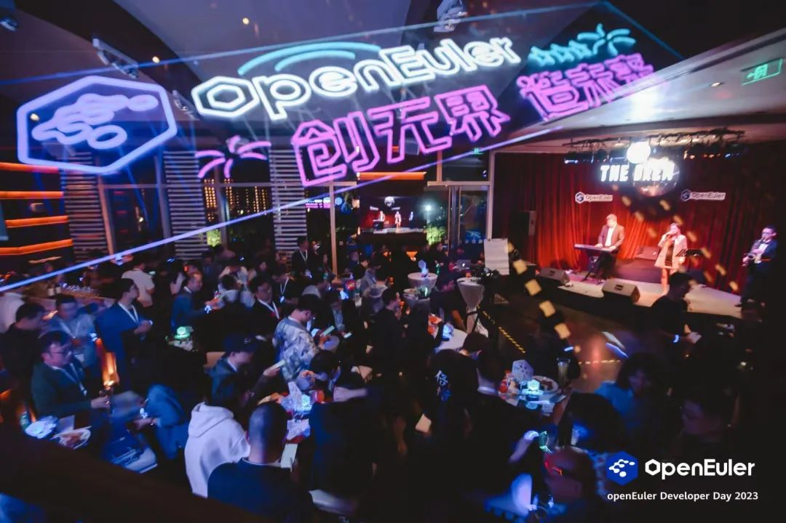
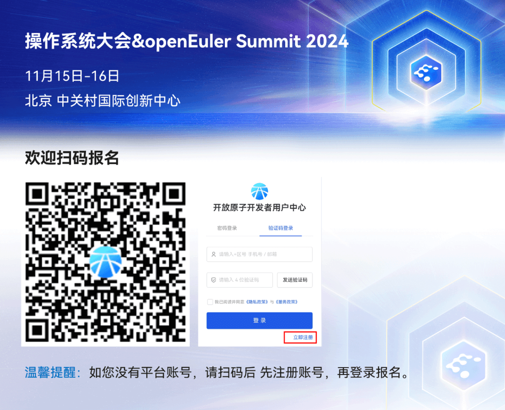

2024年11月15-16日，OpenAtom openEuler（简称
openEuler）社区将在北京中关村国际创新中心举办操作系统大会＆openEuler
Summit
2024，本次大会旨在汇聚全球产业发展力量，邀请思想领袖、商业精英、技术专家、合作伙伴以及全球开源基金会等业界同仁，共同探讨操作系统产业发展方向和未来机遇，联合伙伴展示最新合作成果，分享数字化转型实践，以技术驱动创新不断激发新质生产力。

**参会信息**

参会时间：11月16日 下午分论坛结束后

时长：1小时 \~ 1.5小时

参会地点：北京中关村国际创新中心

SIG报名截止时间：10月30日 18:00

**Call for SIG**

作为大会的重要环节之一，SIG组开放工作会议汇聚社区各个SIG组的用户和开发者，收集需求与问题，线下集中讨论未来
6
个月的规划、技术方向、工作事项、任务分工、优先级等等。**本次SIG组开放工作会议采用两种形式**，各SIG负责人可以根据自己的兴趣选择参与。

**1.八大专题分论坛延续**

为了开发者有更充足的讨论，本次SIG组开放会议将与分论坛八大专题进行联动。若您希望在分论坛结束后，继续沿用该会议室讨论该专题相关议题，请通过以下链接，按要求填写您的想讨论的需求、issue链接、pr链接等。链接：https://etherpad.openeuler.org/p/summit2024-sig-meeting

扫码申报

**2. SIG组工作会议**

若您所属的SIG组计划另外召开工作会议（不沿用分论坛的会议室），请填写本表单进行申请，后续会有工作人员与您联系。链接：https://shimo.im/forms/juGrDffhD8br7Lch/fill

扫码申报

ps：分论坛结束后，以上两种形式的活动将同期举行，大家可根据自己的兴趣选择参与。

**开发者之夜**

SIG组开放工作会议结束后，不妨来参加开发者之夜吧，最有趣最好玩！属于开发者的狂欢party！

还有机会获得精美礼品哦\~

**大会报名**

操作系统大会&openEuler Summit 2024 报名通道已开启，欢迎大家报名。

PC报名:

https://openatomcon.openatom.cn/registration/?activityNo=HD20241010150325\
手机报名:\
https://openatomcon.openatom.cn/registration\_mobile/?activityNo=HD20241010150325

**技术专家交流见面会（小调研）**

本次大会上，您希望与社区哪位技术专家见面交流？讨论哪些话题？欢迎填写表单。

链接：https://shimo.im/forms/2wAld44jO7u27GAP/fill

扫码申报
