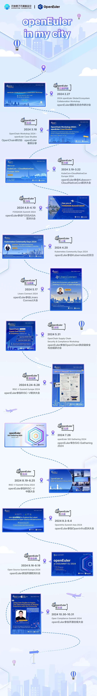
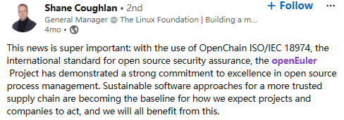
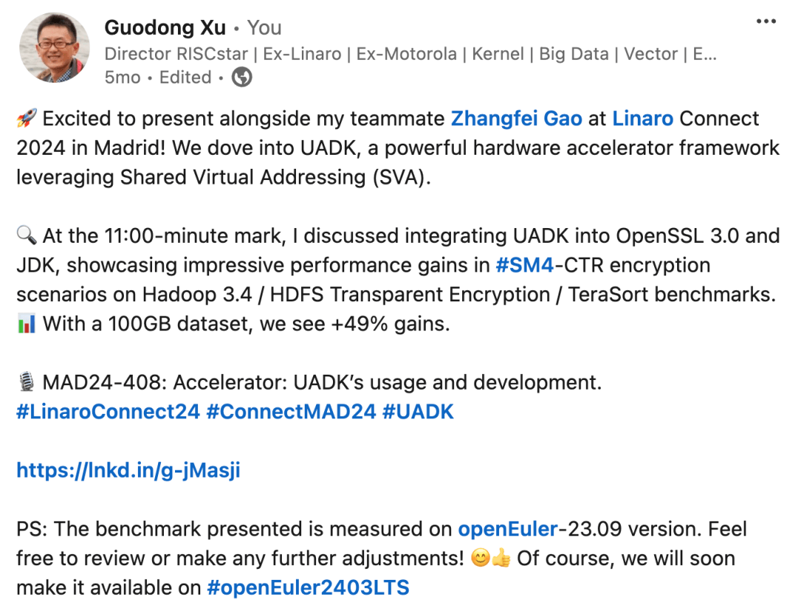
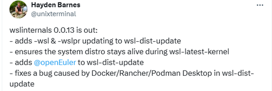
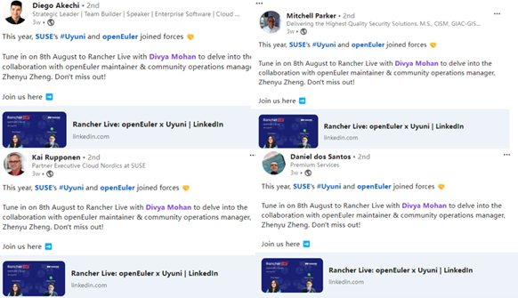
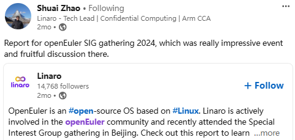
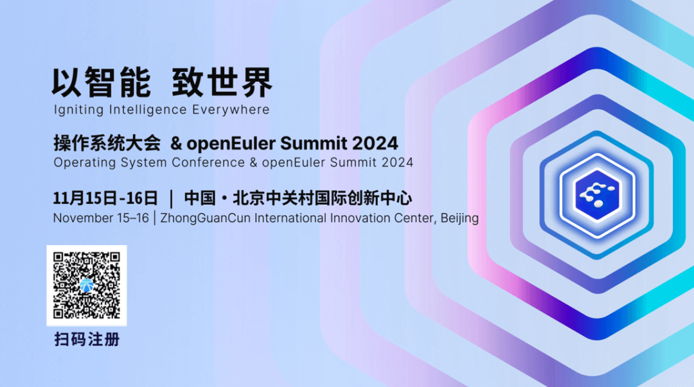

自开源以来，OpenAtom
openEuler（简称openEuler）社区便踏上全球化的征程。从一个初出茅庐的探索团队，发展到如今汇聚成千上万开发者、企业合作伙伴及技术爱好者的大家庭，今天的openEuler，不仅仅是一个开源操作系统，更是一个热爱创新、默契协同的活力社区。今年，随着**openEuler在YouTube上的订阅者突破十万**、内容观看时长超6万小时，openEuler在全球的影响力得到了进一步的证明。每一次点赞、每一位关注者，都是对openEuler的认可和鼓励，激励着我们在开源的路上不断前行。同时，LinkedIn、X（Twitter）等海外社媒平台上也有越来越多的开发者加入openEuler的全球化旅程，为社区注入了多元化的活力和全球视野。

#### openEuler in My City：我们的开源足迹

在这一年中，openEuler走过了许多城市，参加了多场国际行业活动，为全球开发者带去了最新的技术成果与开源理念。在巴塞罗那、河内、东京、香港、维也纳、水原等地的开源大会和合作活动中，openEuler的身影不断出现，成为全球开源生态中不可忽视的一部分。

作为openEuler出海活动的一部分，"openEuler in My
City"正在全球范围内不断拓展。无论是Open Source
Summit上的技术分享、OpenInfra
Summit的互动，还是与海外开发者面对面的交流，openEuler的脚步遍布世界各地，每一站都代表着我们与当地社区的深度链接，也见证了社区成长的每一个瞬间。每一张海报都记录着这些城市中的点点滴滴，将openEuler的全球旅程具象化，也让更多人了解到我们的开源故事。

#### 全球开源生态的桥梁

openEuler不仅仅是在推广技术成果，更搭建了一座沟通中外开发者的桥梁。我们积极融入全球开源生态，与各国开源领袖和企业合作、交流，推动技术创新，分享中国的开源力量。通过每一场跨越国界的合作，我们希望openEuler能够在全球开源生态中起到重要的作用，促进全球的技术共建和社区共荣。

*--- OpenChain总经理Shane Coughlan高度赞扬了openEuler通过ISO/IEC
18974认证，对openEuler在开源合规上的努力表示支持*

*--- RISCstar 大中华区运营总监，前Linaro高级技术主管徐国栋及高级软件工程师高章飞在Linaro
Connect 2024中深入探讨了UADK的使用与开发，并期待其在openEuler 24.03
LTS上的应用*

*--- Hayden
Barnes，新加坡HPE高级开源社区经理，主动将openEuler合入新发布版本*

*--- openEuler 与Rancher by SUSE联合举办Rancher
Live，讲述openEuler与Rancher在Uyuni这一项目上的合作与挑战，获得多位SUSE高层的广泛关注*

*---Linaro技术主管赵帅就参加openEuler SIG Gathering
2024发表了专题报告并对活动表示高度赞扬*

#### 相聚北京，见证开源未来

今年11月15-16日，操作系统大会 & openEuler Summit
2024将于北京举行。这是属于全球开发者的盛会，我们诚邀每一位openEuler的支持者前来，与社区共同探讨最新技术、分享开源经验。这场大会将展示最前沿的技术进展和丰富的实际案例，是每一位开发者不容错过的交流机会。期待与您相聚北京，一起见证openEuler的未来，让我们继续携手前行，将开源的力量带向世界的每一个角落！

