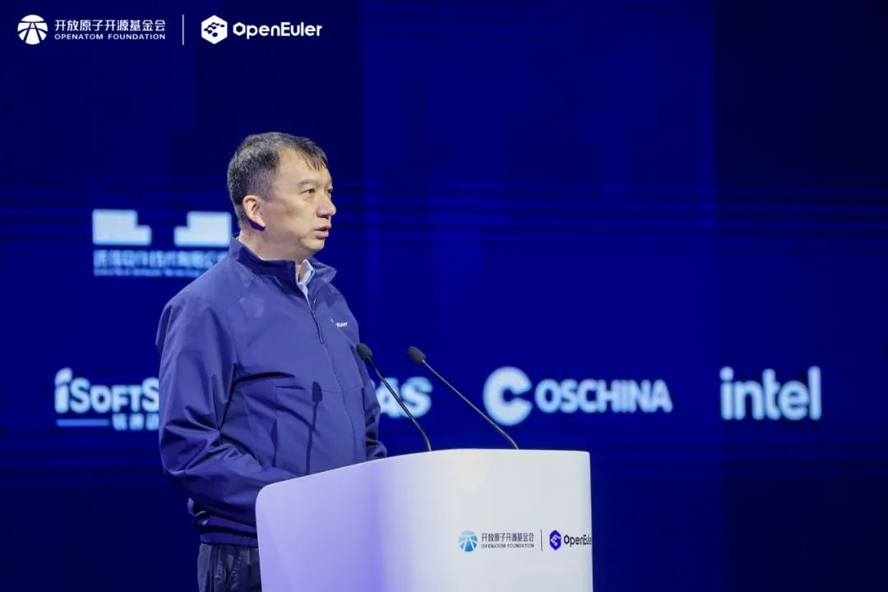
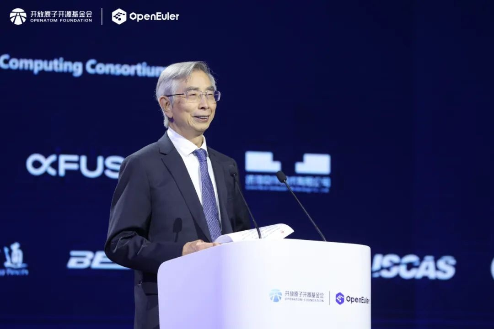
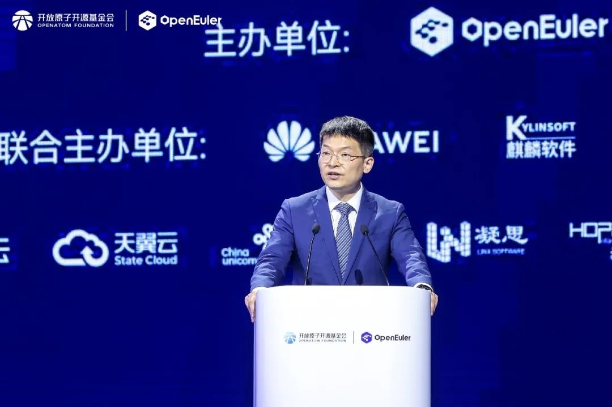
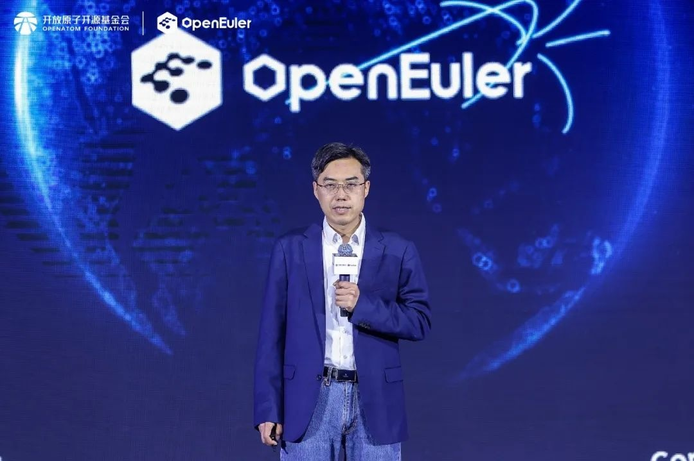

11月15日，以"以智能，致世界"为主题的操作系统大会2024（以下简称"大会"）在北京中关村国际创新中心召开。本次大会由开放原子开源基金会（以下简称"基金会"）孵化及运营的openEuler社区协同产业伙伴共同主办，旨在汇聚全球产业界力量，推动基础软件根技术持续创新，共建全球开源新生态。

openEuler社区在基金会的运营孵化下，商业、技术等生态获得全面发展。**2024年openEuler系操作系统新增装机量超过500万套，五年累计装机量突破1000万套。**openEuler已广泛应用于互联网、金融、运营商等各行业核心应用场景，实现规模商业落地。在引领产业技术创新方面，
openEuler社区发起的原创子项目已累计超过500个，覆盖了系统内核到AI使能全场景。在繁荣产业生态方面，openEuler坚持开放共赢的协同合作，汇聚从处理器到行业应用及云服务等超过1800家全产业链伙伴。**发展至今，openEuler为千行万业数智化提供坚实可靠的基础软件底座，成为中国行业数智化的中流砥柱。**

**开放原子开源基金会理事长 程晓明**

开放原子开源基金会理事长程晓明在致辞中指出，以开源开放的模式促进操作系统生态共建已经成为产业共识，openEuler作为开放原子重点打造的明星项目，已经取得了喜人的成果。**未来，开放原子将继续鼓励更多的国际交流合作，探索开源项目在海外的发展机遇，助力openEuler走向全球。**

**中国工程院院士 倪光南**

中国工程院院士倪光南指出，openEuler社区立足中国，走向全球，不仅是中国知名的操作系统社区，也是全球最活跃的操作系统社区之一。他鼓励产业界以openEuler为典范，积极拥抱开源，为全球贡献世界一流的服务器操作系统，让中国成为全球开源体系中的重要力量。

**华为公司战略部部长盖刚**

华为公司战略部部长盖刚在致辞中表示，过去5年，华为与客户和伙伴一起，见证了中国开源开放计算产业的高速发展，共筑中国坚实的算力底座，为世界提供新的选择。未来华为将继续秉持开放合作的精神，与客户和伙伴构建开放的计算生态体系，共同推动各行业数智化转型发展。华为会继续坚定投入openEuler社区，持续技术创新，夯实安全架构，加速全球合作，以实际行动支持社区及操作系统产业健康、高速发展。

**openEuler 委员会主席 江大勇**

会上，openEuler委员会主席江大勇在主题演讲中表示，openEuler从企业主导发展到社区共建，从跨越生态拐点到市场领先，不断加速前行。未来，openEuler将沿着智能化、可持续和全球化三个方向努力，以智能、致世界，共建数智基础设施最佳开源操作系统。

**openEuler面向AI持续演进，**

**使能全场景应用，引领智能化**

当前AI已成为对行业影响最大的技术之一，AI技术与经济性的提升推动了AI加速走向行业。面向智能加速、数智融合的趋势，openEuler将沿着内核关键技术突破，使能异构算力融合，提升多样算力使用效率，助力更稳定的模型训练和更高的推理应用性能，打造数智基础设施首选开源操作系统。

预计2025年3月，openEuler将发布25.03
创新版，全面增强AI能力，持续使能服务器、云计算、嵌入式等全场景应用。该版本面向openEuler操作系统和应用开发者，升级高效易用的社区基础设施，提供更友好的开发平台。

**打造健康发展的开源社区，**

**openEuler AI机密计算解决方案**

**正式发布，推进可持续**

openEuler在2022年正式提出了构建开放、安全的软件供应链目标，今年完善了可持续化治理框架，在开发过程中严格遵循多项国际规范，优化社区组织健康度评估标准，在密态数据库等场景上提升应用性能。openEuler社区的安全性和合规性已达到国际水准，真正从开发、运行到运维，端到端保障社区的可持续发展。

面向AI时代的数据安全需求，openEuler
社区联合处理器厂商、行业客户联合推出AI机密计算解决方案，在多种计算架构上迅速构建起保护大模型训练、推理的机密计算环境，保障用户个人隐私和企业的数据安全。

openEuler从标准遵从者到推动者、制定者，与全球伙伴共建行业标准，服务更广泛的行业用户。

**开放协作，共建面向全球的**

**开源操作系统，加速全球化**

openEuler致力于构建国际化的开源协作平台，吸引了海外43个国家和地区的2000余名贡献者加入，已获得OpenStack、Ceph、Spark、OpenCV等数十款全球主流开源项目的原生支持，并与Linux
Foundation、OpenInfra等全球性基金会开展深度合作。在应用服务方面，openEuler已在AWS等全球五大公有云、三大容器仓全面上线，未来还将联合伙伴面向全球提供服务支持。目前openEuler已初步构建起产教融合人才培养体系，在社区成员的共同协作和贡献下，加速全球化的人才发展，目前已覆盖16个国家和地区的60多所高校。

本次大会宣布，Arm、百度、奥思维、科银京成、博云、凝思、宝兰德、华郅技术、兆芯共9家企业成为社区捐赠人，未来将为openEuler的社区运营、宣传推广、学术交流、教育培训和国际合作提供充足支持。

去年，openEuler携手7大全球开源组织开启全球化新篇章。本次大会，openEuler宣布与OpenInfra、CNCF、openHPC三家海外头部开源基金会建立深入合作，将原生支持openEuler项目，进一步加速openEuler全球化进程。

现场还举行了"2024年度openEuler领先商业实践"和"2024年度openEuler社区突出贡献单位"仪式。25个openEuler年度领先商业实践项目揭晓，包括13个规模型项目与12个创新型项目。20家国内单位及5家海外单位获得2024年度openEuler社区突出贡献单位。

欢迎更多企业和开发者加入openEuler生态，共创开源新篇章。
