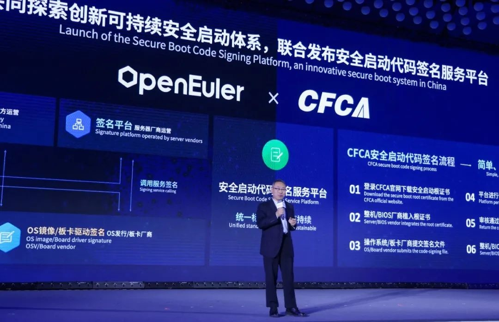
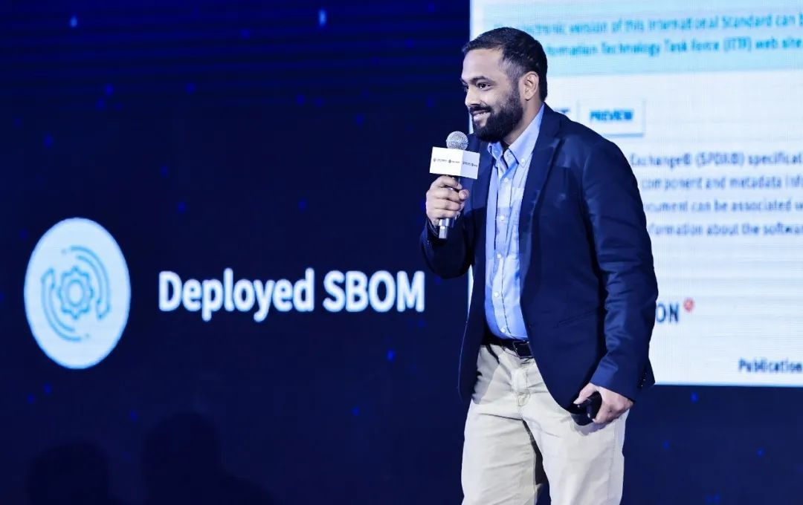

11月16日，在北京中关村国际创新中心举行的openEuler Summit
2024大会上，开放原子开源基金会孵化及运营的openEuler社区联合业界标准机构与认证组织、全球生态伙伴及客户一起讨论社区可持续化发展趋势，并发出 **《openEuler全球可持续化发展倡议》，倡议表示"持续增强社区安全治理，通过安全技术创新，保障数据与模型安全，融入上游社区漏洞处理生态，运维更可靠"。**

该倡议由**openEuler社区、DEKRA、Bureau Veritas、移动云、天翼云、联通云、中金金融认证中心有限公司（CFCA）、SPDX、全球计算联盟（GCC）、电信终端产业协会（TAF）**共同发起，旨在通过技术创新，从开发态、运行态、维护态构建全周期数据安全保护方案，从标准遵从到参与国际标准的制定来保障社区全球可持续化发展，共建AI时代数据安全生态。

大会现场，中金金融认证中心有限公司联合openEuler
发布安全启动代码签名服务平台，共同探索与中国市场需求相契合的创新可持续安全启动体系。该平台提供高效安全的代码签名服务，通过与openEuler
社区深度对接，为平台提供了强大的开源代码审核能力，并成功为行业领军企业浙江大华技术股份有限公司提供服务。

中金金融认证中心有限公司（CFCA）副总经理
张野

此外，openEuler 联合SPDX共同发布了开源软件供应链安全新标准------SPDX
3.0中文版，该版本由开放原子开源基金会旗下源译识社区、openEuler 社区G11N
SIG团队共同完成，译者还来自国家工业信息安全发展研究中心、中国赛宝实验室、OpenHarmony社区、美的集团等组织。SPDX
是全球许多行业和政府正在广泛使用的标准，随着3.0版本的演进，能够为一系列软件提供正确的软件物料清单（SBOM）。中文版上线后，数百万中国开发人员可以与SPDX标准进行原生交互，改进标准，并将全球社区团结在一起，以确保全球软件供应链安全。

Gopi Krishnan Rajbahadur，Co-Lead of SPDX
AI and Dataset Profile, Ambassdor

数据安全是AI时代可持续化发展的关键，操作系统支撑着海量数据的安全流通。开源五年以来，openEuler
从安全技术、安全标准、漏洞治理、安全开发、安全构建和绿色节能等方向践行可持续化发展之路，全方位覆盖开发、运行、运维等各个阶段。除了广泛参与遵守安全标准之外，openEuler
也在积极参与制定和推出安全标准，从原来的标准遵从者，转变为国际标准的推动者和制定者，与全球伙伴一起共建全球化的可持续发展社区。
