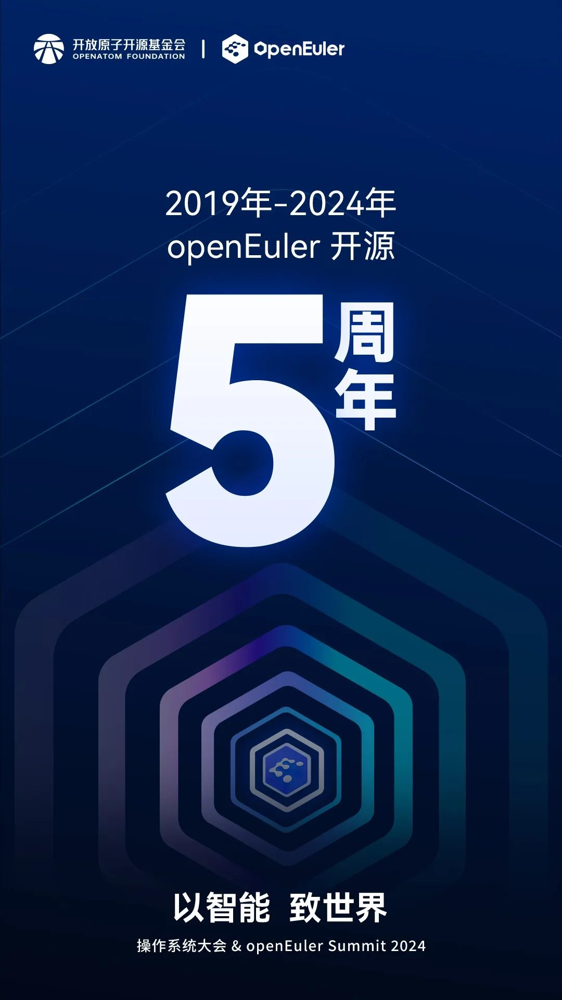
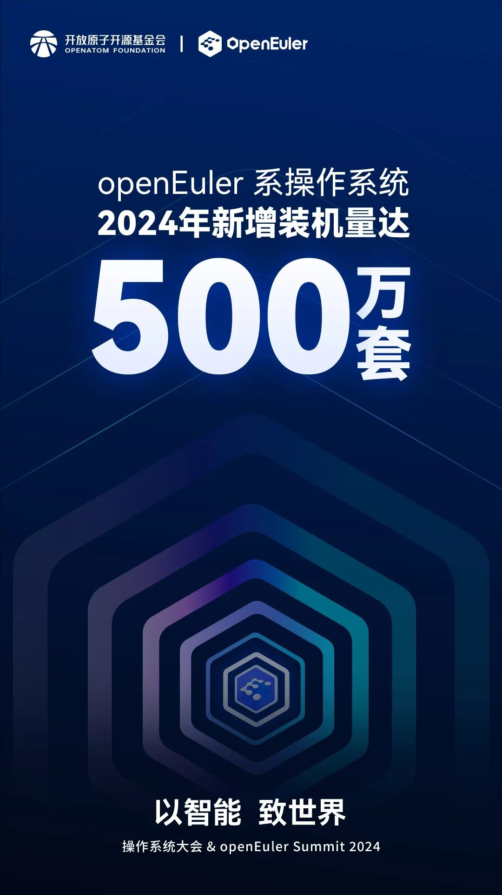
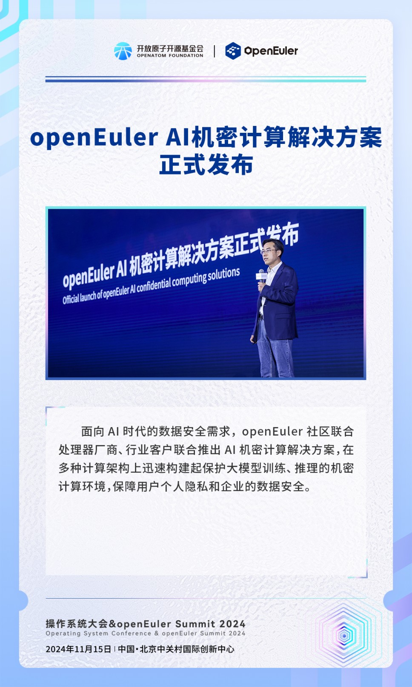
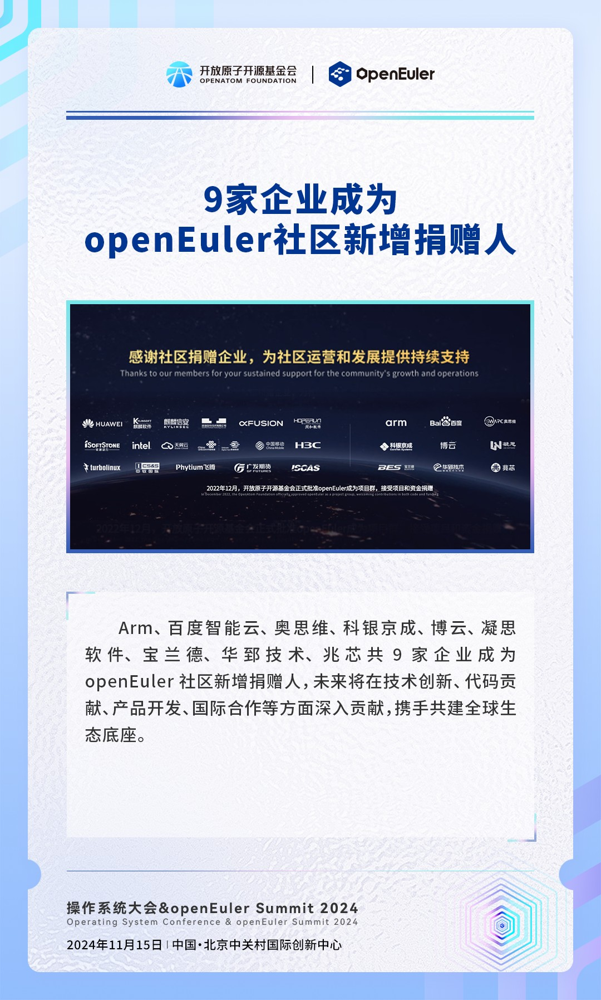
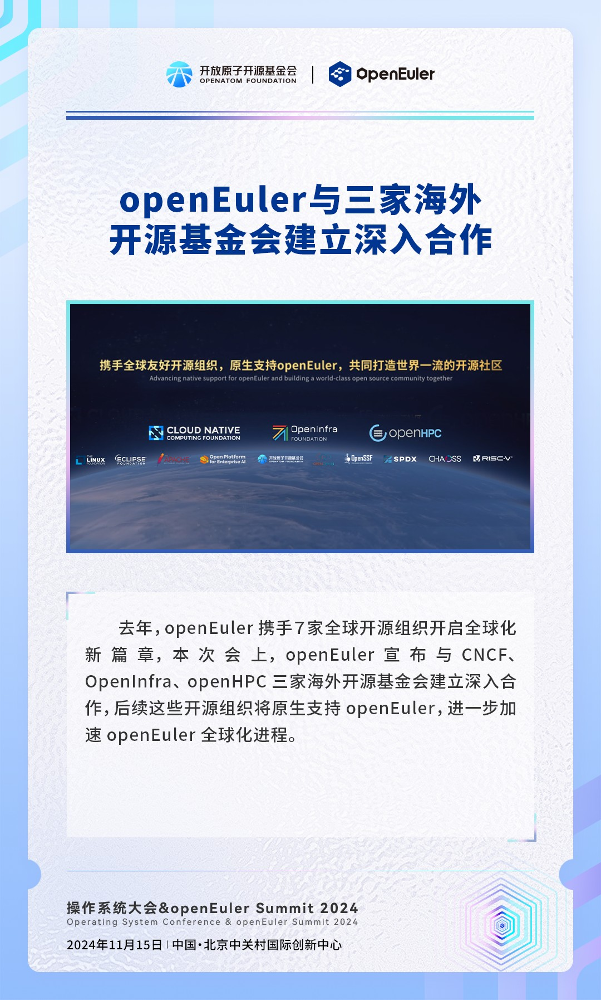

操作系统大会2024
-----
重磅发布直击
-----

2019年-2024年

openEuler 社区

开源五周年

在开放原子开源基金会的运营孵化下

商业、技术等生态上获得全面发展

**2024年openEuler系操作系统新增装机量超过500万套**

**五年累计装机量突破1000万套**

\

\

\
左右滑动查看更多→

本次操作系统大会2024上，openEuler
AI机密计算解决方案正式发布，推进可持续；Arm、百度智能云、奥思维、科银京成、博云、凝思软件、宝兰德、华郅技术、兆芯共9家企业成为openEuler社区新增捐赠人；OpenInfra、CNCF、openHPC三家海外开源基金会与openEuler建立深入合作；25个2024年度openEuler领先商业实践项目揭晓。

\

\

智启新征程，共创新未来

期待下一个五年，openEuler带来更瞩目的成果！
