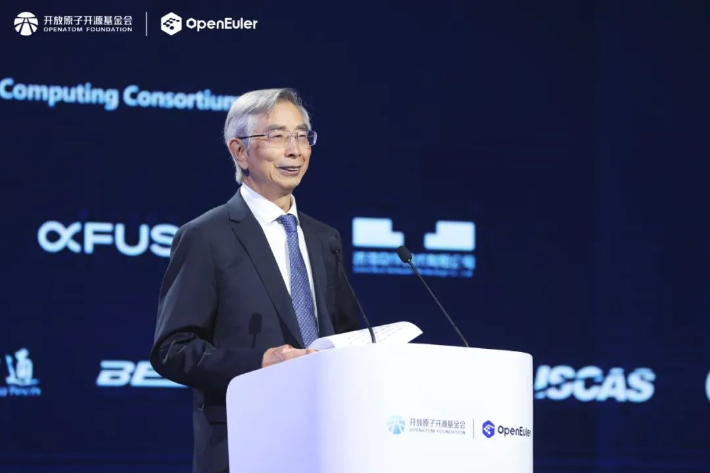

**【中国 北京 2024年11月15日】**"以智能 致世界"为主题的操作系统大会 &
openEuler Summit 2024
在北京中关村国际创新中心举行。会上，中国工程院院士倪光南指出，开放原子开源基金会孵化及运营的openEuler社区立足中国，走向全球，他鼓励产业界以openEuler为典范，积极拥抱开源，为全球贡献世界一流的服务器操作系统，让中国成为全球开源体系中的重要力量。

中国工程院院士倪光南致辞

**以下为倪光南院士致辞全文：**

操作系统大会是中国开源的一次盛会，非常高兴又和大家相聚在这里，与大家共同见证openEuler操作系统和社区的成长。首先我对今年大会的召开表示热烈的祝贺！向与会嘉宾的到来表示诚挚的问候！向长期以来一直关心和致力于开源社区发展的各界人士和广大开发者们表示衷心的感谢！

openEuler是支持多样性算力的开源操作系统，近几年，openEuler依托社区发展，协同全球产业力量，共同推进计算技术和产业发展。实践证明，经过四年多业界的共同努力，openEuler社区已经拥有超过1800家的成员单位，超过365万用户，超过2万多开发者数量。全球下载量突破360万，为全球153个国家和地区提供基础计算服务。

openEuler一直致力于打造国际化的开源平台，协同全球开发者共同推动技术创新和产业发展。立足中国，走向全球，openEuler社区不仅是中国最活跃的操作系统社区，现在也是全球最活跃的操作系统社区之一。多年来，openEuler始终坚持以支持全球的开源软件为宗旨，并联合OpenChain、SPDX、CHAOSS等国际组织，共同制定开源软件供应链安全标准，共同解决开源社区治理和软件安全等问题。

我们在积极推动openEuler社区发展壮大的同时也要积极探索构建中国开源体系建设。要积极推动开源商业模式、开源协议、开源知识产权保护、开源资产评估、开源治理、开源人才培养等相关工作，要充分发挥我国的体制和制度优势，顺应时代潮流，与国内外开源人士增进交流、凝聚共识、深化合作，共同为推动开源高质量发展贡献中国智慧和中国力量。

女士们、先生们、广大开发者朋友们，开源是推动全球技术协同创新、产业协作的重要实践。让我们以openEuler为典范，积极拥抱开源，打造开放、包容的开源文化，构建全球创新合作模式，积极开展与国际伙伴、国际开源与标准组织的合作，传播科学开放精神。共同推动openEuler社区不断发展壮大，打造世界一流的开源社区，为全球贡献世界一流的服务器操作系统，让中国成为全球开源体系中的重要力量。
