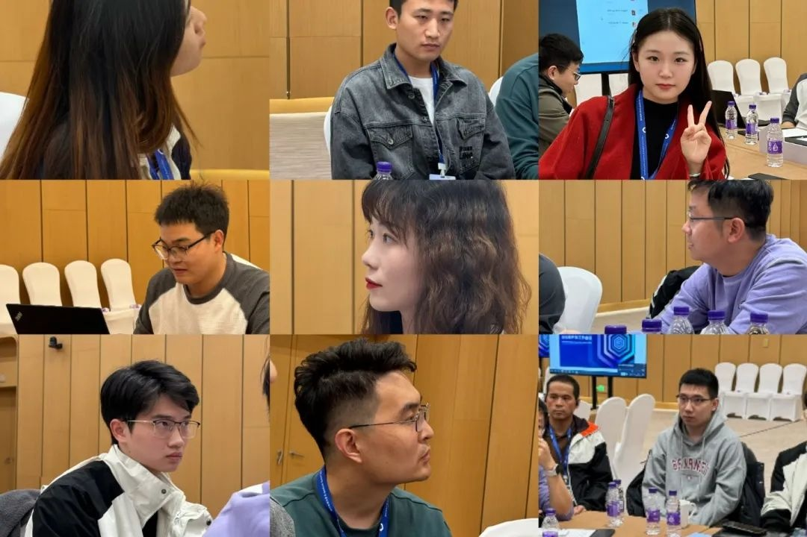
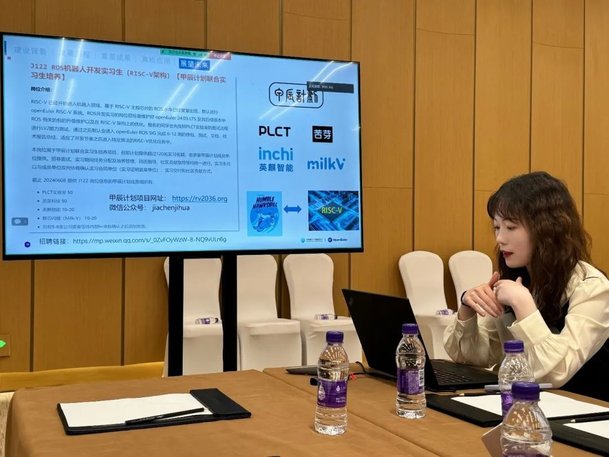
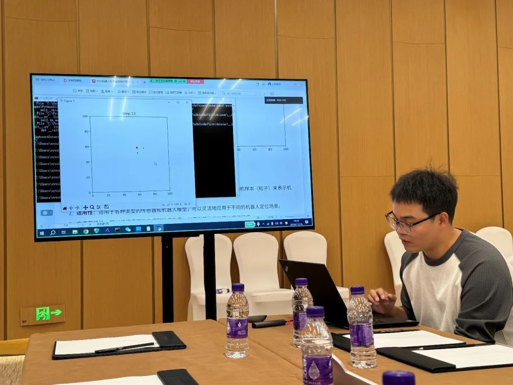
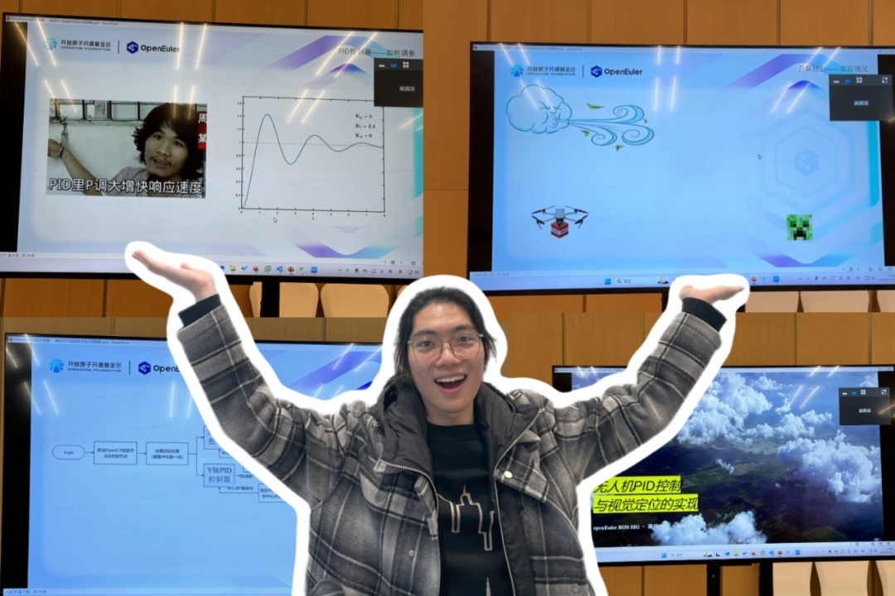
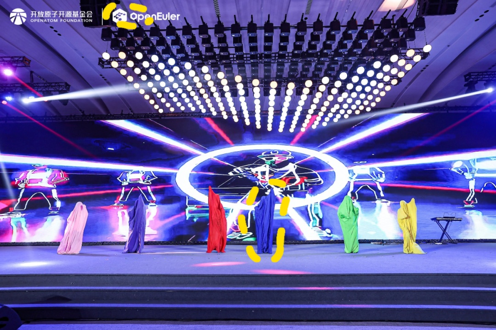

操作系统大会＆openEuler Summit
2024圆满结束，开放原子开源基金会孵化及运营的openEuler社区ROS
SIG的分享也在大合影的相机"咔嚓"声中走进尾声。本次大会ROS
SIG深度参与，采用线上线下双渠道的模式让openEuler ROS
SIG的开发者和ROS爱好者们聚在一起，多样的课题分享+热情的伙伴们+惊喜的开发者之夜=\>愉快的openEuler
ROS SIG分享会，请下滑接受这份会议精彩记录\~

**精彩议题分享**

ROS SIG Maintainer王晓云分享了ROS
SIG进展总结与规划展望，概括介绍openEuler ROS
SIG的建设背景和发展历程后，王晓云为参会成员们展示了ROS
SIG的视频教程新栏目以及丰富多样的真机应用，这些成果不仅展示了ROS2在机器人技术中的广泛应用，也凸显了openEuler在支持不同硬件平台和复杂应用场景中的优势。最后，王晓云向大家介绍了甲辰计划人才培养招聘方案，对RISC-V
或ROS感兴趣的同学可以戳小助手（openEuler123）查看招聘详情。

ROS SIG
Maintainer安传旭为大家介绍了AMCL算法，AMCL（自适应蒙特卡洛定位）是ROS中常用的定位算法，基于粒子滤波原理，适用于非线性、非高斯状态估计。与卡尔曼滤波不同，AMCL通过初始化、预测、更新、重采样和估计五个步骤，不断融合多维传感器数据，调整粒子权重，保持粒子多样性，快速收敛并提高定位精度。这使得AMCL成为机器人导航中高效且精确的定位方案。

ROS SIG
Maintainer韩昊旻演示了Gazebo在openEuler24.03上的安装和使用。Gazebo作为ROS生态中重要的可视化工具，因紧耦合多种第三方库，迁移适配难度较大。今年，通过Gazebo专项突破计划，对其依赖关系进行了梳理、拆分和剪枝。在2024
openEuler
Summit之前，韩昊旻及组员成功完成了基础功能的编译和调试。目前，Gazebo已加入openEuler社区，为ROS开发者提供了更高效的算法迭代与工程开发支持，大大提升了开发效率。

ROS SIG
Maintainer席江玲为我们讲解了ROS-Noetic在openEuler24.03上的应用。ROS-Noetic是ROS1的最后一个长期维护版本，承载着ROS1向ROS2过渡的关键角色。对于openEuler
ROS SIG而言，它同样是最后的长期支持版本。在openEuler
24.03中，ROS-Noetic涵盖了ROS的基础软件包和常用工具指令，如ros-topic、ros-service、ros-action等。席江玲详细介绍并实操了这些经典指令，使得开发者能够轻松入门ROS，真正实现\"开箱即用\"的开发体验。

甲辰计划实习生顾嘉琪用生动的PPT以及逻辑清晰的流程图为我们分享了无人机PID控制与视觉定位的实现，结合"穿越机爆改RISC-V无人机"的有趣项目，以及Minecraft方块人的生动显示，顾嘉琪不仅成功调动了现场气氛，还给现场一位老师留下了深刻的映像，当场邀约会议结束后围绕此项目进一步交流。

甲辰计划实习生林鸿宇带来了ROS2 日志系统分享，首先简要介绍了 ROS2 中的
rclpy rclcpp rcl rcutils rcl\_logging
子系统结构，解释他们是如何协同实现上述功能，再对比了 ROS1 与 ROS2
的区别，简要列出两者在架构、日志级别控制、输出方式等方面的主要差异和改进，突出
ROS2 的灵活性和模块化设计优势。林鸿宇表示，虽然 ROS2
的日志系统更加的灵活可以适应不同的任务场景，但对于开发者而言的学习成本也随之增加。

甲辰计划实习生陈梓恒同学来到了线下，这是开会时认真听ROS SIG议题分享他：

以为他是眼神清澈带点社恐的男大？不不不，晚上6点，陈梓恒同学就这么水灵灵的站上了开发者之夜的舞台，化身为C位小蓝，在蓝色被套下以一种抽象却热情的舞蹈表达着内心与ROS
SIG组线下交流技术的喜悦。

回顾本次活动的美好瞬间，衷心感谢每一位线上线下的参与者与关注ROS
SIG的伙伴们，大家共同努力，造就了一个完美且愉快的 openEuler ROS SIG
分享会，同时欢迎感兴趣的小伙伴们扫码入群，期待与你们的下一次相遇\~

