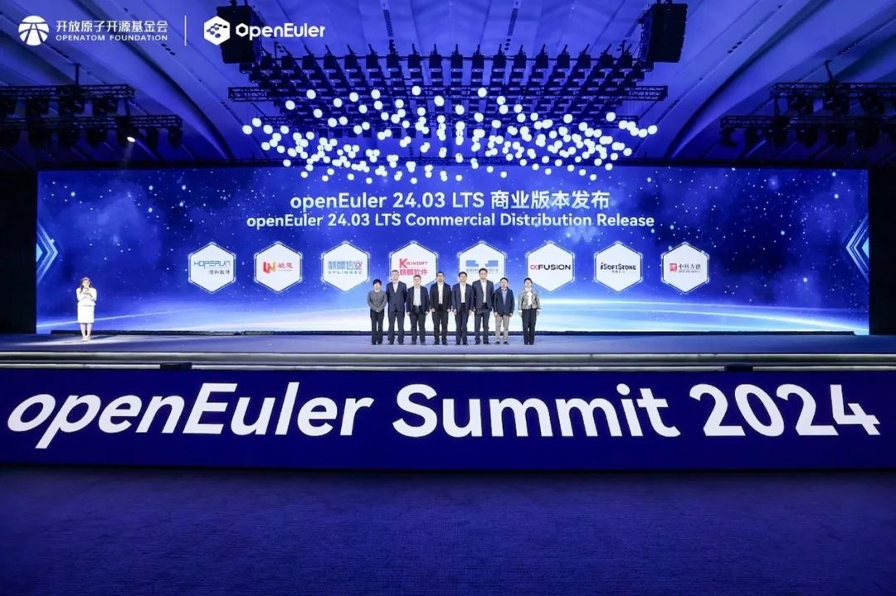

\[中国，北京，2024年11月16日\] openEuler Summit
2024在北京中关村国际创新中心圆满落幕。本次大会由开放原子开源基金会（以下简称"基金会"）孵化及运营的
openEuler社区协同产业伙伴共同主办，以"以智能，致世界"为主题，旨在汇聚全球产业界力量，推动基础软件根技术持续创新，共建全球开源新生态。

openEuler委员会主席江大勇在致辞中表示，开源5年openEuler系操作系统累计装机量超过1000万套，树立了操作系统产业新的里程碑。openEuler商业发展的成功，离不开以社区为主导的健康运作模式。第一，坚持技术创新是openEuler立足的根本，openEuler
持续专注内核创新，累计发布了 588
个软件仓库，覆盖服务器、云计算、边缘计算和嵌入式场景；第二，坚持共建、共治、共享，充分发挥开源社区优势，2024年openEuler
新增9个捐赠人，现有捐赠单位22家，未来将在技术创新、代码贡献、产品开发、国际合作等方面深入贡献；第三，openEuler致力于构建国际化的开源协作平台，联合伙伴发展全球生态，开扩更广泛的产业空间。

openEuler委员会主席江大勇

开放原子开源基金会TOC副主席、openEuler委员会执行总监熊伟表示，开源5年以来，openEuler社区已吸引2万多名社区贡献者，1800多家单位成员加入社区，贡献社区，全球下载量突破360万。openEuler共推出3个LTS版本和7个创新版本，完成194600多次代码合入请求，累计产生20亿行代码，450万次Review。在全球化方面，openEuler社区已与10多个海外头部开源基金会开展技术合作，共建全球开源安全、可信规范标准，为150多个国家和地区提供服务。**面向未来，openEuler将沿着智能化、可持续和全球化三个方向持续努力，共建数智基础设施首选开源操作系统。**

开放原子开源基金会TOC副主席、openEuler委员会执行总监熊伟

**引领智能化发展打造数智基础设施首选开源操作系统**

智能化时代，需要更智能、更友好、更持续的操作系统。openEuler将沿着内核关键技术突破，南向使能通用算力、智能算力、异构算力的融合，提升多样算力使用效率，北向提升基于负载感知的加速能力，助力更稳定的模型训练和更高的推理应用性能。

**计划2025年3月发布openEuler 25.03创新版，全面增强AI能力**

会上，openEuler
技术委员会主席胡欣蔚预告，继2024年发布基于6.6内核的24.03LTS版本和24.09的创新版本之后，**预计2025年3月份openEuler还将发布25.03创新版本，全面增强AI能力，持续使能全场景应用。**在服务器场景，通过编译系统优化和自适应NUMA亲和技术进一步提升了性能。在云计算场景，提升云基础设施的资源利用率、增强抗干扰和安全能力。对于嵌入式场景，推出预装openEuler操作系统的鸿欧派开发板，为开发者提供低成本、全功能的解决方案。在AI领域，通过CPU+GPU协同推理和框架调度优化，提升了AI推理速度。

**openEuler & Friends 5.0使能AI场景创新**

开发者基于openEuler打造AI编程工具、大会海报生成应用的故事，展示了为匹配AI时代快速发展，openEuler基础设施通过上游软件实时监测、软件包自动化升级、智能Review等能力，提升社区开发者协作及软件包维护效率。现场用真实、生动的场景展示了openEuler智能计算领域软件包的丰富应用，支持CPU、GPU、NPU等多种算力及AI加速库，可高效支撑AI开发者完成全场景应用开发，也意味着openEuler具备了OS
for AI的软硬件生态和易用性。

**坚持社区共建、共治、共享促进生态繁荣新篇章**

openEuler社区始终坚持共建、共治、共享的原则，充分发挥开源社区这种创新模式的优势，汇聚产业创新力量，促进生态繁荣发展。openEuler社区的运营与发展离不开社区伙伴、用户的协作与创新，在伙伴们的持续努力下，已经持续迭代发布多个商业版本。

**  8家伙伴基于openEuler 24.03
LTS发布商业发行版**2024年6月6日，openEuler 24.03
LTS版本全球发布，该版凝聚国内外10多家芯片厂商，20多家操作系统厂商，100多家行业头部软件供应商和5136名社区贡献者，是社区里程碑式版本。本次会上，麒麟软件、麒麟信安、统信软件、超聚变、润和软件、软通动力、凝思软件、中科方德领先发布基于openEuler
24.03 LTS的商业发行版。openEuler 24.03
LTS版本汇聚了产业链上下游软硬件厂商技术共识，集合众多开发者的智慧，将成为未来几年中国IT基础设施的坚实基础。

**  9家单位参与openEuler项目群创新项目贡献签约仪式**自2022年openEuler成立项目群后，各行业领域头部企业、高校、科研院所等的创新项目开始不断加入，openEuler项目群的子项目数量持续赠加，社区涵盖的行业也日趋多样化。会上，天翼云、联通数科、华为、麒麟信安、金蝶天燕、中科院软件所、北京大学与北京大学长沙计算与数字经济研究院、同济大学、厦门大学的9家单位的12个项目与openEuler项目群签订贡献意向。来自不同行业和领域的项目为openEuler注入产业各界的创新力量，进一步增强社区技术创新能力，促进社区生态繁荣。

**\
可持续发展携手国际开源组织共建全球开源新生态**

openEuler致力于打造国际化开源协助平台，与国际主流基金会深度合作，已支持全球98%的主流开源软件。当前openEuler已打通与Linux、OpenInfra、Apache、CNCF、Intel、openHPC
等的技术合作支持
，覆盖主流应用场景；openEuler社区与OpenChain、OpenSSF、SPDX
等三家达成深度合作，共筑开源软件供应链安全；同时，在开放原子开源基金会的支持下，携手OpenChain、CHAOSS
共建全球可信开源社区规范。目前，openEuler与英特尔持续加强合作，共同加速AI创新与应用进程，推动操作系统生态繁荣发展。同时，**openEuler与国际主流软件供应链安全组织共建开源安全标准，和源译识翻译社区联合翻译并发布SPDX3.0中文版，与中金金融认证中心（CFCA）联合发布安全启动代码签名服务平台。**

**  10家组织和单位共同发起全球可持续发展倡议**可持续是openEuler发展的关键。openEuler作为操作系统领域基础软件支撑着关键基础设施的安全稳定运行，如何保障系统自身及运行于系统上数据全生命周期的安全至关重要，需要标准组织、安全评估机构、合作伙伴和客户共同助力社区可持续化发展。会上，**openEuler社区与DEKRA、Bureau
Veritas
、移动云、天翼云、联通云、中金金融认证中心有限公司（CFCA）、SPDX、全球计算联盟（GCC）、电信终端产业协会（TAF）共同发起《openEuler全球可持续化发展倡议》**，倡议表示"持续增强社区安全治理，通过安全技术创新，保障数据/模型安全，融入上游社区漏洞处理生态，运维更可靠"。\
社区的繁荣离不开伙伴的持续创新与发展，openEuler自开源以来已经在千行百业积累了众多商业成果及经验。会上，光大银行携手麒麟软件带来在金融行业的实践成果，南京南瑞继保工程技术有限公司携手麒麟信安带来在电力系统中的创新实践，辽宁移动联合超聚变带来在运营商行业的实践分享、统信软件分享了亲身实践的行业应用案例。子项目是openEuler社区发展的推动力，开发者是社区可持续发展的发动机。会上，openEuler社区评选出20个"openEuler
2024年度社区项目之星"和28名openEuler 2024年度贡献之星。

未来，openEuler社区将继续秉持"共建、共治、共享"的理念，通过与伙伴和全球开发者共同努力，推动基础软件技术的持续创新和应用，构建一个更加开放、多元的全球开源社区。
