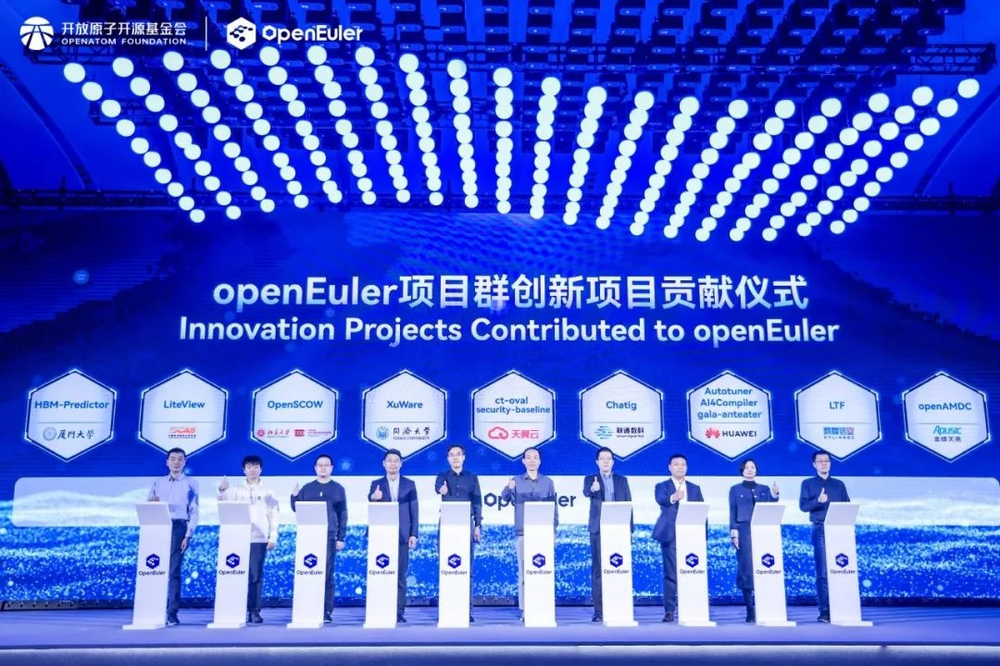
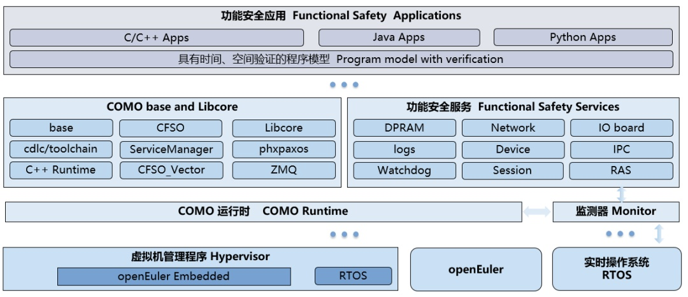
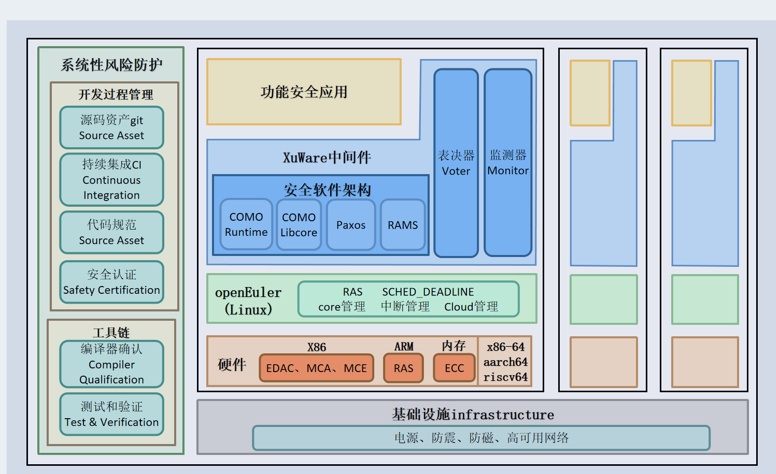

2024年11月16日，openEuler Summit 2024
在北京成功召开。会上，同济大学正式发布了基于XuWare中间件的功能安全计算操作系统，并将其核心实现代码开源至OpenAtom
openEuler（简称\"openEuler\"） 社区。

图1 同济大学黄新林教授（左4）上台签字

**核心技术亮点**

XuWare的核心技术基于C++构件模型技术COMO，其历史可以追溯至20多年前的Elastos手机操作系统项目。该项目由同济大学基础软件工程中心主导开发，是TD-SCDMA操作系统的重要组成部分，为TD-SCDMA产业联盟做出了重要贡献。

COMO技术源于Elastos操作系统及其核心的CAR构件技术。CAR构件技术为C++语言提供了更强的解耦能力、反射支持以及统一继承体系下的类库管理功能，这些特性成为Elastos操作系统开发的基础和核心优势。

为了进一步发展，COMO在继承CAR模块化理念的基础上，将其与Elastos操作系统的紧密耦合解开，并针对功能安全计算场景进行了全新设计。COMO引入了一系列新的计算特性，重新构建了更适应复杂计算需求的C++构件模型技术。

图2 COMO构件技术

**功能安全计算**

面向任务关键型系统需求的计算中间件------XuWare，凝聚了同济大学在轨道交通列车控制、汽车电子等领域的长期研发积累。这类系统对实时性、安全性和可靠性有着极高要求，必须具备功能安全、信息安全、故障隔离与恢复等能力。在这些应用场景中，设备本身价值极高，一旦出现失误，可能带来严重的外部危害。例如，轨道交通系统的故障可能导致列车停滞，而航空航天系统一旦停止工作，可能直接引发飞行器坠毁事故。

功能安全概念最初来源于工业控制领域，主要用于信号和仪表等安全控制，后来扩展至汽车领域的车规级安全控制，并正在向更多领域拓展。

图3 基于openEuler的功能安全计算中间件

**安全技术创新**

XuWare在openEuler操作系统上运行（如图3所示），支持基于COTS（商用现成产品）的功能安全计算部署模式。对于功能安全计算而言，操作系统的功能安全标准和功能安全测试技术至关重要，是工业控制系统的数字基座。此次发布的功能安全操作系统，为中国在工业控制软件领域的最后关键环节填补了空白。

同济大学将这项重要的技术积累转化为面向功能安全领域的创新解决方案，推动XuWare在功能安全垂直领域的应用落地。集成了XuWare的openEuler是一款面向数字基础设施的开源操作系统。

**领先安全架构**

XuWare的设计理念处于全球领先水平。XuWare借助openEuler生态，凭借开源优势显著降低了用户的开发门槛和原有系统升级成本。通过"计算单元"（Computing
Unit）和"计算设备"（Computing
Container）的管理，XuWare构建了一个强大的功能安全计算模型，与openEuler数字底座无缝衔接，形成了一整套完整的功能安全操作系统解决方案。该解决方案基于openEuler的混合部署技术，避免了操作系统内核和基本应用选择上的困境。相比之下，国内现有的工业操作系统主要为RTOS方案，在应对AI模型计算需求时，通常需用户自行解决操作系统与AI计算软件之间的软件包移植与定制问题。

此次发布标志着同济大学在功能安全操作系统领域迈出了重要一步。展望未来，随着全球对功能安全需求的持续增长，XuWare有望成为推动安全技术发展的重要引擎，为工业软件的创新之路增添浓墨重彩的一笔。
