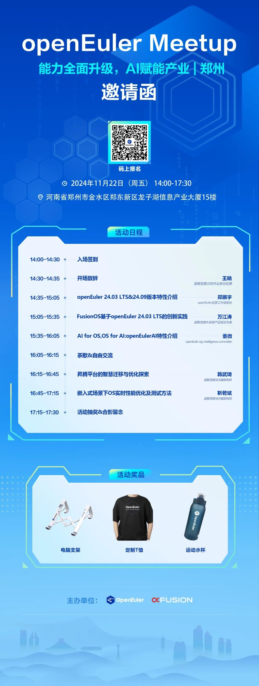

智能的边界在持续拓展，作为连接硬件和应用之间的桥梁，操作系统拥抱数智未来，与
AI 结合是一种必然趋势。OpenAtom openEuler（简称\"openEuler\"）
通过"openEuler for AI"和"AI for openEuler"，实现 AI
全栈使能，打造容器化的、开箱即得即用的方案。

**11月22日，openEuler社区与**超聚变**将在郑州联合主办Meetup
活动，**本次活动主题将紧紧围绕 "能力全面升级，AI
赋能产业"，旨在分享与交流 openEuler 社区在新版本能力升级、AI
领域的最新进展以及实践案例。欢迎报名参加\~

**郑州 Meetup**
----
**活动信息**
-----

**主办单位：**openEuler社区、超聚变

**时间：**2024年11月22日 14:30-17:30

**地点：**河南省郑州市金水区郑东新区龙子湖信息产业大厦15楼

**活动议程&报名**

