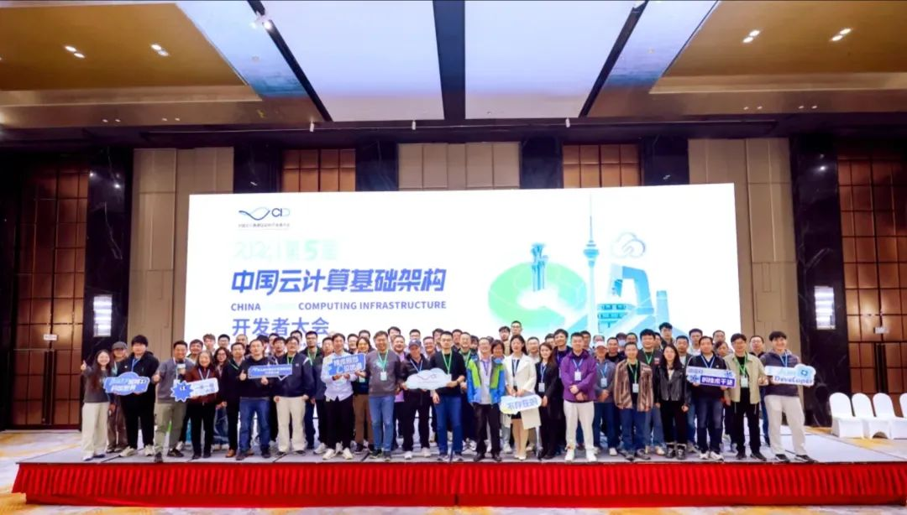
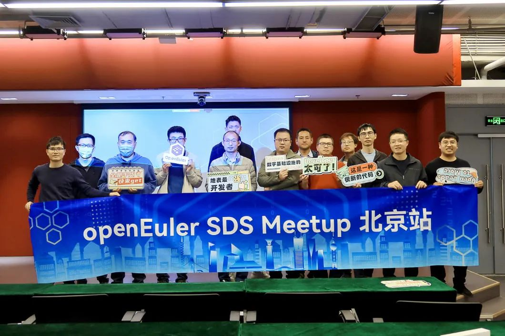
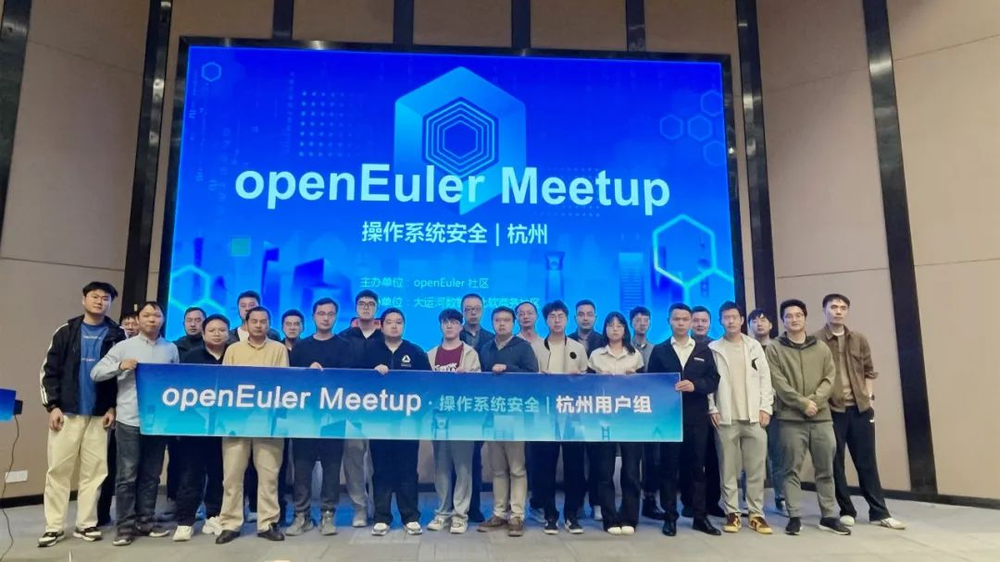
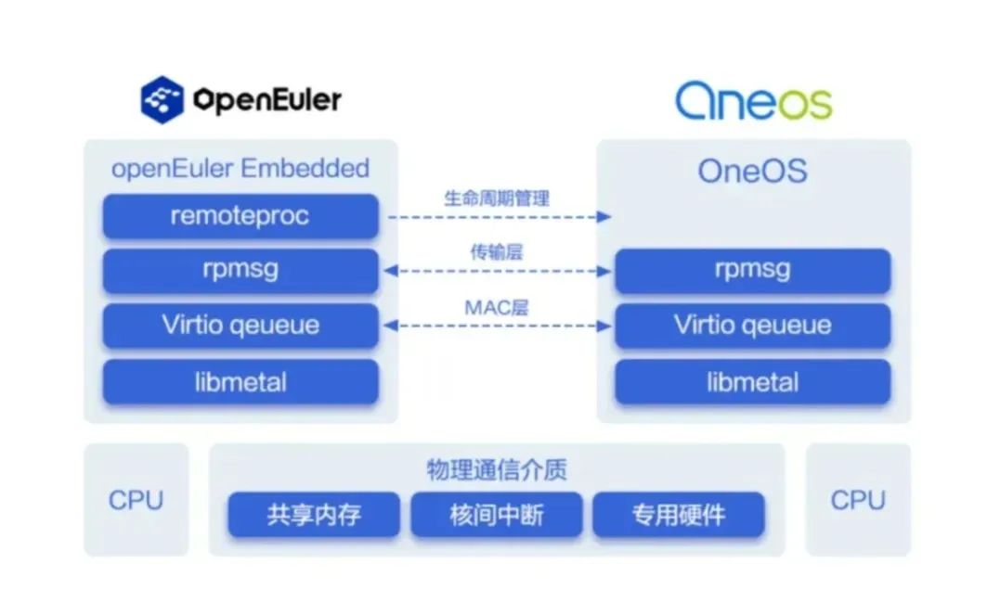
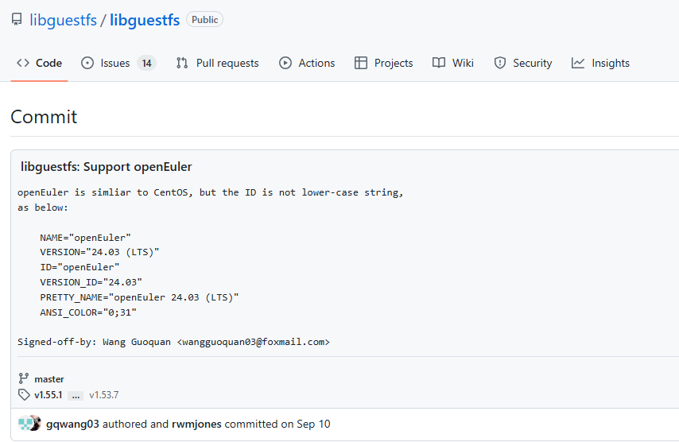
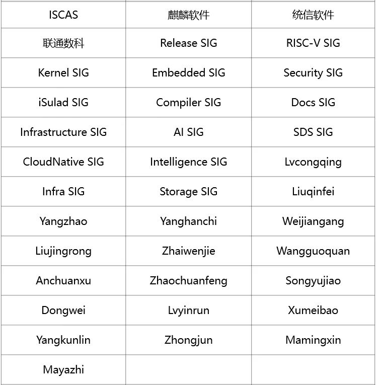

**概述**

在10月的例会上，OpenAtom openEuler(简称:
openEuler)技术委员会达成多项重要决策，包括同意openSCOW、COMO中间件、Livi
Web渲染引擎等新项目在社区开源；同意openHiTLS密码库的合并至openEuler制品仓；同意Standard
Formulation and Certification SIG在社区成立，同时决定将Rust
SIG合并至Compiler SIG，以加强技术维护和社区发展。

在技术发展方面，中移物联OneOS与openEuler展开合作，共同推出非对称AMP双系统方案，实现任务的高效分配与处理，显著提升了系统的实时性与稳定性。

为进一步提升软件包维护，openEuler软件中心新增自动化上游软件包监控能力、增强应用镜像自动升级等功能，上架EPKG、VSCode、x2openEuler等10000+软件包。软件中心作为核心应用在openEuler
DevStation桌面版本默认发布。

在项目发展方面，存储协议时延统计分析工具storprototrace、GlusterFS可视化工具glusterfs-dashboard、AI增强的编译器优化框架ACPO、推理框架vLLM等多个项目相继在openEuler社区孵化运作。

发布在开源之夏的项目"基于libguestfs扩展支持openEuler虚拟机自定义设置"已成功由曲阜师范大学大三学生王国铨(Gitee
ID:
wangguoquan)完成实现。该项目已获得上游社区的认可，并被顺利合并。我们欢迎并鼓励开发者投身于这些有潜力的优秀项目，进一步激发社区的创新活力。

在社区活动方面，第二届openEuler生态大会（中国·湖南）成功举办，推动建设以openEuler为根技术的开源操作系统在湖南的创新发展。同期，openEuler
陆续在北京、杭州等举办Meetup活动，openEuler杭州用户组成立。

操作系统大会&openEuler Summit
2024拟于11月15-16日在北京中关村国际创新中心举办。三十余场主题演讲、十余场分论坛、近百个创新展点等期待您的参加，[欢迎报名]。

感谢成员单位与开发者对openEuler的贡献和支持。

本月报阅读时长预计18分钟。

**社区规模**

截至2024年10月31日，openEuler
社区用户累计超过364万。超过2万名开发者在社区持续贡献。社区累计产生
192.3K个PRs、102.7K条Issues。目前，加入openEuler
社区的单位成员1813家，本月新增38家。

社区贡献看板（截至2024/10/31）

**社区事件**

**第二届openEuler生态大会（中国·湖南）成功举办**

10月30日，第二届openEuler生态大会（中国·湖南）成功举办。大会集结"政产学研用"各界力量，湖南省多个政府部门、行业生态创新中心、操作系统厂商、上下游合作伙伴、行业用户、高校同心聚力，共同加速构建以openEuler根技术为核心的"一生态"体系，技术与生态双轮驱动，使能开源产业繁荣升级。

原文阅读：[第二届openEuler生态大会（中国·湖南）成功举办]    

**openEuler参加第五届中国云计算基础架构开发者大会**

10月19日，第五届中国云计算基础架构开发者大会（简称:
CID大会）在北京举办。openEuler
技术专家栾建海、陆志浩、陈东辉等在会上就社区近期的发展和规划进行了介绍，与现场开发者进行交流。

**openEuler SDS Meetup在北京举办**

10月26日，由openEuler社区与联通数科联合主办的openEuler SDS
Meetup在北京举办。本次Meetup邀请了来自Linaro、Intel、大道运行、联通数科、华为等多位业内专家，分享在分布式存储技术实际应用中的宝贵经验和精彩案例，涵盖SPDK、Ceph
Crimson、fastblock以及高性能全闪存架构设计等方向。

**openEuler Meetup 在杭州举办**

 10月25日，openEuler
Meetup杭州站成功举办。本次Meetup围绕主题"操作系统安全"，邀请了openEuler安全委员会委员、安全技术SIG成员以及华为、超聚变、润和软件、浙江大华等技术专家进行分享，展示openEuler以及发行版在安全治理策略、创新技术和实践案例。同时，openEuler杭州用户组在本次会上成立。

原文阅读：[openEuler Meetup杭州站举办，共话操作系统安全]

**openEuler \"玩转ROS\"系列第1期视频上线**

10月23日，ROS SIG
聂雨婷分享了\"@有电脑就行！三分钟安装openEuler操作系统并搭建ROS环境"，开启了openEuler
\"玩转ROS\" 系列视频的第1期。欢迎感兴趣的朋友关注。

openEuler社区B站技术教程持续连载中，如果您对ROS有想了解的知识，想实践上手操作的demo，想开发探索的ROS软件，都可以关注该系列视频。有任何建议也欢迎大家联系社区小助手(微信号:openeuler123)或在视频下留言，ROS
SIG会根据社区呼声持续更新大家感兴趣的内容。

视频链接：https://b23.tv/l4uBJrT

**社区治理**

**openEuler技术委员会10月会议摘要**

在10月的例会上，openEuler技术委员会达成了一系列重要决策，推动社区更好地运作和发展：

> **同意openSCOW项目的创建**：经技术委员会审议，同意由北京大学&北京大学长沙计算与数字经济研究院发起的openSCOW项目在社区建仓。该项目旨在构建一个面向算力网络的算力中心平台系统，通过简化集群软件部署流程和统一平台管理模式，降低用户使用门槛，实现资源的易管理和易使用。

> **同意COMO项目的创建**：COMO项目是一个基于C++构建的功能安全计算中间件项目，经技术委员会审议，同意该项

> **同意Livi Web渲染引擎(中间件)项目的创建**：该项目将由Desktop
> SIG承载，并考虑集成到嵌入式版本。

        

> **同意openHiTLS开源密码库在openEuler建立制品仓，并由安全技术SIG管理。**

        

> **新SIG成立**：经技术委员会审议，同意Standard Formulation and
> Certification SIG在社区成立，专注于标准制定和认证工作。

        

> **Rust SIG与Compiler
> SIG合并**：为加强Rust相关包的维护，技术委员会同意将Rust
> SIG合并至Compiler SIG。

**技术进展**

**中移物联OneOS与openEuler联合推出非对称AMP双系统方案**

近期，中移物联OneOS与openEuler展开合作，共同推出非对称AMP双系统方案。非对称AMP双系统通过在单颗芯片的多个核心上独立运行不同的操作系统，如Linux与RTOS的结合，实现任务的高效分配与处理，显著提升了系统的实时性与稳定性，在承载复杂算力应用的同时，更有效降低了硬件成本。

原文阅读：

[https://mp.weixin.qq.com/s/512Iy5IGoJz\_K5XD-PUPNw]      

▲图为：openEuler与OneOS混合部署框架基础架构

**存储协议时延统计分析工具storprototrace在社区完成建仓**

由麒麟软件开发，Storage
SIG进行开发维护的项目storprototrace现阶段已在openEuler社区孵化运作。

storprototrace作为一款专注于I/O在进入iSCSI协议驱动层后的时延统计分析工具，未来将增加对LUN时延统计的支持。基于libbpf技术，storprototrace相较于传统的blktrace，能够更精确地统计I/O在iSCSI协议驱动层各阶段的时延数据，包括队列排队等待时间、I/O发送时间和I/O传输完成时间。新增的LUN支持将进一步增强该工具的分析能力，帮助用户在定位和优化特定LUN阶段的性能问题时更加高效。欢迎感兴趣的朋友关注。

项目地址：

https://gitee.com/openeuler/storprototrace

**统信软件GlusterFS可视化工具**

**glusterfs-dashboard项目在社区建仓**

由统信软件发起、SDS
SIG维护管理的glusterfs-dashboard项目已经在openEuler社区完成建仓。glusterfs-dashboard项目旨在填补GlusterFS自身可视化的空缺，提供直观、高效的GlusterFS界面化操作，为GlusterFS使用者带来便捷高效的操作体验。

GlusterFS
是一种可扩展的网络文件系统，适用于云存储和媒体流等数据密集型任务，它将来自多个服务器的磁盘存储资源聚合到单个全局命名空间中。以实现资源的合理规划与分配。目前GlusterFS版本均未提供自带的界面化操作工具，这对GlusterFS使用者及运维人员均有很高的要求，所有的操作均需大量的Gluster命令行支持，且主机、集群监控信息等均需人为获取并整理。

基于这种GlusterFS的使用痛点，glusterfs-dashboard应用而生，提供了涵盖所有GlusterFS操作的界面化实现及优化。glusterfs-dashboard主要优势在于其创新性、高效性；glusterfs-dashboard设计之初并不是简单地将GlusterFS集群操作从命令行替换为界面按钮，而是设计了一整套完整的集群管理策略，涵盖了从节点、存储设备检测、主机的增删改查、卷管理、远程复制、快照、监控等一系列功能点的创新设计及优化。极大地提升了GlusteFS从集群搭建到使用的效率，极大地降低了GlusterFS的使用和运维门槛。

项目地址：

https://gitee.com/openeuler/glusterfs-dashboard

**AI增强的编译器优化框架ACPO在社区完成建仓**

由华为加拿大异构编程实验室主要设计实现的ACPO项目已在openEuler社区完成建仓。预计进入24.03
LTS SP1版本。

ACPO框架旨在将ML（机器学习）模型集成到编译器框架中，并为在编译器中使用模型提供相关工具。主要特点包括：

1.  框架具有训练、推理、特征质量控制（FQC）等工具，可简化在编译器中使用ML模型。

1.  模型与框架解耦，用户可以根据任务类型设计相应模型进行训练。

1.  工具提供一组标准接口，只要输入/输出格式匹配，即可将模型适配到编译器中进行推理。

1.  提供两种适配方法，AOT与实时推理，同时提供示例模型。

 

项目地址：

https://gitee.com/src-openeuler/ACPO

**推理框架 vLLM 项目在社区完成建仓**

由 AI SIG 组维护管理的 vLLM 项目已在 opoenEuler 社区完成建仓。vLLM 是
UCB LMSYS 组织开源的大语言模型高速推理框架。支持在多种 AI
加速硬件上部署大语言模型推理服务。社区计划增加 vLLM 对 鲲鹏 Arm
服务器的支持。并开发 CPU - XPU 异构协同推理加速特性。框架特点：

> 广泛支持多种 AI 计算加速硬件。

        

> 在业内有广泛的应用，拥有活跃的社区。

        

> 首发 paged attention，dynamic batching等大模型推理加速技术，并及时跟进最先进的大模型加速技术。

vLLM项目地址：

https://gitee.com/src-openeuler/vllm

vLLM 原始项目地址：

https://github.com/vllm-project/vllm

**高带宽内存故障分析预测项目hbm-predictor在社区完成建仓**

厦门大学智能存储与计算重点实验室与华为庞加莱实验室联合发起的，关于高带宽内存故障分析预测的合作项目hbm-predictor已在openEuler社区完成建仓。

HPC/AI等多种场景下，HBM颗粒因为带宽的优势被越来越多地封装进SoC；但HBM故障率高的缺点，可能导致SoC返还，甚至单板系统的返还，抬高维护成本，降低客户满意度。本项目旨在实现：

> 分析HBM的故障特征：实现HBM不同层级上的时间、空间、环境因素（例如温度和功率）等多维度的错误特性分析，判定HBM故障的关联因素，辅助故障预测的特征生成。

        

> 构建多层级故障预测器：基于HBM历史错误日志生成的故障预测输入特征，根据HBM故障在不同层级的关联性，训练在行、列、Bank和服务器层级的HBM故障预测器。

        

> 支持HBM故障预测窗口和观测窗口的动态调节，通过灵活调整窗口，适应不同集群、HBM代次和负载导致的HBM故障在时序上的差别，提升故障预测的准确性。

        

> 支持在线的HBM故障预测，可基于预先训练的模型进行线上部署，根据错误事件驱动和固定周期两种方式开展预测，及时识别和预测潜在的HBM故障事件。

项目地址：

https://gitee.com/openeuler/hbm-predictor

**基于libguestfs扩展支持openEuler虚拟机自定义设置**

本月，由openEuler社区发布的开源之夏项目"基于libguestfs扩展支持openEuler虚拟机自定义设置"已由曲阜师范大学大三学生王国铨(Gitee
ID: wangguoquan)完成，并获得上游社区认可，顺利合并。

libguestfs是一组用户访问和修改虚拟机（VM）磁盘映像的工具。由libguestfs-tools包提供的virt-customize命令行工具，可安装在各种
Linux
发行版上。virt-customize可以通过修改虚拟机或磁盘映像来实现安装包、编辑配置文件、设置时区等方式定制虚拟机（磁盘镜像）。

该学生基于openEuler 24.03 LTS版本扩展开发virt-customize命令行，使其支持
raw 和 qcow2 两种格式的openEuler虚拟机自定义设置。

项目地址：

\[1\] https://gitee.com/src-openeuler/libguestfs

\[2\] https://gitee.com/src-openeuler/libguestfs-tools

\[3\] https://github.com/libguestfs/libguestfs/commit/1d8924c343b2f0022767c1d5d5c059ea9d8f4d7e

**openEuler软件中心新增特性**

为帮助开发者更好地维护社区软件包，基础设施团队对软件中心进行了一些提升：

1.  新增软件包源和维护等级：完成EPKG 软件包源扩充，上架10000+EPKG软件包源。协作平台纳入软件包维护等级和建议项，协助维护者根据维护等级由高到低进行软件包维护。

1.  支持openEuler DevStation：完成openEuler DevStation软件上架功能，现已上架EPKG、VSCode、x2openEuler等软件，openEuler软件中心作为核心应用在openEuler DevStation版本桌面默认发布。

1. 上游监控与自动化配置：覆盖L1-L3级2000+软件上游版本监控与3000+其他软件，并构建增量软件包引入上游监控自动化配置能力，自动化补齐增量软件包上游监控。

1.  应用镜像自动升级增强：增加多OS版本应用镜像自动升级功能、归一自动升级pr，同一镜像多os版本升级pr合并至一个，提升验视效率，完成24.03-lts、22.03-lts-sp3、22.03-lts-sp4、20.03-lts-sp，156+应用镜像升级。

欢迎访问体验：

https://easysoftware.openeuler.org/zh

**openEuler Copilot System调优运维进展**

随着微软Build年度开发者大会发布Windows
Copilot，标志着操作系统正式进入原生智能时代。操作系统与大规模语言模型（LLMs）的融合成为了技术创新的前沿阵地。运维与调优具备广泛的商业价值，各厂商纷纷将其作为差异化竞争。基于业界洞察和痛点问题，openEuler社区推出了Copilot
System平台，实现面向操作系统的智能调优、运维等能力，进一步完善openEuler社区在AI
for OS方向的布局。

原文阅读：

[https://mp.weixin.qq.com/s/W38awuSOI5H-8f0gQ0FTkA]      

**gala-anteater项目的开发进展 **

针对openEuler 构建的
gala-anteater项目中基于深度学习的操作系统异常检测平台，我们对此实践涉及的技术原理（基于压缩感知的离群点过滤模型、AE和GAN结合的多指标重构模型、基于极值理论的SPOT模型）展开剖析，帮助用户更深入的理解基于深度学习的异常检测方案。 

原文阅读：

[https://mp.weixin.qq.com/s/grNooV-3r9T8yHuPeAj-8g]      

**软硬件兼容性测评**

截至2024年10月30日，openEuler社区软硬件兼容性方案通过2291个，北向1546个，南向577个，OS
168个。10月新增 北向46个，南向8个, OS 6个。

社区兼容性列表：

https://www.openeuler.org/zh/compatibility/

**安全公告**

2024年10月，社区共发布安全公告92个，修复漏洞255个（其中 Critical
10个，High 64个，其它181个）。

**重点漏洞提醒**

 

> 如下漏洞评估影响较大，请重点关注

在Linux内核中，修复了以下漏洞：ipv6: sr: fix invalid unregister error
pathconfig\_ipv6\_seg6\_lwtunnelis未定义的情况下，seg6\_init()的错误路径错误。在这种情况下，如果seg6\_hmac\_init()失败，则不会调用genl\_unregister\_family()。此问题存在于提交46738b1317e1(ipv6:
sr: add option to controllwtunnel support)和提交5559cea2d5aa (ipv6: sr:
fix possibleuse-after-free and
null-ptr-deref)将此错误路径中的unregister\_pernet\_subsys()替换为genl\_unregister\_family()之后。**（CVE-2024-38612）**

CVSS评分为9.8分

公告链接：

https://www.openeuler.org/zh/security/cve/detail/?cveId=CVE-2024-38612&packageName=kernel

影响范围：

openEuler-20.03-LTS-SP4

openEuler-22.03-LTS-SP1

openEuler-22.03-LTS-SP3

openEuler-22.03-LTS-SP4

openEuler-24.03-LTS

在375之前的xterm允许通过字体操作执行代码，例如，因为OSC
50响应可能具有Ctrl-g，因此导致在Zsh的vi行编辑模式下执行命令。注意：在某些Linux发行版的xterm默认配置中不允许字体操作。**（CVE-2022-45063）**

CVSS评分为9.8分

公告链接：

https://www.openeuler.org/zh/security/cve/detail/?cveId=CVE-2022-45063&packageName=xterm

影响范围：

openEuler-20.03-LTS-SP4

openEuler-22.03-LTS-SP1

openEuler-22.03-LTS-SP3

openEuler-22.03-LTS-SP4

> **漏洞防护**

openEuler社区针对在维版本例行修复漏洞，发布安全补丁。建议用户关注openEuler官网安全公告，及时安装漏洞补丁进行防护。

openEuler 安全公告：

https://www.openeuler.org/zh/security/security-bulletins/

**感谢每一位朋友、开发者的支持**

因为大家的辛勤贡献，openEuler
的每一天都发生着好的事情。小编限于视野和能力，难免有所遗漏，在此表示歉意。同时，衷心感谢社区朋友、开发者们以及openEuler
SIG组成员的贡献：

\* 以上不分先后顺序

如果您希望在月报中增加您的工作内容，或对内容有任何改进建议，请联系wengqiaozhen@openeuler.sh。
