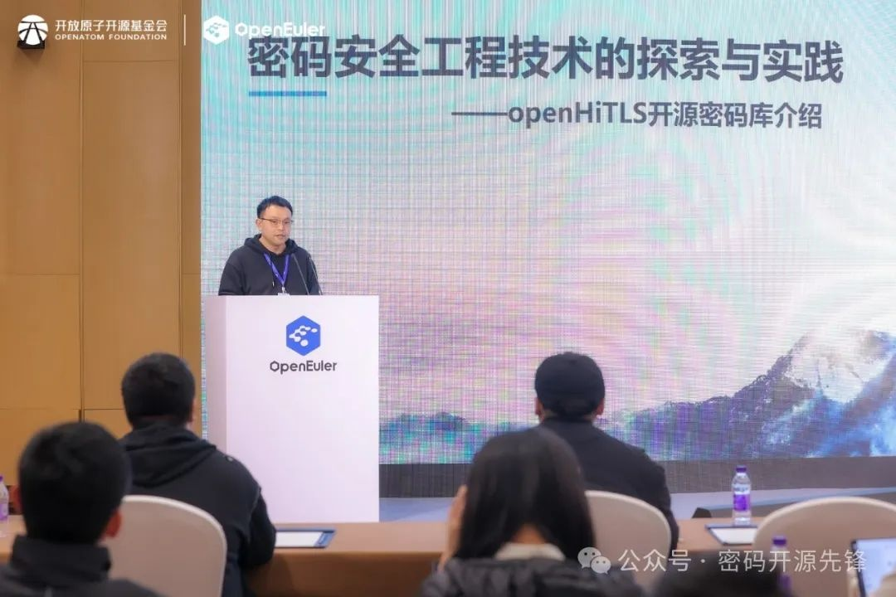

2024年11月16日，openEuler Summit 2024
在北京成功召开。此次大会不仅汇聚了众多开源社区的专家和用户，还见证了**openHiTLS开源密码套件正式纳入OpenAtom
openEuler（简称\"openEuler\"）发行版（24.03-LTS-SP1）**的里程碑事件。在大会的安全合规分论坛上，**openHiTLS开源密码套件架构师同理发表了题为"密码工程安全技术的探索与实践"的主题演讲**，深入探讨了密码技术在保障操作系统安全方面的重要作用以及openHiTLS的技术优势。

openHiTLS开源密码套件架构师同理

openEuler社区旨在构建一个开放、创新且具有广泛适应性的操作系统生态。随着信息技术的迅猛发展，操作系统在云计算、大数据、人工智能等新兴技术领域扮演着越来越重要的角色。openEuler社区通过深度优化Linux内核、提供多重安全保障、支持容器化技术等手段，为用户提供了一个高效、稳定且安全的操作系统平台。

密码库作为操作系统安全的核心组件，对于保障系统安全和数据完整性具有至关重要的作用。密码库提供了加密、解密、数字签名、身份认证等关键功能，能够有效防止数据泄露、篡改和非法访问。因此，一个强大且可靠的密码库是操作系统不可或缺的安全基石。openHiTLS开源密码套件作为我国在密码技术领域的一项重要创新成果，其纳入openEuler社区发行版无疑为openEuler操作系统的安全性提供了强有力的保障。openHiTLS通过轻量级、可剪裁的软件技术架构，满足了各行业不同场景的多样化需求。它支持国际主流及中国商用密码算法和协议，可根据场景需求选择合适的密码算法和协议，从而确保数据传输和存储的安全性。

openHiTLS的技术优势主要体现在以下几个方面：**首先，openHiTLS具备算法先进、性能卓越的特点。**它采用了先进的密码算法和优化的软件架构，能够为用户提供高效、可靠的密码服务。在金融、能源、电信等关键领域，openHiTLS的高性能加解密能力能够确保关键信息的安全传输和存储，有效防止数据泄露和篡改。**其次，openHiTLS架构上提供密码原语级灵活裁剪及轻量化定制能力，具有高度的灵活性和可配置性。**可有力支撑openEuler面向数字基础设施的全场景应用，为从服务器、云计算到边缘计算、嵌入式等多种应用场景需求，提供个性化配置及最适合的安全防护。**此外，openHiTLS具备良好的软硬件结合能力，**能够高效地将加解密流量卸载至鲲鹏KAE(Kunpeng
Accelerator
Engine)引擎及外置硬件加密设备/加密卡上运行，从而实现了国密算法处理性能的显著提升，为用户在加密通信和数据保护方面提供了更为高效且可靠的安全保障。在数字化转型的背景下，密码技术已经成为保障数据安全的重要手段。openHiTLS通过开源共建的方式，汇聚了众多产学研机构的智慧和力量，致力于推动密码技术的不断进步和创新。

未来，openHiTLS将继续发挥其在密码技术方面的优势，为openEuler操作系统和更多行业提供更加安全、可靠的密码服务。此次openHiTLS纳入openEuler社区发行版的事件，不仅标志着openEuler操作系统在安全性方面取得了重要突破，也展示了openHiTLS在密码技术领域的领先地位。未来，随着openEuler社区和openHiTLS的不断发展壮大，我们有理由相信，一个更加安全、可靠、高效的操作系统生态将不断涌现，为数字化转型提供强有力的支撑和保障。
