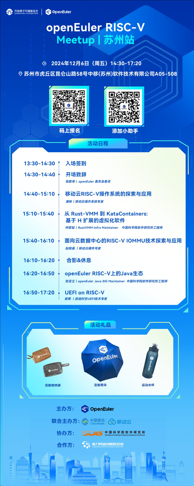

RISC-V，作为开源的精简指令集架构，以其开放、简洁、灵活和可扩展的特点，正引领计算架构的新潮流。**12月6日，OpenAtom
openEuler（简称\"openEuler\"）社区将在苏州举办 RISC-V Meetup
活动，**我们诚邀您参加本次活动，一同深入探讨RISC-V在云计算领域的最新应用与实践。我们将特邀移动云、中国科学院软件研究所及进迭时空等业内知名企业的专家，共同分享RISC-V的前沿技术成果与实战经验。此次活动将助您把握RISC-V架构的发展趋势，洞见云计算的未来格局，为您提供全面了解RISC-V架构在云计算领域发展现状与未来趋势的难得契机。**苏州
Meetup **

**活动信息**

**时间：**2024年12月6日 14:30-17:20

**地点：**苏州市虎丘区昆仑山路58号中移(苏州)软件技术有限公司A05-508

**活动议程&报名**

