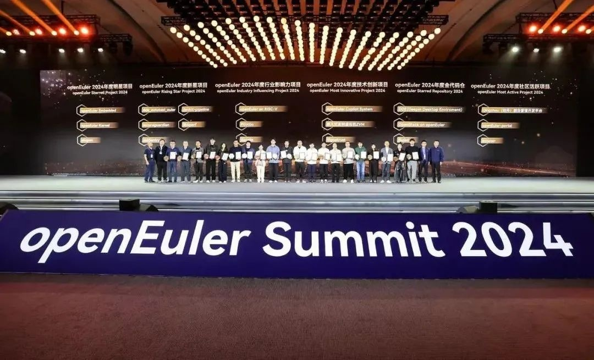
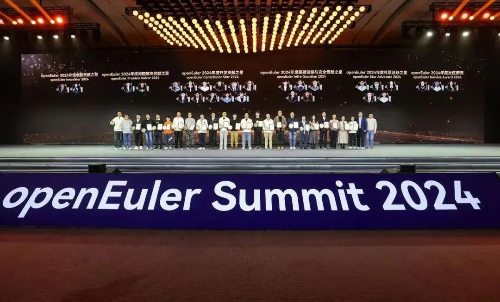
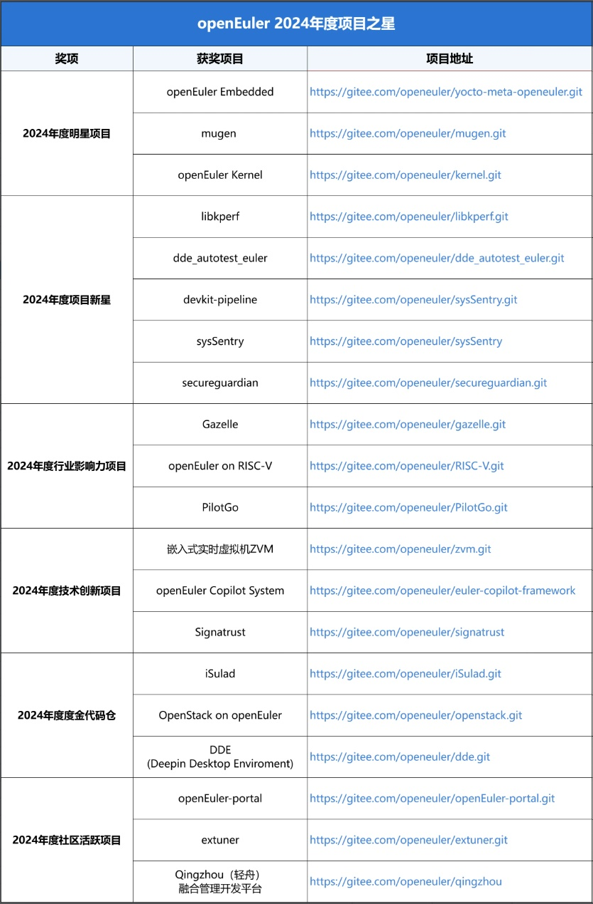
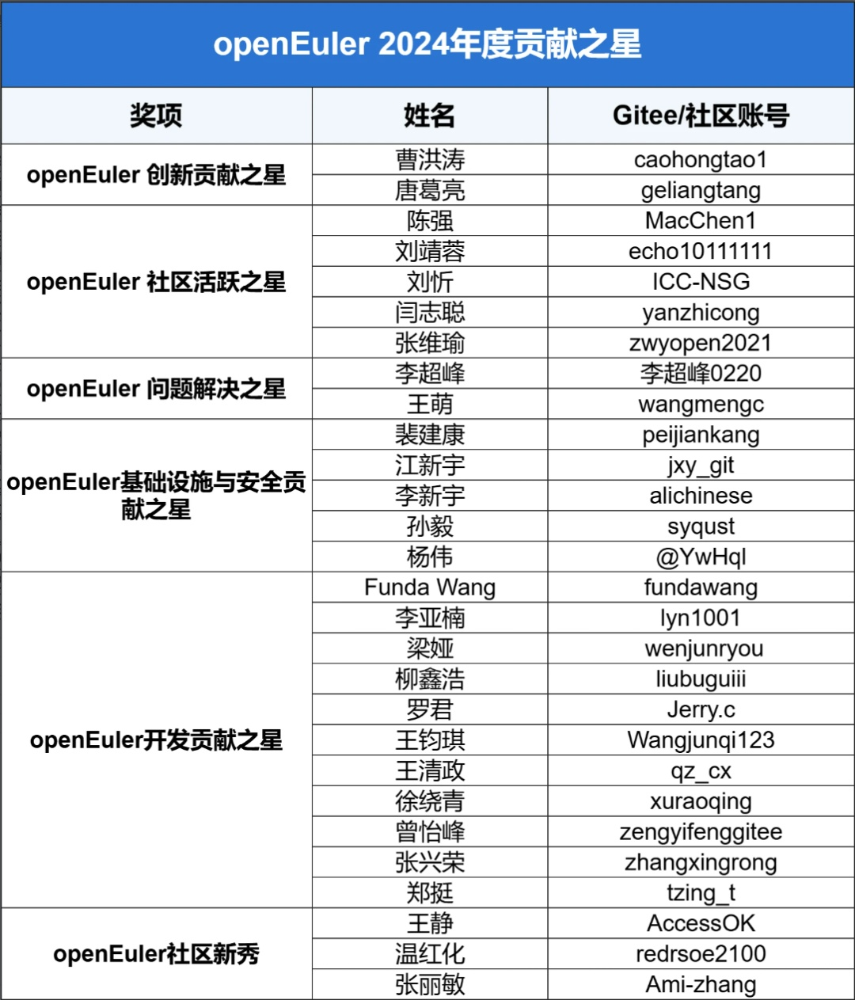
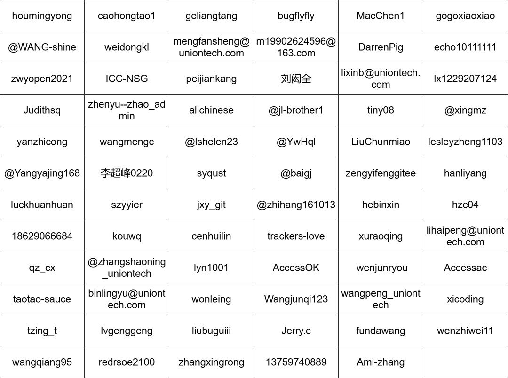

OpenAtom openEuler（简称：openEuler）
5年发展所取得的成绩，离不开每一个成员单位的协作，每一个创新项目的突破，以及每一位贡献者的不懈努力。2024年11月16日，在北京举行的openEuler
Summit 2024上，openEuler
2024年度项目之星与贡献之星的获奖名单揭晓，为这场技术盛宴增添了一抹亮色。

openEuler 2024年度项目之星

openEuler 2024年度贡献之星

### **openEuler 2024年度项目之星**

经openEuler技术委员会的评定，基于技术创新、生态建设、项目活跃度和行业影响力等多个关键维度的综合评估，社区共有20个项目荣获2024年度项目之星。这些项目不仅是openEuler社区技术竞争力的体现，也是社区活力和影响力的缩影。感谢这些项目及其背后开发者团队的贡献与付出。

注：展示不分先后

**openEuler 2024年度贡献之星**

在openEuler社区的蓬勃发展中，每一位开发者的付出与努力都是不可或缺的。为了向这些辛勤工作的成员表达最深的感激与敬意，openEuler社区通过开发者自荐与他荐形式，最后依据技术委员会评选，根据过去一年的杰出贡献，从众多优秀的提名者中精选出28位开发者，成为"2024年度贡献之星"的代表。

注：展示不分先后

**感谢所有提名者**

注：展示不分先后

openEuler
社区始终秉持"共建、共享、共治"的理念，期待更多开发者、开源爱好者加入，一起共建更好的操作系统开源社区！
