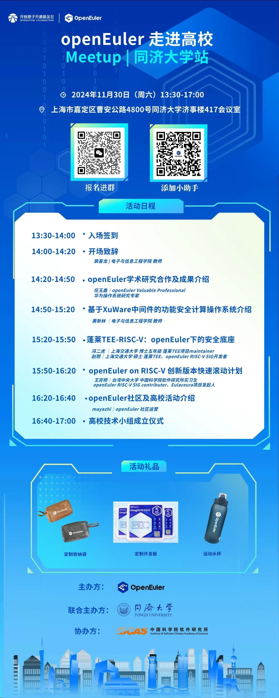

2024年11月16日， 在openEuler Summit
2024大会上，同济大学正式发布了基于[XuWare]{.underline}中间件的功能安全计算操作系统，并将其核心实现代码开源至OpenAtom
openEuler（简称\"openEuler\"）
社区。为让同学们更进一步了解该项目，**openEuler 将于 11 月
30日在同济大学举办一场技术交流 Meetup。**
本次交流活动将邀请openEuler不同领域的开发者，分享在openEuler上的技术成果。欢迎大家踊跃报名。在活动上还将成立同济大学openEuler技术小组，该小组不仅涵盖技术方向的合作，同时融入了多样化的高校人才项目，促进开源文化的传播和发展。报名约起，我们线下见！ 

**活动信息**

**时间：**2024年11月30日 13:30-17:00

**地点：**上海市同济大学嘉定校区济事楼417

**活动议程&报名**

