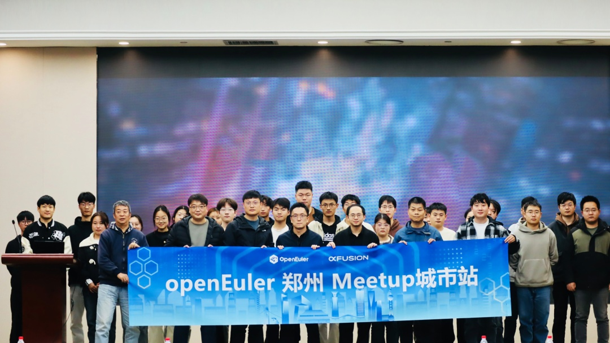
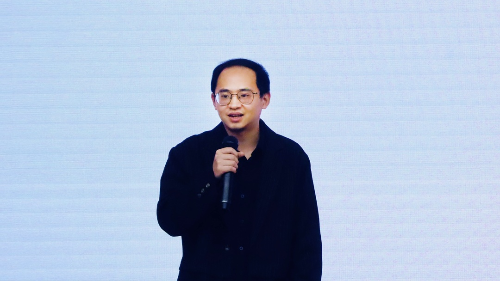
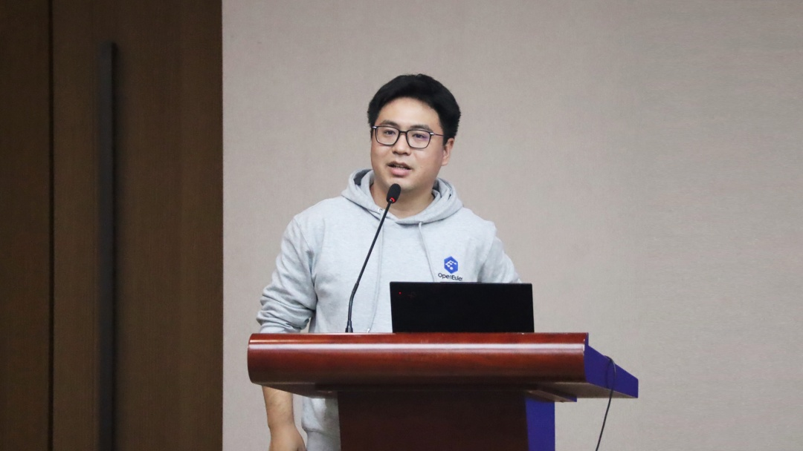
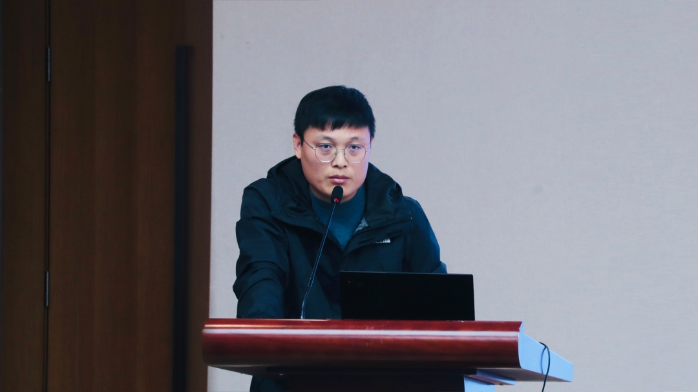
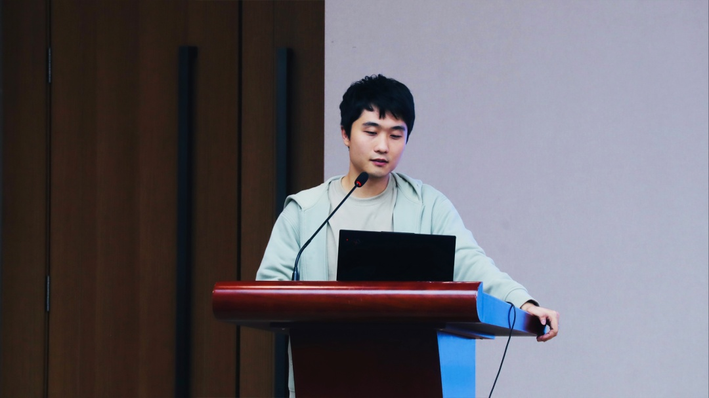
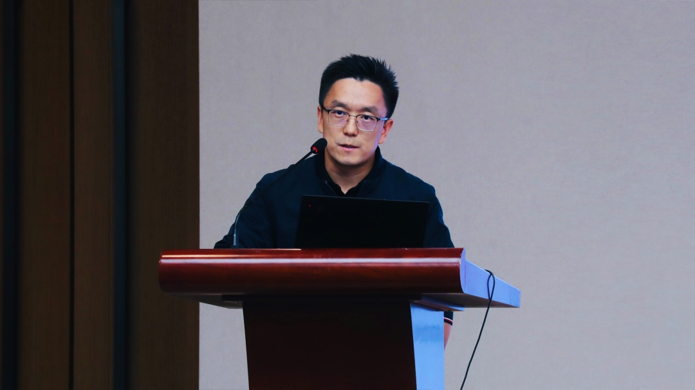
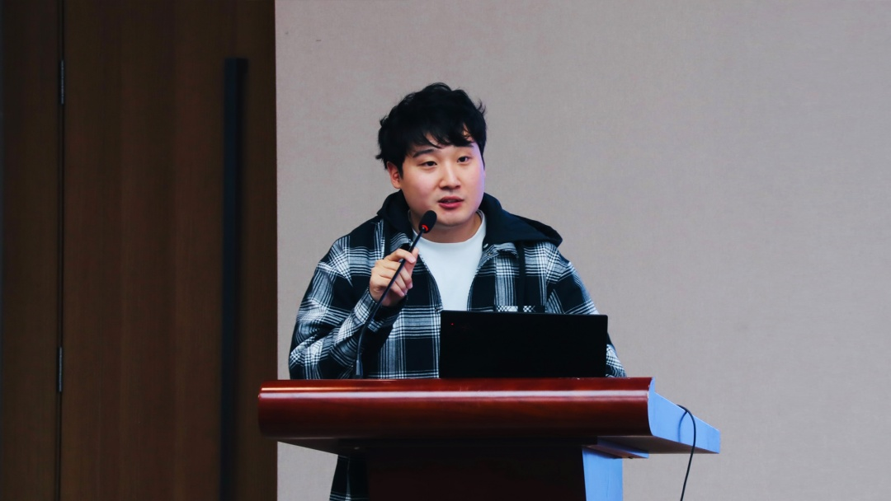

11月22日，由OpenAtom
openEuler（简称\"openEuler\"）主办，超聚变协办的openEuler社区Meetup活动在郑州举办。活动围绕"能力全面升级
AI赋能产业"，汇聚产学研各领域专家与创新力量，分享与探讨openEuler社区在AI领域的能力升级与实践案例。

智能的边界在持续拓展，作为连接硬件与应用之间的桥梁，操作系统拥抱数智未来，与AI结合是一种必然趋势。

超聚变算力软件项目群总监陈茂冬

**超聚变算力软件项目群总监陈茂冬**作开场致辞。他表示：

超聚变服务器操作系统FusionOS支持多样性算力，兼容openEuler软硬件生态，同时面向千行百业应用持续内核技术的投入与创新，为客户提供高性能、高可靠、易运维的业务体验。

openEuler运营工作组组长郑振宇

**openEuler运营工作组组长郑振宇**表示：

智能化时代，需要更智能、更友好、更持续的操作系统。openEuler开源社区通过开放的社区形式与全球的开发者共同构建一个开放、多元和架构包容的软件生态体系。openEuler使能异构算力融合，打造更智能的算力释放平台，提升多样算力使用效率，打造数智基础设施首选开源操作系统。

超聚变操作系统产品规划专家万江涛

**超聚变操作系统产品规划专家万江涛**介绍：

openEuler开源社区蓬勃发展，为FusionOS注入源源不断的活力。依托开源社区，FusionOS不断优化面向具体场景的功能实现，为客户带来持续提升的业务体验。面向AI算力场景，超聚变充分发挥软硬件协同优势，推出FusionOS
for AI，为多种AI负载提供多元化算力支撑，助力打造高性能的AI算力基础设施。

openEuler sig-intelligence committer董微

面向数智未来，**openEuler sig-intelligence committer董微**表示：

openEuler与AI全面结合，打造面向数字基础设施全场景操作系统，为更多用户提供技术便捷。openEuler通过'openEuler
for AI'和'AI for
openEuler'两点，实现AI全栈使能，打造容器化的、开箱即得即用的方案。数字openEuler将逐步演化为智慧openEuler，成长为面向多样性算力和智能时代的下一代OS。

超聚变解决方案架构师韩武琦

**超聚变解决方案架构师韩武琦**分享了超聚变服务器操作系统FusionOS与AI的高性能融合，他指出：

FusionOS将通用计算与AI智能计算深度融合，并提供了全面的功能支持，包括集成AI硬件调优生态，高效AI模型部署，双架构支持，领先的虚拟化性能以及软硬件一体化的安全防护，实现了高性能业务体验的同时，也为客户提供了开箱即用的便利，大幅简化了工程师AI技术实施流程。

超聚变解决方案架构师靳若斌

**超聚变解决方案架构师靳若斌**围绕"嵌入式场景下的OS实时性能优化及测试方法"进行探讨。他介绍：

工业控制场景需要多业务混合和低延时能力。IT与OT业务融合承载，需要工业OS提供实时域和非实时域隔离混部能力；软件定义工控，需要工业OS提供实时能力，满足工业自动化场景微秒级实时相应和精准诉求。超聚变基于openEuler嵌入式的工业FusionOS方案，基于openEuler
Embedded和实时uniproton及混合部署mcs框架，满足工业控制多场景融合诉求。
