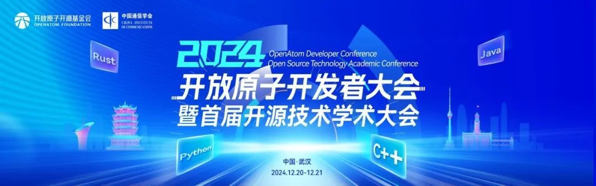
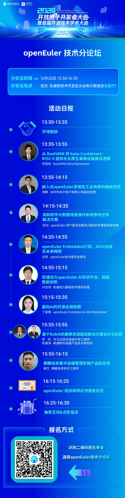
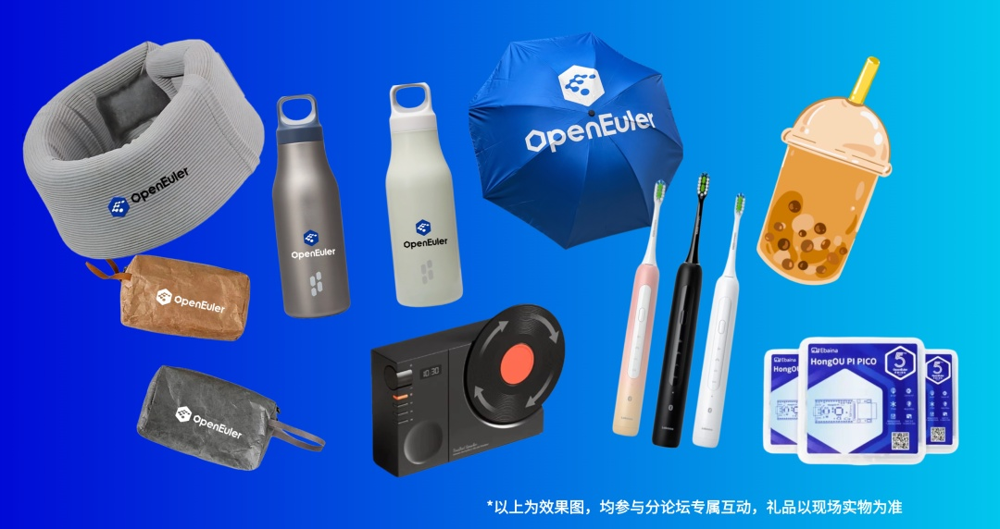

2024开放原子开发者大会暨首届开源技术学术大会将于2024年12月20日-12月21日在武汉举办，大会汇聚众多开发者生态，集聚政、产、学、研、用等各方力量，云集全球技术专家和行业大咖，持续推动开源生态蓬勃发展，将打造属于开发者的年末盛典。作为大会的一部分，openEuler技术分论坛汇集了来自openEuler社区的众多技术专家，他们将分享在**云原生、嵌入式、AI、安全、Linux内核**等技术领域的最新研究成果和实践经验。不管你是初入门的技术小白还是资深开发者，我们都欢迎你来到线下与行业专家面对面交流，解答技术困惑，拓展技术圈。
**论坛亮点抢先看**

本次活动，openEuler技术分论坛将从以下几个领域进行分享：

> **云原生**：探索RustVMM、Kata-Containers等技术在RISC-V虚拟化云原生基础设施建设中的应用。
>
> **嵌入式**：深入了解openEuler
> Embedded在工业场景的最新应用，以及未来的发展趋势。
>
> **AI**：共同探讨如何利用openEuler赋能AI创新，打造智能化的未来。
>
> 安全与合规：关注面向AI的开源合规探索，保障系统安全可靠。
>
> **Linux内核**：学习基于Rubik的集群资源超卖解决方案的设计与实践。
>
> 迁移与运维：掌握大数据场景操作系统原地迁移解决方案，以及集中运维管理系统的应用。

**报名通道**

**2024开放原子开发者大会暨首届开源技术学术大会-openEuler技术分论坛**报名通道已开启，速速扫描下方海报二维码报名，这个冬日一同相约武汉感受技术的热情吧

**时间**：2024/12/20 周五 13:30-16:30

**地点**：武汉光谷希尔顿酒店北京厅1

**参会福利**

1️⃣ **报名（现场签到）即享：**提前报名及现场签到，任君选择的**openEuler精美定制周边礼品**，每一款都安排在开发者的心趴上！

2️⃣ **冬日能量热饮：**冬日一杯热呼呼的奶茶是不是和技术交流更配呢，分论坛开场前13:30抢先签到，openEuler将贴心为每位参会者准备**霸王茶姬暖手茶～**

3️⃣ **惊喜抽奖**：分论坛的最后还将安排惊喜抽奖，奖品包含开发版、热门电子产品等！请务必点燃你的技术热情，畅享技术魅力到最后一刻～

名额有限，速来报名抢占席位！这么给力的专属福利还不码住呼朋唤友一同报名！

除了openEuler技术分论坛外，openEuler社区还在开源集市（12/20-12/21）和openEuler开源工作坊（12/21上午）为大家准备了很多超有趣互动，动手实践，结识同好，拓展开发者的技术交流圈！更多参会彩蛋等你现场解锁，探索openEuler的无限可能～
