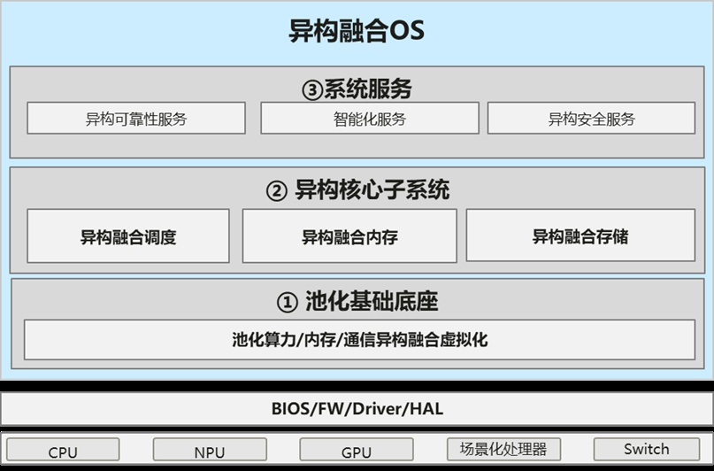

经OpenAtom
openEuler（简称\"openEuler\"）社区技术委员会讨论决定，异构融合SIG(SIG-Long)在openEuler
社区正式成立。**异构融合SIG将致力于构建智能基础设施异构融合计算框架，充分发挥不同硬件设备的优势，最大化满足不同应用负载的诉求，同时降低开发门槛和成本**，提供算力统一接入、异构融合内存、异构融合虚拟化、算力切分、资源优先级配置、弹性迁移等关键能力。我们诚邀业界同仁携手推进异构融合SIG，共同探讨
AI 时代操作系统的演进方向，构筑AI时代融合算力底座。

**异构算力不断涌现，逐渐成为当前数据中心的核心**摩尔定律，由英特尔创始人之一戈登·摩尔在1965年提出，预言集成电路上的晶体管数量每隔18至24个月将翻倍，处理器性能提升一倍，这一理论在过去几十年间几乎成为了芯片发展的金科玉律。然而，随着制程技术逼近物理极限，摩尔定律的增长速度开始放缓，CPU性能提升每年只有不到10%，遭遇性能瓶颈。数据中心作为算力输出的底座，面对算力需求远超摩尔定律的井喷增长，必须持续创新，实现在低资源消耗下产生更大算力。同时，异构算力占比逐渐增多，异构计算指在一个计算系统中使用不同类型的处理器或计算单元来协同完成计算任务的技术，这些单元包括CPU、GPU、以及如NPU这样的专用加速器。

异构计算的目的在于通过结合不同处理器的优势，提高系统的整体性能、效率和适应各种复杂计算场景的能力。AI、5G、边缘计算、物联网等新技术的应用落地，对计算性能提出更高要求，异构加速计算需求正蓬勃兴起。数据中心作为新一代信息通信技术的重要载体，异构加速计算的需求日益旺盛，逐渐成为数据中心算力的主要力量。

**新型内存语义互连技术推动计算架构创新**随着异构计算的兴起，新型芯片互联协议如
Gen-Z、CXL、NvLink及ULink等协议应运而生，通过提供更快的传输速度、更宽的传输带宽及更高效的传输路径，降低CPU、GPU、NPU之间的互联时延。例如，CXL通过高速内存访问语义，支持内存共享和加速器之间的直接通信，减少了数据在系统内部的传输时间。
新的算力、新的总线以及迫切的算力需求，带来了新的机会。在这样的背景下，面向未来，如何更有效地整合不同类型的计算资源，如CPU、GPU、NPU等，实现资源的最优配置和调度，提升系统的整体性能和效率，为数据中心提供更高的资源利用率和更低的成本。**技术设想**基于不断增加的异构算力及新型芯片互联的发展，操作系统
OS作为呈上启下的枢纽，为适应南向硬件的变化应做适当的调整。我们围绕这些变化创建系统创新SIG：SIG-Long，其使命为尝试重构操作系统核心子系统，构筑AI时代融合算力底座。异构融合OS - 技术设想
基于互联域的新一代操作系统，南向构建池化能力，北向构筑新系统接口，重塑异构协同融合的操作系统关键子系统，AI时代融合算力底座，技术特征是：异构池化、原生可靠、极简编程。共分成三层，最底层是池化基础底座，包括池化算力、池化内存、池化通信，高性能异构融合虚拟化，最上层是系统服务，包括异构可靠性服务、智能化服务、异构安全服务等，中间是异构核心子系统，包括融合调度、融合内存、融合存储等操作系统核心子系统。**运作计划1.
SIG 例会**双周例会，北京时间周五上午09:30 --
10:30。首次例会将于本周五（12.13）9:30召开，会议链接：https://meeting.huaweicloud.com:36443/\#/j/982405198**2.
技术分享**异构融合SIG将定期通过openEuler公众号分享如下内容：

-   异构融合业界前沿技术分享

-   openEuler异构融合最新实践

-   优秀客户合作案例

-   技术直播\...

**3. 线下交流**
异构融合SIG欢迎广大开发者面对面交流，碰撞思想火花。我们预计在2025年组织线下技术交流活动，如Meetup、openEuler大会、技术分论坛等。敬请期待\~**加入我们**欢迎感兴趣的朋友们加入到SIG-Long，共同探讨异构融合技术，可以添加小助手微信或扫描微信群二维码，入群讨论。欢迎您的围观和加入！

添加小助手
